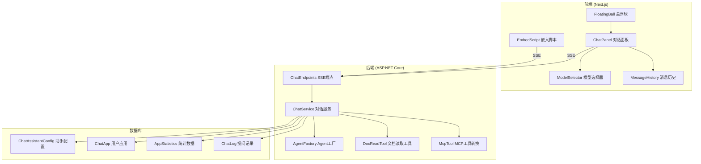
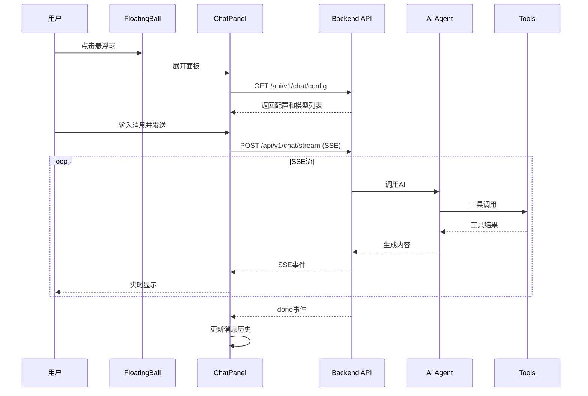

# Design Document: 文档对话助手悬浮球

## Overview

本设计文档描述文档对话助手悬浮球功能的技术实现方案。该功能分为两大部分：
1. **内置悬浮球**：在文档页面右下角显示悬浮球，点击展开对话面板，使用管理员配置的模型和工具
2. **用户应用系统**：用户可创建自己的应用，配置AI模型，通过嵌入脚本集成到外部网站

系统采用前后端分离架构，前端使用React组件实现UI，后端使用ASP.NET Core提供SSE流式API。

## Architecture



## Components and Interfaces

### 1. 前端组件

#### 1.1 FloatingBall 悬浮球组件

```typescript
// web/components/chat/floating-ball.tsx
interface FloatingBallProps {
  enabled: boolean;           // 是否启用
  iconUrl?: string;           // 自定义图标URL
  onToggle: () => void;       // 切换展开/收起
  isOpen: boolean;            // 当前是否展开
}

// 位置：固定在页面右下角 (right: 24px, bottom: 24px)
// 尺寸：56px x 56px 圆形按钮
// 动画：hover时放大1.1倍，点击时有按压效果
```

#### 1.2 ChatPanel 对话面板组件

```typescript
// web/components/chat/chat-panel.tsx
interface ChatPanelProps {
  isOpen: boolean;
  onClose: () => void;
  context: DocContext;        // 文档上下文
  appId?: string;             // 应用ID（嵌入模式）
}

interface DocContext {
  owner: string;
  repo: string;
  branch: string;
  language: string;
  currentDocPath: string;
  catalogMenu: CatalogItem[];
}

interface CatalogItem {
  title: string;
  path: string;
  children?: CatalogItem[];
}
```

#### 1.3 MessageHistory 消息历史管理

```typescript
// web/hooks/use-chat-history.ts
interface ChatMessage {
  id: string;
  role: 'user' | 'assistant' | 'tool';
  content: string;
  images?: string[];          // Base64编码的图片
  toolCalls?: ToolCall[];     // 工具调用
  toolResult?: ToolResult;    // 工具结果
  timestamp: number;
}

interface ToolCall {
  id: string;
  name: string;
  arguments: Record<string, unknown>;
}

interface ToolResult {
  toolCallId: string;
  result: string;
  isError: boolean;
}

// Hook返回
interface UseChatHistory {
  messages: ChatMessage[];
  addMessage: (msg: Omit<ChatMessage, 'id' | 'timestamp'>) => void;
  updateMessage: (id: string, updates: Partial<ChatMessage>) => void;
  clearHistory: () => void;
}
```

#### 1.4 SSE客户端

```typescript
// web/lib/chat-api.ts
interface ChatRequest {
  messages: ChatMessage[];
  modelId: string;
  context: DocContext;
  appId?: string;             // 应用模式
}

interface SSEEvent {
  type: 'content' | 'tool_call' | 'tool_result' | 'done' | 'error';
  data: string | ToolCall | ToolResult | ErrorInfo;
}

async function* streamChat(request: ChatRequest): AsyncGenerator<SSEEvent> {
  const response = await fetch('/api/v1/chat/stream', {
    method: 'POST',
    headers: { 'Content-Type': 'application/json' },
    body: JSON.stringify(request),
  });
  
  const reader = response.body?.getReader();
  // 解析SSE流...
}
```

### 2. 后端组件

#### 2.1 ChatAssistantEndpoints SSE端点

```csharp
// src/OpenDeepWiki/Endpoints/ChatAssistantEndpoints.cs
public static class ChatAssistantEndpoints
{
    public static IEndpointRouteBuilder MapChatAssistantEndpoints(this IEndpointRouteBuilder app)
    {
        var group = app.MapGroup("/api/v1/chat")
            .WithTags("对话助手");
        
        // SSE流式对话
        group.MapPost("/stream", StreamChatAsync)
            .WithName("StreamChat")
            .Produces<IAsyncEnumerable<string>>(contentType: "text/event-stream");
        
        // 获取可用模型列表
        group.MapGet("/models", GetAvailableModelsAsync)
            .WithName("GetChatModels");
        
        // 获取助手配置（是否启用等）
        group.MapGet("/config", GetChatConfigAsync)
            .WithName("GetChatConfig");
        
        return app;
    }
}
```

#### 2.2 ChatAssistantService 对话服务

```csharp
// src/OpenDeepWiki/Services/Chat/ChatAssistantService.cs
public interface IChatAssistantService
{
    Task<ChatAssistantConfig> GetConfigAsync();
    Task<List<ModelConfigDto>> GetAvailableModelsAsync();
    IAsyncEnumerable<SSEEvent> StreamChatAsync(
        ChatRequest request, 
        CancellationToken cancellationToken);
}

public class ChatRequest
{
    public List<ChatMessageDto> Messages { get; set; } = new();
    public string ModelId { get; set; } = string.Empty;
    public DocContextDto Context { get; set; } = new();
    public string? AppId { get; set; }
}

public class DocContextDto
{
    public string Owner { get; set; } = string.Empty;
    public string Repo { get; set; } = string.Empty;
    public string Branch { get; set; } = string.Empty;
    public string Language { get; set; } = string.Empty;
    public string CurrentDocPath { get; set; } = string.Empty;
    public List<CatalogItemDto> CatalogMenu { get; set; } = new();
}
```

#### 2.3 DocReadTool 文档读取工具

```csharp
// src/OpenDeepWiki/Agents/Tools/DocReadTool.cs
public class DocReadTool
{
    private readonly IContext _context;
    private readonly string _owner;
    private readonly string _repo;
    private readonly string _branch;
    private readonly string _language;

    [Description("读取指定路径的文档内容")]
    public async Task<string> ReadDocumentAsync(
        [Description("文档路径，如 'getting-started/introduction'")] 
        string path,
        CancellationToken cancellationToken = default)
    {
        // 1. 查找BranchLanguage
        // 2. 查找DocCatalog
        // 3. 返回DocFile内容
    }

    public List<AITool> GetTools() => new()
    {
        AIFunctionFactory.Create(ReadDocumentAsync, new AIFunctionFactoryOptions
        {
            Name = "ReadDocument"
        })
    };
}
```

#### 2.4 MCP工具转换器

```csharp
// src/OpenDeepWiki/Services/Chat/McpToolConverter.cs
public interface IMcpToolConverter
{
    Task<List<AITool>> ConvertMcpConfigsToToolsAsync(
        List<string> mcpIds, 
        CancellationToken cancellationToken);
}

public class McpToolConverter : IMcpToolConverter
{
    public async Task<List<AITool>> ConvertMcpConfigsToToolsAsync(
        List<string> mcpIds, 
        CancellationToken cancellationToken)
    {
        // 1. 从数据库加载MCP配置
        // 2. 为每个MCP创建HTTP调用工具
        // 3. 返回AITool列表
    }
}
```

### 3. 用户应用系统组件

#### 3.1 ChatApp 实体

```csharp
// src/OpenDeepWiki.Entities/Chat/ChatApp.cs
public class ChatApp : AggregateRoot<string>
{
    [Required]
    public string UserId { get; set; } = string.Empty;
    
    [Required]
    [StringLength(100)]
    public string Name { get; set; } = string.Empty;
    
    [StringLength(500)]
    public string? Description { get; set; }
    
    [StringLength(500)]
    public string? IconUrl { get; set; }
    
    [Required]
    [StringLength(64)]
    public string AppId { get; set; } = string.Empty;  // 公开的应用ID
    
    [Required]
    [StringLength(128)]
    public string AppSecret { get; set; } = string.Empty;  // 服务端验证密钥
    
    // 域名校验配置
    public bool EnableDomainValidation { get; set; } = false;
    
    [StringLength(2000)]
    public string? AllowedDomains { get; set; }  // JSON数组
    
    // AI模型配置
    [Required]
    [StringLength(50)]
    public string ProviderType { get; set; } = "OpenAI";  // OpenAI, OpenAIResponses, Anthropic
    
    [StringLength(500)]
    public string? ApiKey { get; set; }
    
    [StringLength(500)]
    public string? BaseUrl { get; set; }
    
    [StringLength(1000)]
    public string? AvailableModels { get; set; }  // JSON数组
    
    [StringLength(100)]
    public string? DefaultModel { get; set; }
    
    // 限流配置
    public int? RateLimitPerMinute { get; set; }
    
    public bool IsActive { get; set; } = true;
}
```

#### 3.2 AppStatistics 统计实体

```csharp
// src/OpenDeepWiki.Entities/Chat/AppStatistics.cs
public class AppStatistics : AggregateRoot<string>
{
    [Required]
    public string AppId { get; set; } = string.Empty;
    
    public DateTime Date { get; set; }  // 统计日期
    
    public long RequestCount { get; set; } = 0;
    
    public long InputTokens { get; set; } = 0;
    
    public long OutputTokens { get; set; } = 0;
}
```

#### 3.3 ChatLog 提问记录实体

```csharp
// src/OpenDeepWiki.Entities/Chat/ChatLog.cs
public class ChatLog : AggregateRoot<string>
{
    [Required]
    public string AppId { get; set; } = string.Empty;
    
    [StringLength(100)]
    public string? UserIdentifier { get; set; }  // 用户标识（可选）
    
    [Required]
    public string Question { get; set; } = string.Empty;
    
    [StringLength(500)]
    public string? AnswerSummary { get; set; }  // AI回复摘要
    
    public int InputTokens { get; set; }
    
    public int OutputTokens { get; set; }
    
    [StringLength(100)]
    public string? ModelUsed { get; set; }
    
    [StringLength(500)]
    public string? SourceDomain { get; set; }  // 请求来源域名
}
```

#### 3.4 ChatAssistantConfig 助手配置实体

```csharp
// src/OpenDeepWiki.Entities/Chat/ChatAssistantConfig.cs
public class ChatAssistantConfig : AggregateRoot<string>
{
    public bool IsEnabled { get; set; } = false;
    
    [StringLength(2000)]
    public string? EnabledModelIds { get; set; }  // JSON数组
    
    [StringLength(2000)]
    public string? EnabledMcpIds { get; set; }  // JSON数组
    
    [StringLength(2000)]
    public string? EnabledSkillIds { get; set; }  // JSON数组
    
    [StringLength(100)]
    public string? DefaultModelId { get; set; }
}
```

## Data Models

### 前端数据流



### SSE事件格式

```typescript
// 内容事件
{ "type": "content", "data": "AI回复的文本片段" }

// 工具调用事件
{ 
  "type": "tool_call", 
  "data": {
    "id": "call_xxx",
    "name": "ReadDocument",
    "arguments": { "path": "getting-started/intro" }
  }
}

// 工具结果事件
{
  "type": "tool_result",
  "data": {
    "toolCallId": "call_xxx",
    "result": "文档内容...",
    "isError": false
  }
}

// 完成事件
{ "type": "done", "data": { "inputTokens": 100, "outputTokens": 200 } }

// 错误事件
{ "type": "error", "data": { "code": "MODEL_UNAVAILABLE", "message": "模型不可用" } }
```

### 系统提示词模板

```typescript
const systemPrompt = `你是一个文档助手，帮助用户理解和查找文档内容。

当前文档上下文：
- 仓库：${context.owner}/${context.repo}
- 分支：${context.branch}
- 语言：${context.language}
- 当前文档：${context.currentDocPath}

文档目录结构：
${formatCatalogMenu(context.catalogMenu)}

你可以使用 ReadDocument 工具读取其他文档内容。
请使用${context.language === 'zh' ? '中文' : context.language}回答用户问题。`;
```

## Correctness Properties

*A property is a characteristic or behavior that should hold true across all valid executions of a system-essentially, a formal statement about what the system should do. Properties serve as the bridge between human-readable specifications and machine-verifiable correctness guarantees.*

### Property 1: 上下文传递完整性
*For any* 对话请求，发送到后端的请求体必须包含完整的DocContext（owner、repo、branch、language、currentDocPath）
**Validates: Requirements 5.1, 5.2**

### Property 2: 对话历史完整性
*For any* 对话会话，消息历史必须包含所有用户消息、AI回复、工具调用和工具结果，且发送新消息时必须传递完整历史
**Validates: Requirements 8.1, 8.2, 8.3**

### Property 3: SSE事件格式一致性
*For any* SSE流式响应，工具调用事件必须包含id、name、arguments字段，工具结果事件必须包含toolCallId、result、isError字段
**Validates: Requirements 9.3, 9.4**

### Property 4: 文档读取权限控制
*For any* ReadDocument工具调用，只能读取当前owner/repo/branch下的文档，跨仓库请求必须返回错误
**Validates: Requirements 6.2, 6.3**

### Property 5: 模型过滤正确性
*For any* 模型列表请求，返回的模型必须是管理员配置为对话助手可用且处于启用状态的模型
**Validates: Requirements 3.2**

### Property 6: 图片编码正确性
*For any* 包含图片的消息，图片必须被正确编码为Base64格式，且格式必须是PNG、JPG、GIF或WebP之一
**Validates: Requirements 4.3, 4.4**

### Property 7: AppId唯一性
*For any* 新创建的应用，生成的AppId必须是全局唯一的
**Validates: Requirements 12.2**

### Property 8: 域名校验正确性
*For any* 启用域名校验的应用，来自非允许域名的请求必须被拒绝
**Validates: Requirements 14.7, 17.2**

### Property 9: 统计数据记录完整性
*For any* 对话请求，必须记录inputTokens、outputTokens，并更新对应AppId的每日统计
**Validates: Requirements 15.1, 15.3, 15.4**

### Property 10: 提问记录关联正确性
*For any* 通过嵌入脚本的对话，提问记录必须关联到正确的AppId
**Validates: Requirements 16.1, 16.5**

### Property 11: 安全验证完整性
*For any* 嵌入脚本请求，必须验证AppId有效性，启用域名校验时必须验证来源域名
**Validates: Requirements 17.1, 17.2**

### Property 12: 应用配置应用正确性
*For any* 通过嵌入脚本的对话，必须使用应用配置的ProviderType、ApiKey、BaseUrl和模型
**Validates: Requirements 13.5**

## Error Handling

### 前端错误处理

| 错误场景 | 处理方式 |
|---------|---------|
| SSE连接失败 | 显示"连接失败，请检查网络"提示，提供重试按钮 |
| AI回复超时(30s) | 显示"响应超时"提示，提供重试按钮，保留已有历史 |
| 模型不可用 | 显示"当前模型不可用，请选择其他模型"提示 |
| 图片过大(>10MB) | 显示"图片大小超过限制(10MB)"提示，阻止上传 |
| 无可用模型 | 禁用发送按钮，显示"暂无可用模型"提示 |

### 后端错误处理

```csharp
public class ChatErrorCodes
{
    public const string MODEL_UNAVAILABLE = "MODEL_UNAVAILABLE";
    public const string CONFIG_MISSING = "CONFIG_MISSING";
    public const string INVALID_APP_ID = "INVALID_APP_ID";
    public const string DOMAIN_NOT_ALLOWED = "DOMAIN_NOT_ALLOWED";
    public const string RATE_LIMIT_EXCEEDED = "RATE_LIMIT_EXCEEDED";
    public const string DOCUMENT_NOT_FOUND = "DOCUMENT_NOT_FOUND";
    public const string MCP_CALL_FAILED = "MCP_CALL_FAILED";
}

// SSE错误事件格式
public class SSEErrorEvent
{
    public string Type => "error";
    public ErrorData Data { get; set; }
}

public class ErrorData
{
    public string Code { get; set; }
    public string Message { get; set; }
}
```

### 工具调用错误处理

```csharp
// ReadDocument工具错误
public async Task<string> ReadDocumentAsync(string path, CancellationToken ct)
{
    try
    {
        var doc = await FindDocumentAsync(path, ct);
        if (doc == null)
            return JsonSerializer.Serialize(new { error = true, message = $"文档 '{path}' 不存在" });
        return doc.Content;
    }
    catch (Exception ex)
    {
        return JsonSerializer.Serialize(new { error = true, message = $"读取文档失败: {ex.Message}" });
    }
}
```

## Testing Strategy

### 单元测试

使用xUnit + FsCheck进行测试，测试文件位于 `tests/OpenDeepWiki.Tests/Services/Chat/`

#### 测试覆盖范围

1. **ChatAssistantService测试**
   - 配置加载测试
   - 模型过滤测试
   - SSE流生成测试

2. **DocReadTool测试**
   - 文档读取成功测试
   - 文档不存在测试
   - 权限控制测试

3. **McpToolConverter测试**
   - MCP配置转换测试
   - 工具调用测试

4. **ChatApp服务测试**
   - AppId生成唯一性测试
   - 域名校验测试
   - 统计数据记录测试

### 属性测试

使用FsCheck进行属性测试，每个属性测试运行至少100次迭代。

```csharp
// 示例：AppId唯一性属性测试
[Property(MaxTest = 100)]
public Property AppId_ShouldBeUnique()
{
    return Prop.ForAll(
        Arb.Default.PositiveInt(),
        count =>
        {
            var appIds = Enumerable.Range(0, count.Get)
                .Select(_ => GenerateAppId())
                .ToList();
            return appIds.Distinct().Count() == appIds.Count;
        });
}
```

### 前端测试

使用Jest + React Testing Library进行组件测试。

```typescript
// 示例：FloatingBall组件测试
describe('FloatingBall', () => {
  it('should not render when disabled', () => {
    render(<FloatingBall enabled={false} onToggle={() => {}} isOpen={false} />);
    expect(screen.queryByRole('button')).not.toBeInTheDocument();
  });

  it('should toggle panel on click', () => {
    const onToggle = jest.fn();
    render(<FloatingBall enabled={true} onToggle={onToggle} isOpen={false} />);
    fireEvent.click(screen.getByRole('button'));
    expect(onToggle).toHaveBeenCalled();
  });
});
```

## API Endpoints Summary

### 对话助手API

| 方法 | 路径 | 描述 |
|-----|------|------|
| GET | /api/v1/chat/config | 获取助手配置 |
| GET | /api/v1/chat/models | 获取可用模型列表 |
| POST | /api/v1/chat/stream | SSE流式对话 |

### 用户应用API

| 方法 | 路径 | 描述 |
|-----|------|------|
| GET | /api/v1/apps | 获取用户应用列表 |
| POST | /api/v1/apps | 创建应用 |
| GET | /api/v1/apps/{id} | 获取应用详情 |
| PUT | /api/v1/apps/{id} | 更新应用 |
| DELETE | /api/v1/apps/{id} | 删除应用 |
| POST | /api/v1/apps/{id}/regenerate-secret | 重新生成AppSecret |
| GET | /api/v1/apps/{id}/statistics | 获取应用统计 |
| GET | /api/v1/apps/{id}/logs | 获取提问记录 |

### 嵌入脚本API

| 方法 | 路径 | 描述 |
|-----|------|------|
| GET | /api/v1/embed/config | 获取嵌入配置（验证AppId和域名） |
| POST | /api/v1/embed/stream | 嵌入模式SSE流式对话 |

### 管理后台API

| 方法 | 路径 | 描述 |
|-----|------|------|
| GET | /api/admin/chat-assistant/config | 获取助手配置 |
| PUT | /api/admin/chat-assistant/config | 更新助手配置 |

## Embed Script Design

### 嵌入脚本使用方式

```html
<!-- 在外部网站中嵌入 -->
<script 
  src="https://your-domain.com/embed.js"
  data-app-id="app_xxxxx"
  data-icon="https://example.com/icon.png"
></script>
```

### 嵌入脚本实现

```javascript
// public/embed.js
(function() {
  const script = document.currentScript;
  const appId = script.getAttribute('data-app-id');
  const iconUrl = script.getAttribute('data-icon');
  
  if (!appId) {
    console.error('OpenDeepWiki: data-app-id is required');
    return;
  }
  
  // 验证配置
  fetch(`${API_BASE}/api/v1/embed/config?appId=${appId}`)
    .then(res => res.json())
    .then(config => {
      if (!config.valid) {
        console.error('OpenDeepWiki: Invalid app configuration');
        return;
      }
      // 注入悬浮球和对话面板
      injectChatWidget(appId, iconUrl, config);
    });
})();
```
