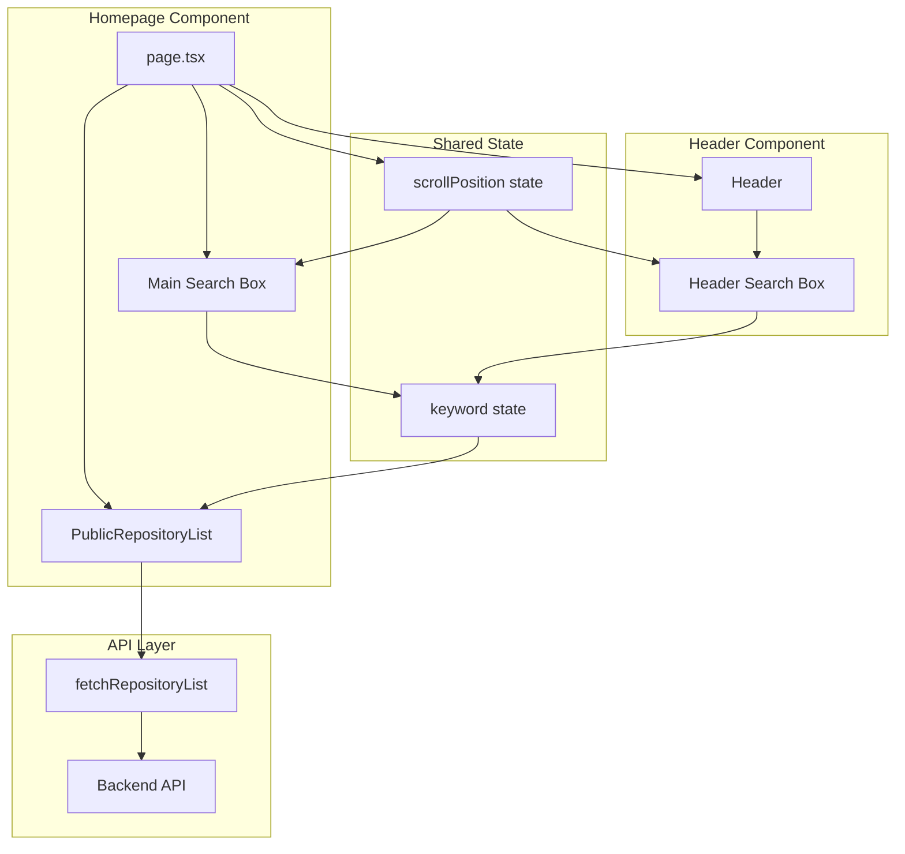
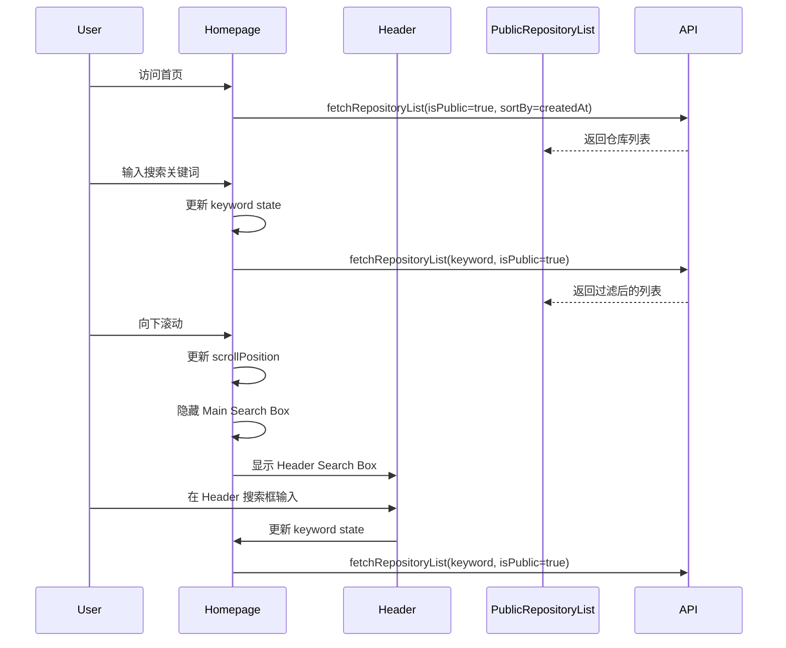

# Design Document: Homepage Repository List

## Overview

本设计为 OpenDeepWiki 首页实现公开仓库列表功能，包含搜索、滚动交互动画和响应式布局。设计遵循现有代码架构，复用已有组件，并通过 React hooks 管理滚动状态和搜索同步。

### 核心设计决策

1. **状态提升**: 将搜索关键词状态提升到首页组件，实现主搜索框和 Header 搜索框的同步
2. **滚动检测**: 使用自定义 hook `useScrollPosition` 检测滚动位置，触发 UI 过渡
3. **动画方案**: 使用 CSS transitions 实现淡入淡出效果，保持轻量级
4. **API 扩展**: 扩展现有 `fetchRepositoryList` 函数，添加搜索和排序参数

## Architecture



### 数据流



## Components and Interfaces

### 1. PublicRepositoryList 组件

新建公开仓库列表组件，专门用于首页展示。

```typescript
// web/components/repo/public-repository-list.tsx

interface PublicRepositoryListProps {
  keyword: string;
  className?: string;
}

export function PublicRepositoryList({ keyword, className }: PublicRepositoryListProps): JSX.Element
```

**职责**:
- 获取并展示公开仓库列表
- 根据 keyword 过滤仓库
- 按创建时间降序排列
- 响应式网格布局

### 2. PublicRepositoryCard 组件

简化版仓库卡片，用于首页展示。

```typescript
// web/components/repo/public-repository-card.tsx

interface PublicRepositoryCardProps {
  repository: RepositoryItemResponse;
}

export function PublicRepositoryCard({ repository }: PublicRepositoryCardProps): JSX.Element
```

**职责**:
- 展示仓库名称、状态、创建时间
- 点击跳转到仓库详情页

### 3. HeaderSearchBox 组件

Header 中的搜索框组件。

```typescript
// web/components/header-search-box.tsx

interface HeaderSearchBoxProps {
  value: string;
  onChange: (value: string) => void;
  visible: boolean;
}

export function HeaderSearchBox({ value, onChange, visible }: HeaderSearchBoxProps): JSX.Element
```

**职责**:
- 显示/隐藏搜索框
- 与主搜索框同步关键词
- 淡入淡出动画

### 4. useScrollPosition Hook

自定义 hook 用于检测滚动位置。

```typescript
// web/hooks/use-scroll-position.ts

interface ScrollPosition {
  y: number;
  isScrolled: boolean;
}

export function useScrollPosition(threshold?: number): ScrollPosition
```

**职责**:
- 监听滚动事件
- 返回当前滚动位置
- 判断是否超过阈值

### 5. 修改 Header 组件

扩展 Header 组件以支持搜索框。

```typescript
// web/components/header.tsx (修改)

interface HeaderProps {
  title: string;
  currentWeekday: string;
  searchBox?: {
    value: string;
    onChange: (value: string) => void;
    visible: boolean;
  };
}
```

### 6. 修改首页组件

更新首页以集成所有功能。

```typescript
// web/app/(main)/page.tsx (修改)

// 新增状态
const [keyword, setKeyword] = useState("");
const { isScrolled } = useScrollPosition(100);

// 传递给 Header 和 PublicRepositoryList
```

## Data Models

### API 参数扩展

```typescript
// web/lib/repository-api.ts

interface FetchRepositoryListParams {
  page?: number;
  pageSize?: number;
  ownerId?: string;
  status?: number;
  // 新增参数
  keyword?: string;
  sortBy?: 'createdAt' | 'updatedAt';
  sortOrder?: 'asc' | 'desc';
  isPublic?: boolean;
}

export async function fetchRepositoryList(
  params?: FetchRepositoryListParams
): Promise<RepositoryListResponse>
```

### 滚动状态类型

```typescript
// web/hooks/use-scroll-position.ts

interface ScrollPosition {
  y: number;           // 当前滚动位置
  isScrolled: boolean; // 是否超过阈值
}
```

## Correctness Properties

*A property is a characteristic or behavior that should hold true across all valid executions of a system—essentially, a formal statement about what the system should do. Properties serve as the bridge between human-readable specifications and machine-verifiable correctness guarantees.*

### Property 1: Public Repository Filtering

*For any* API response containing repositories, when `isPublic=true` is specified, all returned repositories SHALL have `isPublic=true`.

**Validates: Requirements 1.1**

### Property 2: Sorting by Creation Date

*For any* list of repositories returned by the API with `sortBy=createdAt` and `sortOrder=desc`, for every adjacent pair of repositories (repo[i], repo[i+1]), repo[i].createdAt >= repo[i+1].createdAt.

**Validates: Requirements 1.2**

### Property 3: Card Rendering Completeness

*For any* repository object, the rendered PublicRepositoryCard SHALL contain the `orgName`, `repoName`, status indicator, and formatted `createdAt` date.

**Validates: Requirements 1.3**

### Property 4: Navigation Link Construction

*For any* repository with `orgName` and `repoName`, the PublicRepositoryCard link href SHALL equal `/${orgName}/${repoName}`.

**Validates: Requirements 1.4**

### Property 5: Search Filtering Logic

*For any* search keyword and list of repositories, the filtered results SHALL only contain repositories where `orgName.toLowerCase().includes(keyword.toLowerCase())` OR `repoName.toLowerCase().includes(keyword.toLowerCase())`.

**Validates: Requirements 2.1**

### Property 6: API Parameter Construction

*For any* combination of optional parameters (keyword, sortBy, sortOrder, isPublic), the `fetchRepositoryList` function SHALL construct a URL query string containing all provided parameters with their correct values.

**Validates: Requirements 2.4, 4.1, 4.2, 4.3, 4.4**

### Property 7: Scroll-Based Visibility Toggle

*For any* scroll position value and threshold, when scrollPosition > threshold, the Main_Search_Box SHALL have opacity=0 AND the Header_Search_Box SHALL have opacity=1; when scrollPosition <= threshold, the inverse SHALL be true.

**Validates: Requirements 3.2, 3.3**

## Error Handling

### API 错误处理

| 错误场景 | 处理方式 |
|---------|---------|
| 网络请求失败 | 显示错误提示，提供重试按钮 |
| API 返回空列表 | 显示空状态提示 |
| API 返回非 200 状态码 | 显示错误信息，记录日志 |

### UI 错误处理

| 错误场景 | 处理方式 |
|---------|---------|
| 搜索输入过长 | 限制输入长度为 100 字符 |
| 滚动事件节流 | 使用 throttle 防止性能问题 |

## Testing Strategy

### 单元测试

单元测试用于验证特定示例和边界情况：

1. **空列表测试** - 验证无公开仓库时显示空状态 (Requirements 1.5)
2. **空搜索词测试** - 验证搜索词为空时显示所有仓库 (Requirements 2.2)
3. **无匹配结果测试** - 验证搜索无结果时显示提示 (Requirements 2.3)
4. **初始状态测试** - 验证页面顶部时主搜索框可见 (Requirements 3.1)

### 属性测试

使用 FsCheck 进行属性测试，每个属性测试至少运行 100 次迭代：

1. **Property 1**: 生成随机仓库列表，验证 isPublic 过滤
2. **Property 2**: 生成随机日期的仓库列表，验证排序正确性
3. **Property 3**: 生成随机仓库数据，验证渲染完整性
4. **Property 4**: 生成随机 orgName/repoName，验证链接构造
5. **Property 5**: 生成随机搜索词和仓库列表，验证过滤逻辑
6. **Property 6**: 生成随机参数组合，验证 URL 构造
7. **Property 7**: 生成随机滚动位置，验证可见性状态

### 测试配置

```typescript
// 属性测试标签格式
// Feature: homepage-repository-list, Property N: [property description]
```

由于前端测试框架尚未配置，属性测试将在后端 API 层使用 xUnit + FsCheck 实现，前端使用手动测试验证 UI 行为。

