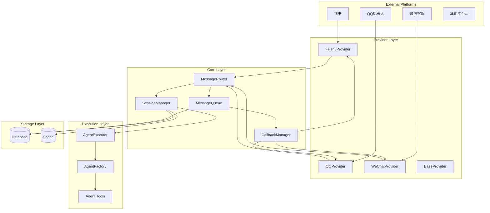
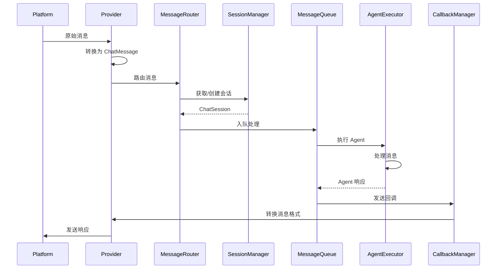
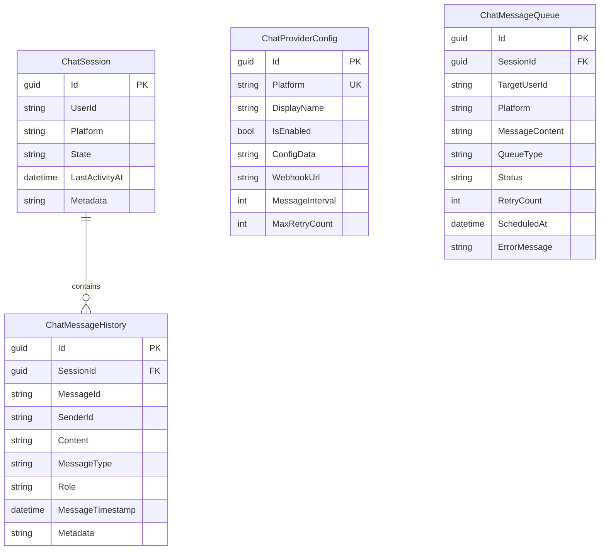
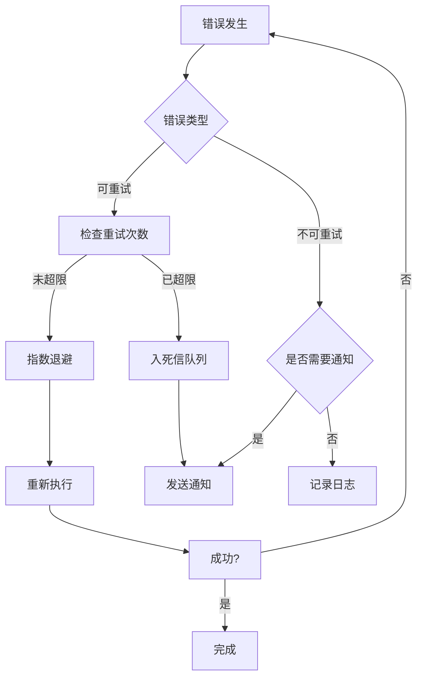

# Design Document: Multi-Platform Agent Chat System

## Overview

本设计文档描述了 OpenDeepWiki 多平台 Agent Chat 系统的技术架构。系统采用分层架构，通过统一的消息抽象层和可扩展的 Provider 机制，实现对多种第三方对话平台的支持。

核心设计原则：
- **平台无关性**：通过消息抽象层屏蔽平台差异
- **可扩展性**：通过 Provider 接口支持新平台接入
- **异步处理**：通过后台任务和消息队列保证系统稳定性
- **松耦合**：各组件通过接口交互，便于测试和维护

## Architecture

### 系统架构图



### 消息处理流程



## Components and Interfaces

### 1. 消息抽象层

#### IChatMessage 接口

```csharp
namespace OpenDeepWiki.Chat.Abstractions;

/// <summary>
/// 统一消息抽象接口
/// </summary>
public interface IChatMessage
{
    /// <summary>
    /// 消息唯一标识
    /// </summary>
    string MessageId { get; }
    
    /// <summary>
    /// 发送者标识（平台用户ID）
    /// </summary>
    string SenderId { get; }
    
    /// <summary>
    /// 接收者标识（可选，用于群聊场景）
    /// </summary>
    string? ReceiverId { get; }
    
    /// <summary>
    /// 消息内容
    /// </summary>
    string Content { get; }
    
    /// <summary>
    /// 消息类型
    /// </summary>
    ChatMessageType MessageType { get; }
    
    /// <summary>
    /// 平台来源
    /// </summary>
    string Platform { get; }
    
    /// <summary>
    /// 消息时间戳
    /// </summary>
    DateTimeOffset Timestamp { get; }
    
    /// <summary>
    /// 附加数据（平台特定信息）
    /// </summary>
    IDictionary<string, object>? Metadata { get; }
}

/// <summary>
/// 消息类型枚举
/// </summary>
public enum ChatMessageType
{
    Text,
    Image,
    File,
    Audio,
    Video,
    RichText,
    Card,
    Unknown
}
```

#### ChatMessage 实现

```csharp
namespace OpenDeepWiki.Chat.Abstractions;

/// <summary>
/// 统一消息实现
/// </summary>
public class ChatMessage : IChatMessage
{
    public string MessageId { get; init; } = Guid.NewGuid().ToString();
    public string SenderId { get; init; } = string.Empty;
    public string? ReceiverId { get; init; }
    public string Content { get; init; } = string.Empty;
    public ChatMessageType MessageType { get; init; } = ChatMessageType.Text;
    public string Platform { get; init; } = string.Empty;
    public DateTimeOffset Timestamp { get; init; } = DateTimeOffset.UtcNow;
    public IDictionary<string, object>? Metadata { get; init; }
}
```

### 2. Provider 抽象层

#### IMessageProvider 接口

```csharp
namespace OpenDeepWiki.Chat.Providers;

/// <summary>
/// 消息提供者接口
/// </summary>
public interface IMessageProvider
{
    /// <summary>
    /// 平台标识符
    /// </summary>
    string PlatformId { get; }
    
    /// <summary>
    /// 平台显示名称
    /// </summary>
    string DisplayName { get; }
    
    /// <summary>
    /// 是否已启用
    /// </summary>
    bool IsEnabled { get; }
    
    /// <summary>
    /// 初始化 Provider
    /// </summary>
    Task InitializeAsync(CancellationToken cancellationToken = default);
    
    /// <summary>
    /// 解析平台原始消息为统一格式
    /// </summary>
    Task<IChatMessage?> ParseMessageAsync(string rawMessage, CancellationToken cancellationToken = default);
    
    /// <summary>
    /// 发送消息到平台
    /// </summary>
    Task<SendResult> SendMessageAsync(IChatMessage message, string targetUserId, CancellationToken cancellationToken = default);
    
    /// <summary>
    /// 批量发送消息
    /// </summary>
    Task<IEnumerable<SendResult>> SendMessagesAsync(IEnumerable<IChatMessage> messages, string targetUserId, CancellationToken cancellationToken = default);
    
    /// <summary>
    /// 验证 Webhook 请求
    /// </summary>
    Task<WebhookValidationResult> ValidateWebhookAsync(HttpRequest request, CancellationToken cancellationToken = default);
    
    /// <summary>
    /// 关闭 Provider
    /// </summary>
    Task ShutdownAsync(CancellationToken cancellationToken = default);
}

/// <summary>
/// 发送结果
/// </summary>
public record SendResult(
    bool Success,
    string? MessageId = null,
    string? ErrorCode = null,
    string? ErrorMessage = null,
    bool ShouldRetry = false
);

/// <summary>
/// Webhook 验证结果
/// </summary>
public record WebhookValidationResult(
    bool IsValid,
    string? Challenge = null,
    string? ErrorMessage = null
);
```

#### BaseMessageProvider 抽象基类

```csharp
namespace OpenDeepWiki.Chat.Providers;

/// <summary>
/// Provider 基类，提供通用实现
/// </summary>
public abstract class BaseMessageProvider : IMessageProvider
{
    protected readonly ILogger Logger;
    protected readonly IOptions<ProviderOptions> Options;
    
    public abstract string PlatformId { get; }
    public abstract string DisplayName { get; }
    public virtual bool IsEnabled => Options.Value.Enabled;
    
    protected BaseMessageProvider(ILogger logger, IOptions<ProviderOptions> options)
    {
        Logger = logger;
        Options = options;
    }
    
    public virtual Task InitializeAsync(CancellationToken cancellationToken = default)
    {
        Logger.LogInformation("Initializing {Provider}", DisplayName);
        return Task.CompletedTask;
    }
    
    public abstract Task<IChatMessage?> ParseMessageAsync(string rawMessage, CancellationToken cancellationToken = default);
    
    public abstract Task<SendResult> SendMessageAsync(IChatMessage message, string targetUserId, CancellationToken cancellationToken = default);
    
    public virtual async Task<IEnumerable<SendResult>> SendMessagesAsync(
        IEnumerable<IChatMessage> messages, 
        string targetUserId, 
        CancellationToken cancellationToken = default)
    {
        var results = new List<SendResult>();
        foreach (var message in messages)
        {
            var result = await SendMessageAsync(message, targetUserId, cancellationToken);
            results.Add(result);
            
            if (!result.Success && !result.ShouldRetry)
                break;
                
            // 默认消息间隔
            await Task.Delay(Options.Value.MessageInterval, cancellationToken);
        }
        return results;
    }
    
    public virtual Task<WebhookValidationResult> ValidateWebhookAsync(HttpRequest request, CancellationToken cancellationToken = default)
    {
        return Task.FromResult(new WebhookValidationResult(true));
    }
    
    public virtual Task ShutdownAsync(CancellationToken cancellationToken = default)
    {
        Logger.LogInformation("Shutting down {Provider}", DisplayName);
        return Task.CompletedTask;
    }
    
    /// <summary>
    /// 消息类型降级处理
    /// </summary>
    protected virtual IChatMessage DegradeMessage(IChatMessage message)
    {
        if (message.MessageType == ChatMessageType.Text)
            return message;
            
        Logger.LogWarning("Message type {Type} not supported, degrading to text", message.MessageType);
        return new ChatMessage
        {
            MessageId = message.MessageId,
            SenderId = message.SenderId,
            ReceiverId = message.ReceiverId,
            Content = $"[{message.MessageType}] {message.Content}",
            MessageType = ChatMessageType.Text,
            Platform = message.Platform,
            Timestamp = message.Timestamp,
            Metadata = message.Metadata
        };
    }
}
```

### 3. 会话管理

#### IChatSession 接口

```csharp
namespace OpenDeepWiki.Chat.Sessions;

/// <summary>
/// 对话会话接口
/// </summary>
public interface IChatSession
{
    /// <summary>
    /// 会话唯一标识
    /// </summary>
    string SessionId { get; }
    
    /// <summary>
    /// 用户标识
    /// </summary>
    string UserId { get; }
    
    /// <summary>
    /// 平台标识
    /// </summary>
    string Platform { get; }
    
    /// <summary>
    /// 会话状态
    /// </summary>
    SessionState State { get; }
    
    /// <summary>
    /// 对话历史
    /// </summary>
    IReadOnlyList<IChatMessage> History { get; }
    
    /// <summary>
    /// 创建时间
    /// </summary>
    DateTimeOffset CreatedAt { get; }
    
    /// <summary>
    /// 最后活动时间
    /// </summary>
    DateTimeOffset LastActivityAt { get; }
    
    /// <summary>
    /// 会话元数据
    /// </summary>
    IDictionary<string, object>? Metadata { get; }
    
    /// <summary>
    /// 添加消息到历史
    /// </summary>
    void AddMessage(IChatMessage message);
    
    /// <summary>
    /// 清空历史
    /// </summary>
    void ClearHistory();
    
    /// <summary>
    /// 更新状态
    /// </summary>
    void UpdateState(SessionState state);
}

/// <summary>
/// 会话状态
/// </summary>
public enum SessionState
{
    Active,
    Processing,
    Waiting,
    Expired,
    Closed
}
```

#### ISessionManager 接口

```csharp
namespace OpenDeepWiki.Chat.Sessions;

/// <summary>
/// 会话管理器接口
/// </summary>
public interface ISessionManager
{
    /// <summary>
    /// 获取或创建会话
    /// </summary>
    Task<IChatSession> GetOrCreateSessionAsync(string userId, string platform, CancellationToken cancellationToken = default);
    
    /// <summary>
    /// 获取会话
    /// </summary>
    Task<IChatSession?> GetSessionAsync(string sessionId, CancellationToken cancellationToken = default);
    
    /// <summary>
    /// 更新会话
    /// </summary>
    Task UpdateSessionAsync(IChatSession session, CancellationToken cancellationToken = default);
    
    /// <summary>
    /// 关闭会话
    /// </summary>
    Task CloseSessionAsync(string sessionId, CancellationToken cancellationToken = default);
    
    /// <summary>
    /// 清理过期会话
    /// </summary>
    Task CleanupExpiredSessionsAsync(CancellationToken cancellationToken = default);
}
```

### 4. 消息队列与回调

#### IMessageQueue 接口

```csharp
namespace OpenDeepWiki.Chat.Queue;

/// <summary>
/// 消息队列接口
/// </summary>
public interface IMessageQueue
{
    /// <summary>
    /// 入队消息
    /// </summary>
    Task EnqueueAsync(QueuedMessage message, CancellationToken cancellationToken = default);
    
    /// <summary>
    /// 出队消息
    /// </summary>
    Task<QueuedMessage?> DequeueAsync(CancellationToken cancellationToken = default);
    
    /// <summary>
    /// 获取队列长度
    /// </summary>
    Task<int> GetQueueLengthAsync(CancellationToken cancellationToken = default);
    
    /// <summary>
    /// 标记消息完成
    /// </summary>
    Task CompleteAsync(string messageId, CancellationToken cancellationToken = default);
    
    /// <summary>
    /// 标记消息失败
    /// </summary>
    Task FailAsync(string messageId, string reason, CancellationToken cancellationToken = default);
}

/// <summary>
/// 队列消息
/// </summary>
public record QueuedMessage(
    string Id,
    IChatMessage Message,
    string SessionId,
    string TargetUserId,
    QueuedMessageType Type,
    int RetryCount = 0,
    DateTimeOffset? ScheduledAt = null
);

/// <summary>
/// 队列消息类型
/// </summary>
public enum QueuedMessageType
{
    Incoming,
    Outgoing,
    Retry
}
```

#### IMessageCallback 接口

```csharp
namespace OpenDeepWiki.Chat.Callbacks;

/// <summary>
/// 消息回调接口
/// </summary>
public interface IMessageCallback
{
    /// <summary>
    /// 发送消息给用户
    /// </summary>
    Task<SendResult> SendAsync(string platform, string userId, IChatMessage message, CancellationToken cancellationToken = default);
    
    /// <summary>
    /// 批量发送消息给用户
    /// </summary>
    Task<IEnumerable<SendResult>> SendBatchAsync(string platform, string userId, IEnumerable<IChatMessage> messages, CancellationToken cancellationToken = default);
    
    /// <summary>
    /// 发送流式消息（实时输出）
    /// </summary>
    IAsyncEnumerable<SendResult> SendStreamAsync(string platform, string userId, IAsyncEnumerable<string> contentStream, CancellationToken cancellationToken = default);
}
```

### 5. Agent 执行器

#### IAgentExecutor 接口

```csharp
namespace OpenDeepWiki.Chat.Execution;

/// <summary>
/// Agent 执行器接口
/// </summary>
public interface IAgentExecutor
{
    /// <summary>
    /// 执行 Agent 处理消息
    /// </summary>
    Task<AgentResponse> ExecuteAsync(
        IChatMessage message, 
        IChatSession session, 
        CancellationToken cancellationToken = default);
    
    /// <summary>
    /// 流式执行 Agent
    /// </summary>
    IAsyncEnumerable<AgentResponseChunk> ExecuteStreamAsync(
        IChatMessage message, 
        IChatSession session, 
        CancellationToken cancellationToken = default);
}

/// <summary>
/// Agent 响应
/// </summary>
public record AgentResponse(
    bool Success,
    IEnumerable<IChatMessage> Messages,
    string? ErrorMessage = null
);

/// <summary>
/// Agent 响应块（流式）
/// </summary>
public record AgentResponseChunk(
    string Content,
    bool IsComplete,
    string? ErrorMessage = null
);
```

### 6. 消息路由

#### IMessageRouter 接口

```csharp
namespace OpenDeepWiki.Chat.Routing;

/// <summary>
/// 消息路由器接口
/// </summary>
public interface IMessageRouter
{
    /// <summary>
    /// 路由入站消息
    /// </summary>
    Task RouteIncomingAsync(IChatMessage message, CancellationToken cancellationToken = default);
    
    /// <summary>
    /// 路由出站消息
    /// </summary>
    Task RouteOutgoingAsync(IChatMessage message, string targetUserId, CancellationToken cancellationToken = default);
    
    /// <summary>
    /// 获取指定平台的 Provider
    /// </summary>
    IMessageProvider? GetProvider(string platform);
    
    /// <summary>
    /// 获取所有已注册的 Provider
    /// </summary>
    IEnumerable<IMessageProvider> GetAllProviders();
}
```

## Data Models

### 实体定义

#### ChatSession 实体

```csharp
namespace OpenDeepWiki.Entities.Chat;

/// <summary>
/// 对话会话实体
/// </summary>
public class ChatSession : AggregateRoot<Guid>
{
    /// <summary>
    /// 用户标识（平台用户ID）
    /// </summary>
    public string UserId { get; set; } = string.Empty;
    
    /// <summary>
    /// 平台标识
    /// </summary>
    public string Platform { get; set; } = string.Empty;
    
    /// <summary>
    /// 会话状态
    /// </summary>
    public string State { get; set; } = "Active";
    
    /// <summary>
    /// 最后活动时间
    /// </summary>
    public DateTime LastActivityAt { get; set; } = DateTime.UtcNow;
    
    /// <summary>
    /// 会话元数据（JSON）
    /// </summary>
    public string? Metadata { get; set; }
    
    /// <summary>
    /// 关联的消息历史
    /// </summary>
    public virtual ICollection<ChatMessageHistory> Messages { get; set; } = new List<ChatMessageHistory>();
}
```

#### ChatMessageHistory 实体

```csharp
namespace OpenDeepWiki.Entities.Chat;

/// <summary>
/// 消息历史实体
/// </summary>
public class ChatMessageHistory : AggregateRoot<Guid>
{
    /// <summary>
    /// 关联的会话ID
    /// </summary>
    public Guid SessionId { get; set; }
    
    /// <summary>
    /// 消息ID（平台消息ID）
    /// </summary>
    public string MessageId { get; set; } = string.Empty;
    
    /// <summary>
    /// 发送者标识
    /// </summary>
    public string SenderId { get; set; } = string.Empty;
    
    /// <summary>
    /// 消息内容
    /// </summary>
    public string Content { get; set; } = string.Empty;
    
    /// <summary>
    /// 消息类型
    /// </summary>
    public string MessageType { get; set; } = "Text";
    
    /// <summary>
    /// 消息角色（User/Assistant）
    /// </summary>
    public string Role { get; set; } = "User";
    
    /// <summary>
    /// 消息时间戳
    /// </summary>
    public DateTime MessageTimestamp { get; set; }
    
    /// <summary>
    /// 消息元数据（JSON）
    /// </summary>
    public string? Metadata { get; set; }
    
    /// <summary>
    /// 关联的会话
    /// </summary>
    public virtual ChatSession Session { get; set; } = null!;
}
```

#### ChatProviderConfig 实体

```csharp
namespace OpenDeepWiki.Entities.Chat;

/// <summary>
/// Provider 配置实体
/// </summary>
public class ChatProviderConfig : AggregateRoot<Guid>
{
    /// <summary>
    /// 平台标识
    /// </summary>
    public string Platform { get; set; } = string.Empty;
    
    /// <summary>
    /// 显示名称
    /// </summary>
    public string DisplayName { get; set; } = string.Empty;
    
    /// <summary>
    /// 是否启用
    /// </summary>
    public bool IsEnabled { get; set; } = true;
    
    /// <summary>
    /// 配置数据（加密JSON）
    /// </summary>
    public string ConfigData { get; set; } = string.Empty;
    
    /// <summary>
    /// Webhook URL
    /// </summary>
    public string? WebhookUrl { get; set; }
    
    /// <summary>
    /// 消息发送间隔（毫秒）
    /// </summary>
    public int MessageInterval { get; set; } = 500;
    
    /// <summary>
    /// 最大重试次数
    /// </summary>
    public int MaxRetryCount { get; set; } = 3;
}
```

#### ChatMessageQueue 实体

```csharp
namespace OpenDeepWiki.Entities.Chat;

/// <summary>
/// 消息队列实体
/// </summary>
public class ChatMessageQueue : AggregateRoot<Guid>
{
    /// <summary>
    /// 关联的会话ID
    /// </summary>
    public Guid? SessionId { get; set; }
    
    /// <summary>
    /// 目标用户ID
    /// </summary>
    public string TargetUserId { get; set; } = string.Empty;
    
    /// <summary>
    /// 平台标识
    /// </summary>
    public string Platform { get; set; } = string.Empty;
    
    /// <summary>
    /// 消息内容（JSON）
    /// </summary>
    public string MessageContent { get; set; } = string.Empty;
    
    /// <summary>
    /// 队列类型（Incoming/Outgoing/Retry）
    /// </summary>
    public string QueueType { get; set; } = "Incoming";
    
    /// <summary>
    /// 处理状态（Pending/Processing/Completed/Failed）
    /// </summary>
    public string Status { get; set; } = "Pending";
    
    /// <summary>
    /// 重试次数
    /// </summary>
    public int RetryCount { get; set; } = 0;
    
    /// <summary>
    /// 计划执行时间
    /// </summary>
    public DateTime? ScheduledAt { get; set; }
    
    /// <summary>
    /// 错误信息
    /// </summary>
    public string? ErrorMessage { get; set; }
}
```

### 数据库关系图




## Correctness Properties

*A property is a characteristic or behavior that should hold true across all valid executions of a system—essentially, a formal statement about what the system should do. Properties serve as the bridge between human-readable specifications and machine-verifiable correctness guarantees.*

### Property 1: 消息字段完整性

*For any* ChatMessage 对象，所有必需字段（MessageId、SenderId、Content、MessageType、Platform、Timestamp）都必须存在且非空。

**Validates: Requirements 1.1**

### Property 2: 消息转换往返一致性

*For any* 有效的 ChatMessage，将其转换为平台特定格式后再转换回 ChatMessage，关键字段（SenderId、Content、MessageType）应保持一致。

**Validates: Requirements 1.2, 1.3**

### Property 3: 消息类型降级正确性

*For any* 不被目标平台支持的消息类型，降级后的消息类型必须为 Text，且原始内容信息应被保留在降级后的 Content 中。

**Validates: Requirements 1.5**

### Property 4: Provider 路由正确性

*For any* 消息和已注册的 Provider 集合，消息应被路由到与其 Platform 字段匹配的 Provider。

**Validates: Requirements 2.3, 7.2**

### Property 5: Provider 启用/禁用状态一致性

*For any* Provider，启用或禁用操作后，其 IsEnabled 状态应立即反映变更，且只有启用的 Provider 才能处理消息。

**Validates: Requirements 2.5**

### Property 6: 会话查找/创建幂等性

*For any* 用户标识和平台组合，多次调用 GetOrCreateSession 应返回相同的会话实例（相同 SessionId）。

**Validates: Requirements 6.2**

### Property 7: 会话历史限制

*For any* 配置了最大历史消息数量 N 的会话，添加消息后历史记录数量不应超过 N。

**Validates: Requirements 6.3**

### Property 8: 会话持久化往返一致性

*For any* 有效的 ChatSession，保存到数据库后再加载，所有字段（UserId、Platform、State、History）应保持一致。

**Validates: Requirements 6.5**

### Property 9: 消息队列顺序保持

*For any* 按顺序入队的消息序列，出队顺序应与入队顺序一致（FIFO）。

**Validates: Requirements 8.1**

### Property 10: 消息重试机制

*For any* 发送失败的消息，如果 ShouldRetry 为 true，消息应被加入重试队列，且 RetryCount 应递增。

**Validates: Requirements 7.4, 8.5**

### Property 11: 消息合并正确性

*For any* 多条连续的短文本消息（总长度不超过阈值），合并后的消息内容应包含所有原始消息的内容，且顺序保持不变。

**Validates: Requirements 8.4**

### Property 12: Agent 上下文传递完整性

*For any* Agent 执行请求，传递给 Agent 的上下文应包含当前消息和会话历史中的所有消息。

**Validates: Requirements 9.1, 9.3**

### Property 13: Agent 错误处理

*For any* Agent 执行错误，返回的响应应包含友好的错误消息，且 Success 字段为 false。

**Validates: Requirements 9.4**

### Property 14: 异步消息确认

*For any* 收到的平台消息，系统应在将消息入队后立即返回确认，入队操作不应阻塞。

**Validates: Requirements 10.1**

### Property 15: 死信队列处理

*For any* 处理失败且超过最大重试次数的消息，应被移入死信队列，且原队列中不再包含该消息。

**Validates: Requirements 10.4**

### Property 16: 配置持久化往返一致性

*For any* 有效的 ProviderConfig，保存到数据库后再加载，所有非敏感字段应保持一致。

**Validates: Requirements 11.2**

### Property 17: 敏感配置加密

*For any* 包含敏感信息（如 API 密钥）的配置，存储到数据库的值应与原始值不同（已加密），且解密后应与原始值一致。

**Validates: Requirements 11.4**

### Property 18: 配置热重载

*For any* 配置变更，变更后获取的配置值应反映最新的变更，无需重启服务。

**Validates: Requirements 11.3**

### Property 19: 配置验证完整性

*For any* 缺少必要配置项的 ProviderConfig，验证应失败并返回明确的错误信息，指出缺少的配置项。

**Validates: Requirements 11.5**

## Error Handling

### 错误分类

| 错误类型 | 处理策略 | 重试 | 用户通知 |
|---------|---------|------|---------|
| 网络超时 | 指数退避重试 | 是 | 否（静默重试） |
| API 限流 | 延迟后重试 | 是 | 否 |
| 认证失败 | 记录错误，禁用 Provider | 否 | 是（管理员） |
| 消息格式错误 | 降级处理 | 否 | 否 |
| Agent 执行错误 | 返回友好错误 | 否 | 是 |
| 数据库错误 | 重试后入死信队列 | 是 | 是（管理员） |

### 错误处理流程



### 异常类型定义

```csharp
namespace OpenDeepWiki.Chat.Exceptions;

/// <summary>
/// Chat 系统基础异常
/// </summary>
public class ChatException : Exception
{
    public string ErrorCode { get; }
    public bool ShouldRetry { get; }
    
    public ChatException(string message, string errorCode, bool shouldRetry = false)
        : base(message)
    {
        ErrorCode = errorCode;
        ShouldRetry = shouldRetry;
    }
}

/// <summary>
/// Provider 异常
/// </summary>
public class ProviderException : ChatException
{
    public string Platform { get; }
    
    public ProviderException(string platform, string message, string errorCode, bool shouldRetry = false)
        : base(message, errorCode, shouldRetry)
    {
        Platform = platform;
    }
}

/// <summary>
/// 消息发送异常
/// </summary>
public class MessageSendException : ProviderException
{
    public string? MessageId { get; }
    
    public MessageSendException(string platform, string? messageId, string message, string errorCode, bool shouldRetry = true)
        : base(platform, message, errorCode, shouldRetry)
    {
        MessageId = messageId;
    }
}

/// <summary>
/// 限流异常
/// </summary>
public class RateLimitException : ProviderException
{
    public TimeSpan RetryAfter { get; }
    
    public RateLimitException(string platform, TimeSpan retryAfter)
        : base(platform, "Rate limit exceeded", "RATE_LIMIT", shouldRetry: true)
    {
        RetryAfter = retryAfter;
    }
}
```

## Testing Strategy

### 测试框架

- **单元测试**: xUnit + Moq
- **属性测试**: FsCheck
- **集成测试**: xUnit + TestContainers（数据库）

### 测试分层

```
┌─────────────────────────────────────────┐
│           集成测试 (E2E)                 │
│    - Provider Webhook 端点测试           │
│    - 完整消息处理流程测试                │
├─────────────────────────────────────────┤
│           组件测试                       │
│    - SessionManager + 数据库             │
│    - MessageQueue + 数据库               │
├─────────────────────────────────────────┤
│           单元测试 + 属性测试            │
│    - 消息转换逻辑                        │
│    - 路由逻辑                            │
│    - 队列顺序                            │
│    - 配置验证                            │
└─────────────────────────────────────────┘
```

### 属性测试配置

- 每个属性测试运行 **100 次迭代**
- 使用 FsCheck 生成随机测试数据
- 测试标签格式: `Feature: multi-platform-agent-chat, Property N: {property_text}`

### 测试覆盖要求

| 组件 | 单元测试 | 属性测试 | 集成测试 |
|-----|---------|---------|---------|
| ChatMessage | ✓ | ✓ (Property 1, 2) | - |
| MessageProvider | ✓ | ✓ (Property 3, 4, 5) | ✓ |
| SessionManager | ✓ | ✓ (Property 6, 7, 8) | ✓ |
| MessageQueue | ✓ | ✓ (Property 9, 10, 11) | ✓ |
| AgentExecutor | ✓ | ✓ (Property 12, 13) | ✓ |
| ConfigManager | ✓ | ✓ (Property 16, 17, 18, 19) | - |

### 示例属性测试

```csharp
using FsCheck;
using FsCheck.Xunit;

namespace OpenDeepWiki.Tests.Chat;

/// <summary>
/// Feature: multi-platform-agent-chat, Property 9: 消息队列顺序保持
/// </summary>
public class MessageQueuePropertyTests
{
    [Property(MaxTest = 100)]
    public Property MessageQueue_ShouldMaintainFIFOOrder()
    {
        return Prop.ForAll(
            Arb.From<List<string>>().Filter(l => l.Count > 0 && l.Count <= 100),
            messages =>
            {
                var queue = new InMemoryMessageQueue();
                
                // 入队
                foreach (var msg in messages)
                {
                    queue.EnqueueAsync(CreateQueuedMessage(msg)).Wait();
                }
                
                // 出队并验证顺序
                var dequeued = new List<string>();
                while (queue.GetQueueLengthAsync().Result > 0)
                {
                    var item = queue.DequeueAsync().Result;
                    if (item != null)
                        dequeued.Add(item.Message.Content);
                }
                
                return messages.SequenceEqual(dequeued);
            });
    }
    
    private static QueuedMessage CreateQueuedMessage(string content)
    {
        return new QueuedMessage(
            Guid.NewGuid().ToString(),
            new ChatMessage { Content = content },
            Guid.NewGuid().ToString(),
            "user123",
            QueuedMessageType.Outgoing
        );
    }
}
```
