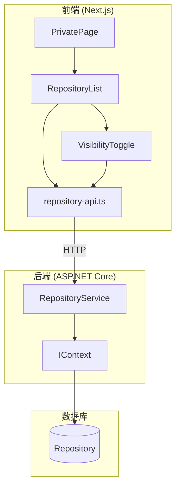

# 设计文档

## 概述

私有仓库管理功能为用户提供一个集中的界面来管理其提交的所有仓库。该功能基于现有的 `RepositoryList` 组件进行扩展，添加可见性切换功能，并确保安全性约束（无密码仓库不能设为私有）。

系统采用前后端分离架构：
- **前端**：Next.js + TypeScript，使用现有UI组件库
- **后端**：ASP.NET Core API，使用Entity Framework Core

## 架构



## 组件和接口

### 前端组件

#### 1. VisibilityToggle 组件

新增组件，用于切换仓库可见性。

```typescript
interface VisibilityToggleProps {
  repositoryId: string;
  isPublic: boolean;
  hasPassword: boolean;
  onVisibilityChange: (newIsPublic: boolean) => void;
  disabled?: boolean;
}
```

#### 2. RepositoryList 组件扩展

扩展现有组件，添加可见性切换功能。

```typescript
interface RepositoryItemResponse {
  id: string;
  orgName: string;
  repoName: string;
  gitUrl: string;
  status: number;
  statusName: RepositoryStatus;
  isPublic: boolean;
  hasPassword: boolean;  // 新增字段
  createdAt: string;
  updatedAt?: string;
}
```

### 后端接口

#### 1. 更新可见性API

```csharp
// POST /api/v1/repositories/visibility
public class UpdateVisibilityRequest
{
    public string RepositoryId { get; set; }
    public bool IsPublic { get; set; }
    public string OwnerUserId { get; set; }  // 用于验证所有权
}

public class UpdateVisibilityResponse
{
    public string Id { get; set; }
    public bool IsPublic { get; set; }
    public bool Success { get; set; }
    public string? ErrorMessage { get; set; }
}
```

#### 2. 仓库列表响应扩展

```csharp
public class RepositoryItemResponse
{
    // 现有字段...
    public bool HasPassword { get; set; }  // 新增：是否设置了密码
}
```

## 数据模型

### 现有实体（无需修改）

```csharp
public class Repository : AggregateRoot<string>
{
    public string OwnerUserId { get; set; }
    public string GitUrl { get; set; }
    public string RepoName { get; set; }
    public string OrgName { get; set; }
    public string? AuthAccount { get; set; }
    public string? AuthPassword { get; set; }  // 用于判断是否可设为私有
    public bool IsPublic { get; set; }
    public RepositoryStatus Status { get; set; }
    // ...
}
```

### 前端类型扩展

```typescript
// web/types/repository.ts
export interface RepositoryItemResponse {
  id: string;
  orgName: string;
  repoName: string;
  gitUrl: string;
  status: number;
  statusName: RepositoryStatus;
  isPublic: boolean;
  hasPassword: boolean;  // 新增
  createdAt: string;
  updatedAt?: string;
}

export interface UpdateVisibilityRequest {
  repositoryId: string;
  isPublic: boolean;
  ownerUserId: string;
}

export interface UpdateVisibilityResponse {
  id: string;
  isPublic: boolean;
  success: boolean;
  errorMessage?: string;
}
```


## 正确性属性

*正确性属性是一种特征或行为，应该在系统的所有有效执行中保持为真——本质上是关于系统应该做什么的形式化陈述。属性作为人类可读规范和机器可验证正确性保证之间的桥梁。*

### Property 1: 仓库列表所有权过滤

*对于任意*用户ID和仓库列表请求，返回的所有仓库的 `OwnerUserId` 都应该等于请求中指定的用户ID。

**验证: 需求 1.1**

### Property 2: 仓库列表项信息完整性

*对于任意*仓库实体，渲染后的列表项字符串应该包含仓库名称、组织名、Git地址、状态名称和可见性标识。

**验证: 需求 1.5**

### Property 3: 无密码仓库私有化限制

*对于任意*仓库，如果其 `AuthPassword` 为空或null，则将 `IsPublic` 设置为 `false` 的请求应该被拒绝并返回验证错误。

**验证: 需求 3.1, 3.2, 3.4, 5.3**

### Property 4: Wiki按钮显示条件

*对于任意*仓库，"查看Wiki"按钮的显示状态应该等于 `(status === "Completed")`。

**验证: 需求 4.1, 4.3**

### Property 5: Wiki导航URL正确性

*对于任意*包含特殊字符的 `orgName` 和 `repoName`，生成的Wiki导航URL应该正确编码，且解码后能还原原始值。

**验证: 需求 4.2, 4.4**

### Property 6: 仓库所有权验证

*对于任意*可见性更新请求，如果请求中的 `OwnerUserId` 与仓库的 `OwnerUserId` 不匹配，则请求应该被拒绝。

**验证: 需求 5.2**

### Property 7: 可见性更新持久化一致性

*对于任意*有效的可见性更新请求（有密码的仓库或设为公开），更新后查询该仓库的 `IsPublic` 字段应该等于请求中指定的值。

**验证: 需求 5.4, 5.5**

### Property 8: 请求序列化往返一致性

*对于任意* `UpdateVisibilityRequest` 对象，JSON序列化后再反序列化应该产生等价的对象。

**验证: 需求 5.6**

## 错误处理

### 前端错误处理

| 错误场景 | 处理方式 |
|---------|---------|
| 仓库列表加载失败 | 显示错误信息和重试按钮 |
| 可见性更新失败 | 显示Toast错误提示，保持原状态 |
| 网络超时 | 显示网络错误提示，允许重试 |
| 无密码仓库尝试私有化 | 禁用切换按钮，显示Tooltip说明原因 |

### 后端错误处理

| 错误场景 | HTTP状态码 | 错误消息 |
|---------|-----------|---------|
| 仓库不存在 | 404 | "仓库不存在" |
| 非仓库所有者 | 403 | "无权限修改此仓库" |
| 无密码仓库设为私有 | 400 | "仓库凭据为空时不允许设置为私有" |
| 数据库错误 | 500 | "服务器内部错误" |

## 测试策略

### 双重测试方法

本功能采用单元测试和属性测试相结合的方式：

- **单元测试**: 验证特定示例、边界情况和错误条件
- **属性测试**: 验证跨所有输入的通用属性

### 属性测试配置

- **测试框架**: xUnit + FsCheck (C#后端)
- **最小迭代次数**: 每个属性测试100次
- **标签格式**: `Feature: private-repository-management, Property {number}: {property_text}`

### 测试覆盖计划

#### 后端测试 (C# / xUnit + FsCheck)

1. **Property 3 测试**: 无密码仓库私有化限制
   - 生成随机的无密码仓库
   - 验证私有化请求被拒绝

2. **Property 6 测试**: 仓库所有权验证
   - 生成随机的用户ID和仓库
   - 验证非所有者请求被拒绝

3. **Property 7 测试**: 可见性更新持久化一致性
   - 生成随机的有效更新请求
   - 验证数据库状态与请求一致

4. **Property 8 测试**: 请求序列化往返一致性
   - 生成随机的请求对象
   - 验证JSON序列化/反序列化往返一致

#### 前端测试 (示例测试)

由于前端测试框架未配置，以下测试作为手动验证项：

1. 仓库列表加载和显示
2. 可见性切换交互
3. Wiki导航链接
4. 错误状态显示

### 边界情况

- 空仓库列表
- 特殊字符的仓库名称
- 并发可见性更新
- 网络中断恢复
