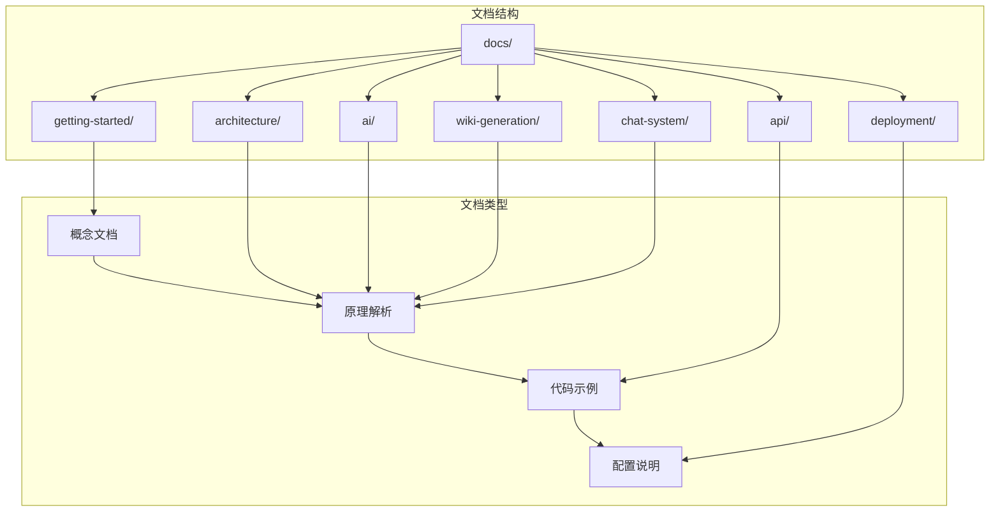
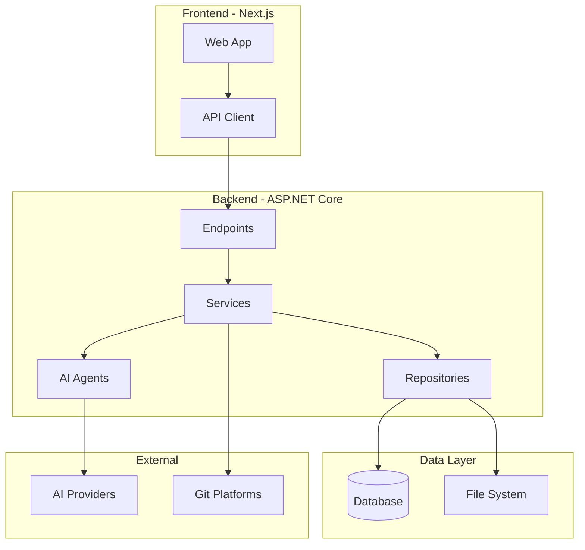
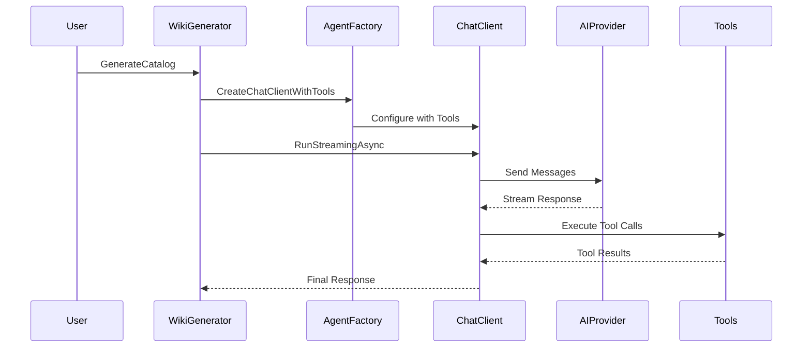
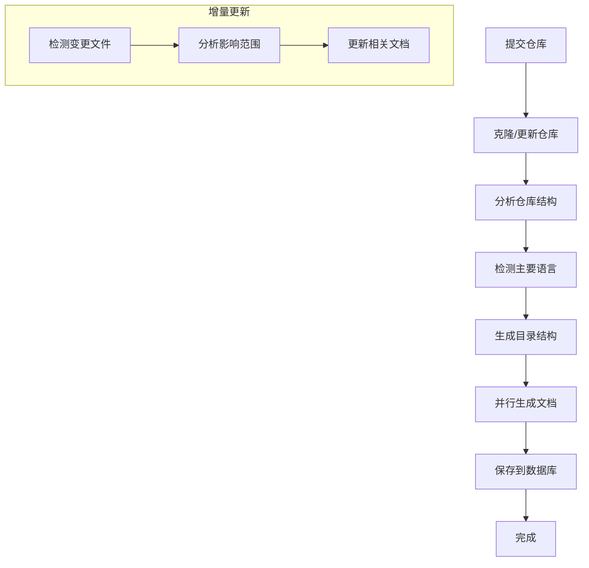
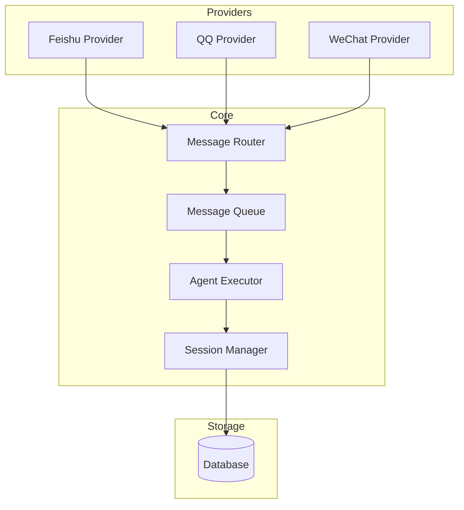

# Design Document

## Overview

本设计文档详细规划 OpenDeepWiki 项目技术文档的内容结构。每个文档以原理解析为核心，包含架构图、流程图、代码示例和配置说明。

## Architecture

## Components and Interfaces

### 1. Getting Started 模块

#### 1.1 introduction.md - 项目简介

**内容结构：**
- 项目定位与愿景
- 核心功能列表
- 技术栈概览（.NET 9, Next.js, Semantic Kernel）
- 与 DeepWiki 的关系
- 适用场景

**包含图表：**
- 功能架构图（Mermaid flowchart）
- 技术栈关系图

#### 1.2 quick-start.md - 快速启动

**内容结构：**
- 环境要求（Docker, .NET SDK, Node.js）
- 一键启动（docker-compose）
- 首次配置（API Key, 数据库）
- 添加第一个仓库
- 验证安装成功

**包含图表：**
- 启动流程图

#### 1.3 configuration.md - 环境配置

**内容结构：**
- 环境变量完整列表
- AI 模型配置（OpenAI/Azure/Anthropic）
- 数据库配置（SQLite/PostgreSQL/MySQL/SqlServer）
- 高级配置选项
- 配置示例

### 2. Architecture 模块

#### 2.1 overview.md - 系统架构总览

**内容结构：**
- 整体架构设计理念
- 前后端分离架构
- 核心模块划分
- 数据流向
- 扩展点设计

**包含图表：**

#### 2.2 backend-architecture.md - 后端架构原理

**内容结构：**
- ASP.NET Core Minimal APIs 设计
- 依赖注入配置
- 中间件管道
- 认证授权机制（JWT）
- 服务层设计模式
- 后台任务处理（HostedService）

**包含图表：**
- 请求处理管道图
- 服务依赖关系图

#### 2.3 frontend-architecture.md - 前端架构原理

**内容结构：**
- Next.js App Router 路由设计
- 页面组织结构
- 组件分层（UI/业务/布局）
- 数据获取模式（Server Components）
- 状态管理策略
- 国际化实现（next-intl）

**包含图表：**
- 路由结构图
- 组件层次图

#### 2.4 data-layer.md - 数据层架构

**内容结构：**
- EF Core 多数据库支持原理
- MasterDbContext 设计
- Provider 模式实现
- 实体模型设计
- 迁移策略

**包含图表：**
- 实体关系图（ER Diagram）
- 数据库适配器模式图

### 3. AI 模块

#### 3.1 agent-system.md - AI代理系统原理

**内容结构：**
- AgentFactory 设计原理
- ChatClientAgent 工作机制
- Tool 绑定与调用流程
- 流式响应处理
- Token 统计与限制
- 重试机制

**包含图表：**

#### 3.2 prompt-engineering.md - Prompt工程

**内容结构：**
- Prompt 模板系统设计
- FilePromptPlugin 实现
- 变量替换机制
- catalog-generator 模板解析
- content-generator 模板解析
- 最佳实践与调优

**包含图表：**
- Prompt 处理流程图

#### 3.3 tool-system.md - Tool系统

**内容结构：**
- AITool 接口设计
- GitTool 实现（ListFiles, Read, Grep）
- CatalogTool 实现（Read, Write, Edit）
- DocTool 实现（Read, Write, Edit）
- Tool 注册与发现机制

**包含图表：**
- Tool 类图
- Tool 调用序列图

#### 3.4 multi-provider.md - 多AI提供商适配

**内容结构：**
- AiRequestType 枚举设计
- OpenAI 适配实现
- Azure OpenAI 适配实现
- Anthropic 适配实现
- 配置切换机制
- 扩展新 Provider 指南

### 4. Wiki Generation 模块

#### 4.1 overview.md - Wiki生成流程总览

**内容结构：**
- 完整生成流程
- 各阶段职责
- 并行处理策略
- 错误处理机制

**包含图表：**

#### 4.2 repository-analyzer.md - 仓库分析原理

**内容结构：**
- RepositoryAnalyzer 设计
- LibGit2Sharp 集成
- 克隆与拉取策略
- 分支管理
- 文件变更检测
- 语言检测算法

#### 4.3 catalog-generator.md - 目录生成原理

**内容结构：**
- 目录生成 Prompt 设计
- 仓库上下文收集
- 入口点分析
- 目录结构设计原则
- CatalogStorage 实现

#### 4.4 content-generator.md - 内容生成原理

**内容结构：**
- 内容生成 Prompt 设计
- 源码分析策略
- Mermaid 图表生成
- 代码示例提取
- 文档质量保证

#### 4.5 incremental-update.md - 增量更新机制

**内容结构：**
- 增量更新触发条件
- 变更文件分析
- 影响范围评估
- 文档更新策略
- 性能优化

### 5. Chat System 模块

#### 5.1 overview.md - 聊天系统架构

**内容结构：**
- 多平台聊天系统设计
- 核心组件介绍
- 消息处理流程
- 扩展性设计

**包含图表：**

#### 5.2 provider-abstraction.md - Provider抽象层

**内容结构：**
- IMessageProvider 接口设计
- BaseMessageProvider 基类
- Provider 生命周期
- Webhook 验证机制
- 消息发送抽象

#### 5.3 message-queue.md - 消息队列与会话

**内容结构：**
- DatabaseMessageQueue 实现
- 消息合并策略
- 会话管理机制
- 死信处理
- 并发控制

#### 5.4 platform-integration.md - 平台集成

**内容结构：**
- 飞书 Provider 实现
- QQ Provider 实现
- 微信 Provider 实现
- 添加新平台指南

### 6. API 模块

#### 6.1 authentication.md - 认证授权API

**内容结构：**
- JWT 认证流程
- 登录/注册接口
- OAuth 集成
- 权限控制

#### 6.2 repository.md - 仓库管理API

**内容结构：**
- 仓库 CRUD 接口
- 分支管理接口
- 处理状态查询
- 重新生成接口

#### 6.3 wiki.md - Wiki文档API

**内容结构：**
- 目录查询接口
- 文档内容接口
- 搜索接口

#### 6.4 admin.md - 管理后台API

**内容结构：**
- 用户管理接口
- 角色权限接口
- 系统设置接口
- 统计数据接口

#### 6.5 mcp.md - MCP协议接口

**内容结构：**
- MCP 协议介绍
- SSE 端点实现
- Streamable HTTP 端点
- 配置示例

### 7. Deployment 模块

#### 7.1 docker-deployment.md - Docker部署

**内容结构：**
- docker-compose 配置解析
- 镜像构建
- 多架构支持
- 生产环境配置

#### 7.2 environment-variables.md - 环境变量

**内容结构：**
- 完整环境变量表
- 分类说明
- 配置示例

#### 7.3 database-migration.md - 数据库迁移

**内容结构：**
- EF Core 迁移命令
- 多数据库迁移
- 数据备份恢复

#### 7.4 troubleshooting.md - 问题排查

**内容结构：**
- 常见问题列表
- 日志分析
- 性能调优

## Data Models

文档使用 Markdown 格式，包含以下元素：
- 标题层级（H1-H4）
- 代码块（带语法高亮）
- Mermaid 图表
- 表格
- 列表

## Correctness Properties

*A property is a characteristic or behavior that should hold true across all valid executions of a system-essentially, a formal statement about what the system should do.*

由于本需求是文档生成，主要验证文档完整性和准确性：

Property 1: 文档结构完整性
*For any* 生成的文档，必须包含标题、概述、主要内容和相关链接四个基本部分
**Validates: Requirements 1-10**

Property 2: 代码示例准确性
*For any* 文档中的代码示例，必须来源于实际项目代码，不得虚构
**Validates: Requirements 2, 3, 4, 5**

Property 3: 图表与内容一致性
*For any* Mermaid 图表，其组件名称必须与实际代码中的类名/模块名一致
**Validates: Requirements 2, 3, 4, 5**

## Error Handling

- 如果源代码文件不存在，文档中标注"待补充"
- 如果 API 接口变更，需要同步更新文档
- 如果配置项变更，需要更新环境变量文档

## Testing Strategy

文档验证策略：
1. 人工审核文档结构完整性
2. 验证代码示例可编译/运行
3. 验证 Mermaid 图表可正确渲染
4. 验证链接有效性
