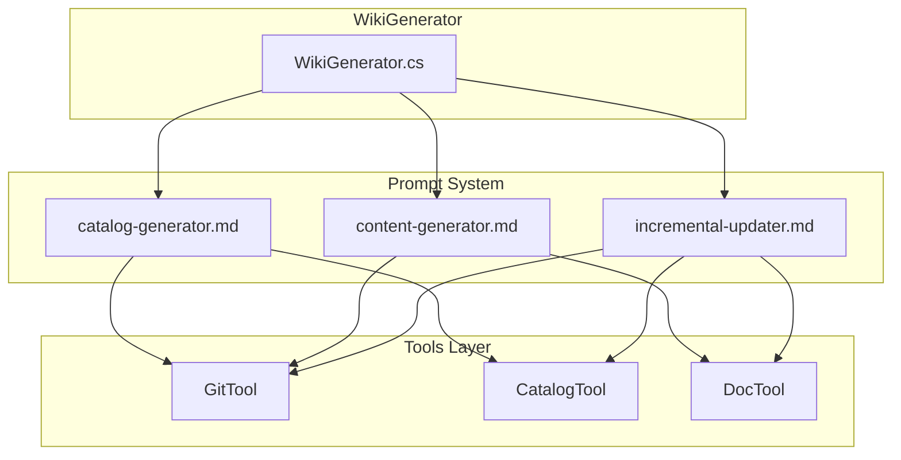

# 设计文档

## 概述

本设计文档描述了 OpenDeepWiki Wiki 生成提示词的优化方案。优化将重构三个核心提示词文件（catalog-generator.md、content-generator.md、incremental-updater.md），使其具有统一的结构、清晰的工具使用指导、完善的错误处理机制和高质量的输出规范。

## 架构

### 提示词系统架构



### 统一提示词结构

每个提示词将采用以下统一结构：

```
1. 角色定义 (Role Definition)
2. 上下文信息 (Context)
3. 可用工具 (Available Tools)
4. 任务说明 (Task Description)
5. 执行步骤 (Execution Steps)
6. 输出格式 (Output Format)
7. 错误处理 (Error Handling)
8. 质量检查 (Quality Checklist)
9. 示例 (Examples)
```

## 组件与接口

### 1. 目录生成器 (Catalog Generator)

**职责**：分析仓库结构，生成 Wiki 目录树

**输入变量**：
- `{{repository_name}}`: 仓库名称（格式：org/repo）
- `{{language}}`: 目标语言代码（如 zh、en）

**可用工具**：
- `GitTool.ListFiles(filePattern?)`: 列出仓库文件
- `GitTool.Read(relativePath)`: 读取文件内容
- `GitTool.Grep(pattern, filePattern?)`: 搜索代码
- `CatalogTool.ReadAsync()`: 读取现有目录
- `CatalogTool.WriteAsync(catalogJson)`: 写入目录结构

**输出**：JSON 格式的目录结构

### 2. 内容生成器 (Content Generator)

**职责**：为指定目录项生成 Markdown 文档

**输入变量**：
- `{{repository_name}}`: 仓库名称
- `{{language}}`: 目标语言代码
- `{{catalog_path}}`: 目录项路径
- `{{catalog_title}}`: 目录项标题

**可用工具**：
- `GitTool.ListFiles(filePattern?)`: 列出仓库文件
- `GitTool.Read(relativePath)`: 读取文件内容
- `GitTool.Grep(pattern, filePattern?)`: 搜索代码
- `DocTool.ReadAsync(catalogPath)`: 读取现有文档
- `DocTool.WriteAsync(catalogPath, content)`: 写入文档
- `DocTool.EditAsync(catalogPath, oldContent, newContent)`: 编辑文档

**输出**：Markdown 格式的文档内容

### 3. 增量更新器 (Incremental Updater)

**职责**：根据代码变更更新相关文档

**输入变量**：
- `{{repository_name}}`: 仓库名称
- `{{language}}`: 目标语言代码
- `{{previous_commit}}`: 上次提交 ID
- `{{current_commit}}`: 当前提交 ID
- `{{changed_files}}`: 变更文件列表

**可用工具**：
- `GitTool.ListFiles(filePattern?)`: 列出仓库文件
- `GitTool.Read(relativePath)`: 读取文件内容
- `GitTool.Grep(pattern, filePattern?)`: 搜索代码
- `CatalogTool.ReadAsync()`: 读取目录结构
- `CatalogTool.WriteAsync(catalogJson)`: 更新目录
- `CatalogTool.EditAsync(path, nodeJson)`: 编辑目录节点
- `DocTool.ReadAsync(catalogPath)`: 读取文档
- `DocTool.WriteAsync(catalogPath, content)`: 写入文档
- `DocTool.EditAsync(catalogPath, oldContent, newContent)`: 编辑文档

**输出**：更新后的目录和文档

## 数据模型

### 目录结构 JSON Schema

```json
{
  "$schema": "http://json-schema.org/draft-07/schema#",
  "type": "object",
  "required": ["items"],
  "properties": {
    "items": {
      "type": "array",
      "items": {
        "$ref": "#/definitions/CatalogItem"
      }
    }
  },
  "definitions": {
    "CatalogItem": {
      "type": "object",
      "required": ["title", "path", "order", "children"],
      "properties": {
        "title": {
          "type": "string",
          "minLength": 1,
          "description": "目录项的显示标题"
        },
        "path": {
          "type": "string",
          "pattern": "^[a-z0-9-]+(\\.[a-z0-9-]+)*$",
          "description": "URL 友好的路径标识"
        },
        "order": {
          "type": "integer",
          "minimum": 0,
          "description": "排序序号"
        },
        "children": {
          "type": "array",
          "items": {
            "$ref": "#/definitions/CatalogItem"
          },
          "description": "子目录项"
        }
      }
    }
  }
}
```

### 文档结构模板

```markdown
# {标题}

{简要描述}

## 概述

{详细概述，解释组件的目的和在系统中的位置}

## {主要内容章节}

### {子章节}

{详细内容}

## 使用示例

```{language}
{代码示例}
```

## 配置选项

| 选项 | 类型 | 默认值 | 描述 |
|------|------|--------|------|
| ... | ... | ... | ... |

## API 参考

### `方法名(参数: 类型): 返回类型`

{方法描述}

**参数：**
- `参数名`: {描述}

**返回值：** {描述}

## 相关链接

- [相关主题](./path)
```

### 变更分析报告格式

```markdown
## 变更分析报告

### 影响范围

- **高优先级变更**：{列表}
- **中优先级变更**：{列表}
- **低优先级变更**：{列表}

### 需要更新的文档

| 文档路径 | 变更类型 | 原因 |
|----------|----------|------|
| ... | 新增/更新/删除 | ... |

### 执行的操作

1. {操作描述}
2. {操作描述}
```

## 工具使用指南

### GitTool 使用指南

#### ListFiles - 列出文件

```
用途：获取仓库中的文件列表
参数：filePattern (可选) - 文件模式过滤，如 "*.cs"、"*.md"
返回：相对路径数组

最佳实践：
- 先使用 ListFiles 获取文件概览，再选择性读取
- 使用文件模式过滤减少返回结果
- 常用模式：
  - "*.md" - 所有 Markdown 文件
  - "*.cs" - 所有 C# 文件
  - "package.json" - 特定文件
```

#### Read - 读取文件

```
用途：读取指定文件的内容
参数：relativePath - 相对于仓库根目录的路径
返回：文件内容字符串

最佳实践：
- 优先读取关键文件：README.md、package.json、*.csproj
- 避免读取二进制文件
- 对于大文件，考虑使用 Grep 搜索特定内容
```

#### Grep - 搜索代码

```
用途：在仓库中搜索匹配模式的内容
参数：
  - pattern - 搜索模式（支持正则表达式）
  - filePattern (可选) - 文件类型过滤
返回：匹配结果数组，包含文件路径、行号、内容

最佳实践：
- 使用简单模式提高搜索效率
- 结合 filePattern 缩小搜索范围
- 常用搜索：
  - "class\\s+\\w+" - 查找类定义
  - "function\\s+\\w+" - 查找函数定义
  - "TODO|FIXME" - 查找待办事项
```

### CatalogTool 使用指南

#### ReadAsync - 读取目录

```
用途：获取当前的 Wiki 目录结构
返回：JSON 格式的目录树

使用场景：
- 增量更新前获取现有结构
- 检查目录项是否已存在
```

#### WriteAsync - 写入目录

```
用途：写入完整的目录结构（替换现有）
参数：catalogJson - JSON 格式的目录结构

注意事项：
- 会替换所有现有目录项
- 确保 JSON 格式正确
- 每个节点必须包含 title、path、order、children
```

#### EditAsync - 编辑节点

```
用途：编辑目录中的特定节点
参数：
  - path - 节点路径
  - nodeJson - 新的节点数据

使用场景：
- 更新单个目录项
- 添加子节点
- 修改节点属性
```

### DocTool 使用指南

#### ReadAsync - 读取文档

```
用途：读取指定目录项的文档内容
参数：catalogPath - 目录项路径
返回：Markdown 内容或 null

使用场景：
- 增量更新前获取现有内容
- 检查文档是否需要更新
```

#### WriteAsync - 写入文档

```
用途：为目录项写入文档内容
参数：
  - catalogPath - 目录项路径
  - content - Markdown 内容

注意事项：
- 如果文档已存在会更新
- 目录项必须先存在
```

#### EditAsync - 编辑文档

```
用途：替换文档中的特定内容
参数：
  - catalogPath - 目录项路径
  - oldContent - 要替换的内容
  - newContent - 新内容

注意事项：
- oldContent 必须精确匹配
- 如果找不到匹配内容会报错
- 建议用于小范围修改
```

## 错误处理策略

### 文件操作错误

| 错误类型 | 处理策略 |
|----------|----------|
| 文件不存在 | 记录警告，跳过该文件，继续处理其他文件 |
| 文件读取失败 | 记录错误，尝试使用 Grep 获取部分信息 |
| 二进制文件 | 跳过，不尝试读取内容 |
| 文件过大 | 使用 Grep 搜索关键内容而非完整读取 |

### 目录操作错误

| 错误类型 | 处理策略 |
|----------|----------|
| JSON 格式错误 | 检查并修正格式，重新提交 |
| 必填字段缺失 | 补充缺失字段，重新提交 |
| 路径格式错误 | 转换为 URL 友好格式（小写、连字符） |
| 节点不存在 | 使用 WriteAsync 创建新结构 |

### 文档操作错误

| 错误类型 | 处理策略 |
|----------|----------|
| 目录项不存在 | 先创建目录项，再写入文档 |
| 替换内容不匹配 | 使用 WriteAsync 重写整个文档 |
| 内容为空 | 生成默认内容模板 |

## 多语言支持策略

### 语言检测与适配

```
支持的语言代码：
- zh: 中文（简体）
- en: English
- ja: 日本語
- ko: 한국어
- es: Español
- fr: Français
- de: Deutsch
```

### 语言特定规则

**中文 (zh)**：
- 使用中文标点符号
- 技术术语保留英文原文并附中文解释
- 代码注释使用中文
- 文档风格：简洁、直接

**英文 (en)**：
- 使用英文标点符号
- 遵循技术文档写作规范
- 代码注释使用英文
- 文档风格：详细、专业

### 不翻译的内容

- 代码标识符（变量名、函数名、类名）
- 文件路径
- 配置键名
- API 端点
- 命令行参数


## 正确性属性

*正确性属性是一种应该在系统所有有效执行中保持为真的特征或行为——本质上是关于系统应该做什么的形式化陈述。属性作为人类可读规范和机器可验证正确性保证之间的桥梁。*

### Property 1: 目录 JSON 结构完整性

*对于任何*生成的目录 JSON，每个节点都必须包含 title、path、order、children 四个必填字段，且 path 必须符合 URL 友好格式（小写字母、数字、连字符）。

**验证: 需求 2.2**

### Property 2: 文档结构完整性

*对于任何*生成的 Markdown 文档，必须包含标题（H1）、概述章节、至少一个内容章节，以及相关链接章节。

**验证: 需求 2.4**

### Property 3: API 文档结构完整性

*对于任何*生成的 API 参考文档，每个方法描述必须包含方法签名、参数说明（包含类型）、返回值说明，以及可能的异常说明。

**验证: 需求 6.3**

### Property 4: 提示词结构一致性

*对于所有*三个提示词文件，必须具有相同的章节结构（角色定义、上下文、工具说明、任务说明、执行步骤、输出格式、错误处理、质量检查、示例），使用相同的变量命名规范（{{variable_name}}），并且工具说明、示例、质量检查清单部分具有相同的格式。

**验证: 需求 7.1, 7.2, 7.3, 7.4, 7.5**

## 错误处理

### 提示词加载错误

| 错误场景 | 处理方式 |
|----------|----------|
| 提示词文件不存在 | 抛出 FileNotFoundException，记录错误日志 |
| 模板变量未替换 | 记录警告，使用空字符串替换 |
| 模板格式错误 | 抛出 FormatException，记录详细错误信息 |

### AI 代理执行错误

| 错误场景 | 处理方式 |
|----------|----------|
| 工具调用失败 | 根据提示词中的错误处理指导进行重试或跳过 |
| 输出格式错误 | 验证失败后重试，最多 3 次 |
| 超时 | 记录当前进度，支持断点续传 |

### 数据验证错误

| 错误场景 | 处理方式 |
|----------|----------|
| 目录 JSON 格式错误 | 返回详细的验证错误信息，指导修正 |
| 文档内容为空 | 生成默认模板内容 |
| 路径格式不合法 | 自动转换为合法格式 |

## 测试策略

### 单元测试

单元测试用于验证特定示例和边界情况：

1. **提示词加载测试**
   - 测试模板变量替换
   - 测试缺失变量处理
   - 测试特殊字符转义

2. **输出格式验证测试**
   - 测试有效的目录 JSON
   - 测试无效的目录 JSON（缺失字段、格式错误）
   - 测试有效的 Markdown 文档
   - 测试边界情况（空内容、超长内容）

3. **多语言支持测试**
   - 测试中文输出
   - 测试英文输出
   - 测试不支持的语言代码

### 属性测试

属性测试用于验证跨所有输入的通用属性：

1. **Property 1 测试: 目录 JSON 结构完整性**
   - 生成随机的目录结构
   - 验证所有节点包含必填字段
   - 验证路径格式符合规范
   - **Feature: prompt-optimization, Property 1: 目录 JSON 结构完整性**

2. **Property 2 测试: 文档结构完整性**
   - 生成随机的文档内容
   - 验证必需章节存在
   - 验证章节顺序正确
   - **Feature: prompt-optimization, Property 2: 文档结构完整性**

3. **Property 3 测试: API 文档结构完整性**
   - 生成随机的 API 方法描述
   - 验证方法签名格式
   - 验证参数和返回值说明存在
   - **Feature: prompt-optimization, Property 3: API 文档结构完整性**

4. **Property 4 测试: 提示词结构一致性**
   - 解析所有提示词文件
   - 验证章节结构一致
   - 验证变量命名规范一致
   - **Feature: prompt-optimization, Property 4: 提示词结构一致性**

### 测试配置

- 属性测试最少运行 100 次迭代
- 使用 FsCheck 或类似的属性测试库
- 每个测试用例标注对应的设计属性编号
