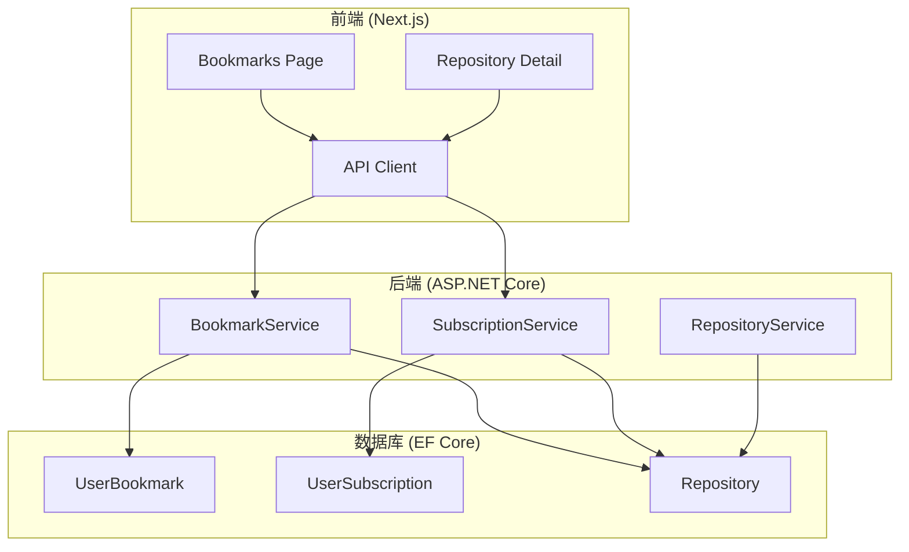
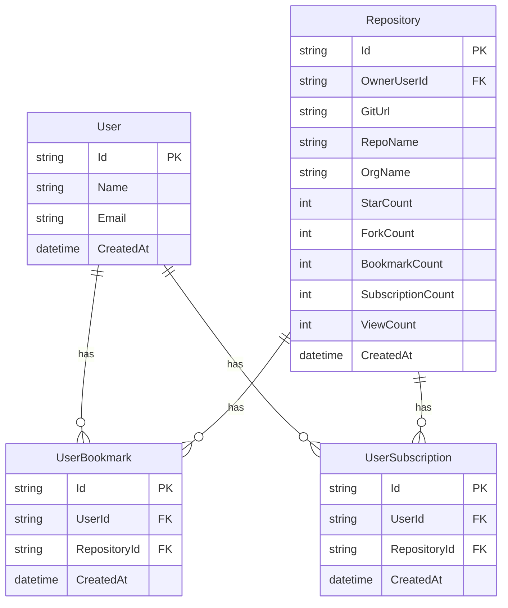

# Design Document: Repository Bookmark & Subscription

## Overview

本设计文档描述仓库收藏和订阅功能的技术实现方案。该功能允许用户收藏和订阅感兴趣的仓库，并通过原子性计数器更新确保数据一致性。

主要组件包括：
- 数据库实体扩展（Repository、UserBookmark、UserSubscription）
- 后端 API 服务（BookmarkService、SubscriptionService）
- 前端页面和组件改造

## Architecture



## Components and Interfaces

### 1. 数据库实体

#### 1.1 Repository 实体扩展

```csharp
// 在现有 Repository 实体中添加以下字段
public class Repository : AggregateRoot<string>
{
    // ... 现有字段 ...
    
    /// <summary>
    /// 收藏数量
    /// </summary>
    public int BookmarkCount { get; set; } = 0;
    
    /// <summary>
    /// 订阅数量
    /// </summary>
    public int SubscriptionCount { get; set; } = 0;
    
    /// <summary>
    /// 浏览数量
    /// </summary>
    public int ViewCount { get; set; } = 0;
}
```

#### 1.2 UserBookmark 实体

```csharp
public class UserBookmark : AggregateRoot<string>
{
    [Required]
    [StringLength(36)]
    public string UserId { get; set; } = string.Empty;
    
    [Required]
    [StringLength(36)]
    public string RepositoryId { get; set; } = string.Empty;
    
    [ForeignKey("UserId")]
    public virtual User? User { get; set; }
    
    [ForeignKey("RepositoryId")]
    public virtual Repository? Repository { get; set; }
}
```

#### 1.3 UserSubscription 实体

```csharp
public class UserSubscription : AggregateRoot<string>
{
    [Required]
    [StringLength(36)]
    public string UserId { get; set; } = string.Empty;
    
    [Required]
    [StringLength(36)]
    public string RepositoryId { get; set; } = string.Empty;
    
    [ForeignKey("UserId")]
    public virtual User? User { get; set; }
    
    [ForeignKey("RepositoryId")]
    public virtual Repository? Repository { get; set; }
}
```

### 2. 后端服务接口

#### 2.1 BookmarkService API

```csharp
[MiniApi(Route = "/api/v1/bookmarks")]
[Tags("收藏")]
public class BookmarkService
{
    // 添加收藏
    [HttpPost]
    Task<BookmarkResponse> AddBookmarkAsync(AddBookmarkRequest request);
    
    // 取消收藏
    [HttpDelete("{repositoryId}")]
    Task<BookmarkResponse> RemoveBookmarkAsync(string repositoryId, string userId);
    
    // 获取用户收藏列表
    [HttpGet]
    Task<BookmarkListResponse> GetUserBookmarksAsync(
        string userId, int page = 1, int pageSize = 20);
    
    // 检查收藏状态
    [HttpGet("{repositoryId}/status")]
    Task<BookmarkStatusResponse> GetBookmarkStatusAsync(
        string repositoryId, string userId);
}
```

#### 2.2 SubscriptionService API

```csharp
[MiniApi(Route = "/api/v1/subscriptions")]
[Tags("订阅")]
public class SubscriptionService
{
    // 添加订阅
    [HttpPost]
    Task<SubscriptionResponse> AddSubscriptionAsync(AddSubscriptionRequest request);
    
    // 取消订阅
    [HttpDelete("{repositoryId}")]
    Task<SubscriptionResponse> RemoveSubscriptionAsync(string repositoryId, string userId);
    
    // 检查订阅状态
    [HttpGet("{repositoryId}/status")]
    Task<SubscriptionStatusResponse> GetSubscriptionStatusAsync(
        string repositoryId, string userId);
}
```

### 3. 请求/响应模型

```csharp
// 添加收藏请求
public record AddBookmarkRequest(string UserId, string RepositoryId);

// 收藏响应
public record BookmarkResponse(
    bool Success,
    string? ErrorMessage,
    string? BookmarkId);

// 收藏列表响应
public record BookmarkListResponse(
    List<BookmarkItemResponse> Items,
    int Total,
    int Page,
    int PageSize);

// 收藏项响应
public record BookmarkItemResponse(
    string BookmarkId,
    string RepositoryId,
    string RepoName,
    string OrgName,
    string? Description,
    int StarCount,
    int ForkCount,
    int BookmarkCount,
    DateTime BookmarkedAt);

// 收藏状态响应
public record BookmarkStatusResponse(
    bool IsBookmarked,
    DateTime? BookmarkedAt);

// 添加订阅请求
public record AddSubscriptionRequest(string UserId, string RepositoryId);

// 订阅响应
public record SubscriptionResponse(
    bool Success,
    string? ErrorMessage,
    string? SubscriptionId);

// 订阅状态响应
public record SubscriptionStatusResponse(
    bool IsSubscribed,
    DateTime? SubscribedAt);
```

### 4. 前端 API 客户端

```typescript
// web/lib/bookmark-api.ts
export interface AddBookmarkRequest {
  userId: string;
  repositoryId: string;
}

export interface BookmarkResponse {
  success: boolean;
  errorMessage?: string;
  bookmarkId?: string;
}

export interface BookmarkItemResponse {
  bookmarkId: string;
  repositoryId: string;
  repoName: string;
  orgName: string;
  description?: string;
  starCount: number;
  forkCount: number;
  bookmarkCount: number;
  bookmarkedAt: string;
}

export interface BookmarkListResponse {
  items: BookmarkItemResponse[];
  total: number;
  page: number;
  pageSize: number;
}

export interface BookmarkStatusResponse {
  isBookmarked: boolean;
  bookmarkedAt?: string;
}

// API 函数
export async function addBookmark(request: AddBookmarkRequest): Promise<BookmarkResponse>;
export async function removeBookmark(repositoryId: string, userId: string): Promise<BookmarkResponse>;
export async function getUserBookmarks(userId: string, page?: number, pageSize?: number): Promise<BookmarkListResponse>;
export async function getBookmarkStatus(repositoryId: string, userId: string): Promise<BookmarkStatusResponse>;
```

```typescript
// web/lib/subscription-api.ts
export interface AddSubscriptionRequest {
  userId: string;
  repositoryId: string;
}

export interface SubscriptionResponse {
  success: boolean;
  errorMessage?: string;
  subscriptionId?: string;
}

export interface SubscriptionStatusResponse {
  isSubscribed: boolean;
  subscribedAt?: string;
}

// API 函数
export async function addSubscription(request: AddSubscriptionRequest): Promise<SubscriptionResponse>;
export async function removeSubscription(repositoryId: string, userId: string): Promise<SubscriptionResponse>;
export async function getSubscriptionStatus(repositoryId: string, userId: string): Promise<SubscriptionStatusResponse>;
```

## Data Models

### 数据库表结构



### EF Core 配置

```csharp
// MasterDbContext.OnModelCreating 中添加
modelBuilder.Entity<UserBookmark>()
    .HasIndex(b => new { b.UserId, b.RepositoryId })
    .IsUnique();

modelBuilder.Entity<UserSubscription>()
    .HasIndex(s => new { s.UserId, s.RepositoryId })
    .IsUnique();
```


## Correctness Properties

*A property is a characteristic or behavior that should hold true across all valid executions of a system—essentially, a formal statement about what the system should do. Properties serve as the bridge between human-readable specifications and machine-verifiable correctness guarantees.*

### Property 1: 收藏操作原子性

*For any* valid user and repository combination, when a bookmark is added, the system SHALL create a UserBookmark record AND increment the Repository.BookmarkCount by exactly 1 in a single atomic operation.

**Validates: Requirements 4.1, 4.2**

### Property 2: 取消收藏操作原子性

*For any* existing bookmark, when it is removed, the system SHALL delete the UserBookmark record AND decrement the Repository.BookmarkCount by exactly 1 in a single atomic operation.

**Validates: Requirements 5.1, 5.2**

### Property 3: 订阅操作原子性

*For any* valid user and repository combination, when a subscription is added, the system SHALL create a UserSubscription record AND increment the Repository.SubscriptionCount by exactly 1 in a single atomic operation.

**Validates: Requirements 7.1, 7.2**

### Property 4: 取消订阅操作原子性

*For any* existing subscription, when it is removed, the system SHALL delete the UserSubscription record AND decrement the Repository.SubscriptionCount by exactly 1 in a single atomic operation.

**Validates: Requirements 8.1, 8.2**

### Property 5: 收藏计数非负不变量

*For any* sequence of bookmark and unbookmark operations on a repository, the BookmarkCount SHALL never become negative.

**Validates: Requirements 1.4, 5.5**

### Property 6: 订阅计数非负不变量

*For any* sequence of subscribe and unsubscribe operations on a repository, the SubscriptionCount SHALL never become negative.

**Validates: Requirements 1.4, 8.5**

### Property 7: 收藏操作事务一致性

*For any* failed bookmark or unbookmark operation, the BookmarkCount SHALL remain unchanged from its value before the operation.

**Validates: Requirements 4.5, 5.4**

### Property 8: 订阅操作事务一致性

*For any* failed subscribe or unsubscribe operation, the SubscriptionCount SHALL remain unchanged from its value before the operation.

**Validates: Requirements 7.5, 8.4**

### Property 9: 收藏列表完整性

*For any* user, the bookmark list returned by the service SHALL contain exactly the repositories that have a corresponding UserBookmark record for that user.

**Validates: Requirements 6.1**

### Property 10: 收藏列表排序

*For any* bookmark list returned by the service, the items SHALL be ordered by CreatedAt in descending order.

**Validates: Requirements 6.5**

### Property 11: 收藏列表分页正确性

*For any* paginated bookmark list request with page P and pageSize S, the returned items SHALL be a subset of size at most S, starting from index (P-1)*S of the full sorted list.

**Validates: Requirements 6.4**

### Property 12: 收藏状态查询一致性

*For any* user and repository, the bookmark status query SHALL return isBookmarked=true if and only if a UserBookmark record exists for that user-repository pair.

**Validates: Requirements 9.1**

### Property 13: 订阅状态查询一致性

*For any* user and repository, the subscription status query SHALL return isSubscribed=true if and only if a UserSubscription record exists for that user-repository pair.

**Validates: Requirements 9.2**

### Property 14: 实体引用验证

*For any* bookmark or subscription creation request with non-existent UserId or RepositoryId, the service SHALL return a not found error without creating any records.

**Validates: Requirements 2.5, 3.5**

### Property 15: 收藏列表响应数据完整性

*For any* bookmark item in the list response, the item SHALL contain all required fields: repositoryId, repoName, orgName, starCount, forkCount, bookmarkCount, and bookmarkedAt.

**Validates: Requirements 6.2**

## Error Handling

### 错误类型定义

| 错误码 | 错误类型 | 描述 | HTTP 状态码 |
|--------|----------|------|-------------|
| BOOKMARK_NOT_FOUND | NotFound | 收藏记录不存在 | 404 |
| BOOKMARK_DUPLICATE | Conflict | 重复收藏 | 409 |
| SUBSCRIPTION_NOT_FOUND | NotFound | 订阅记录不存在 | 404 |
| SUBSCRIPTION_DUPLICATE | Conflict | 重复订阅 | 409 |
| REPOSITORY_NOT_FOUND | NotFound | 仓库不存在 | 404 |
| USER_NOT_FOUND | NotFound | 用户不存在 | 404 |
| UNAUTHORIZED | Unauthorized | 未授权操作 | 401 |
| INTERNAL_ERROR | InternalServerError | 服务器内部错误 | 500 |

### 错误响应格式

```csharp
public record ErrorResponse(
    string ErrorCode,
    string Message,
    string? Details = null);
```

### 事务回滚策略

1. 收藏/订阅操作使用数据库事务
2. 如果创建记录成功但更新计数失败，整个事务回滚
3. 使用 EF Core 的 `ExecuteSqlRawAsync` 进行原子性计数更新

```csharp
// 原子性更新示例
await context.Database.ExecuteSqlRawAsync(
    "UPDATE Repositories SET BookmarkCount = BookmarkCount + 1 WHERE Id = {0}",
    repositoryId);
```

## Testing Strategy

### 测试框架

- **单元测试**: xUnit
- **属性测试**: FsCheck
- **测试位置**: `tests/OpenDeepWiki.Tests/Services/Bookmarks/`

### 双重测试方法

本功能采用单元测试和属性测试相结合的方式：

- **单元测试**: 验证特定示例、边界情况和错误条件
- **属性测试**: 验证所有输入的通用属性

### 属性测试配置

- 每个属性测试最少运行 100 次迭代
- 每个测试必须引用设计文档中的属性
- 标签格式: **Feature: repository-bookmark-subscription, Property {number}: {property_text}**

### 测试用例分类

#### 属性测试 (Property-Based Tests)

| 属性 | 测试描述 | 生成器 |
|------|----------|--------|
| Property 1 | 收藏操作原子性 | 随机用户ID + 随机仓库ID |
| Property 2 | 取消收藏操作原子性 | 随机已存在的收藏记录 |
| Property 5 | 收藏计数非负不变量 | 随机操作序列 |
| Property 9 | 收藏列表完整性 | 随机用户 + 随机收藏集合 |
| Property 10 | 收藏列表排序 | 随机收藏列表 |
| Property 11 | 收藏列表分页正确性 | 随机页码 + 随机页大小 |
| Property 12 | 收藏状态查询一致性 | 随机用户-仓库对 |

#### 单元测试 (Unit Tests)

| 场景 | 测试描述 |
|------|----------|
| 重复收藏 | 验证重复收藏返回 409 错误 |
| 收藏不存在的仓库 | 验证返回 404 错误 |
| 取消不存在的收藏 | 验证返回 404 错误 |
| 空收藏列表 | 验证返回空列表和正确的 total=0 |
| 未登录用户状态查询 | 验证返回 isBookmarked=false |

### FsCheck 生成器示例

```csharp
public static class BookmarkGenerators
{
    public static Arbitrary<string> ValidUserId() =>
        Arb.From(Gen.Elements(TestUsers.Select(u => u.Id)));
    
    public static Arbitrary<string> ValidRepositoryId() =>
        Arb.From(Gen.Elements(TestRepositories.Select(r => r.Id)));
    
    public static Arbitrary<(string UserId, string RepositoryId)> ValidBookmarkPair() =>
        Arb.From(
            from userId in ValidUserId().Generator
            from repoId in ValidRepositoryId().Generator
            select (userId, repoId));
    
    public static Arbitrary<List<BookmarkOperation>> OperationSequence() =>
        Arb.From(
            Gen.ListOf(
                Gen.OneOf(
                    Gen.Constant(BookmarkOperation.Add),
                    Gen.Constant(BookmarkOperation.Remove))));
}
```

### 测试文件结构

```
tests/OpenDeepWiki.Tests/
├── Services/
│   └── Bookmarks/
│       ├── BookmarkServicePropertyTests.cs
│       ├── BookmarkServiceUnitTests.cs
│       ├── SubscriptionServicePropertyTests.cs
│       └── SubscriptionServiceUnitTests.cs
```
