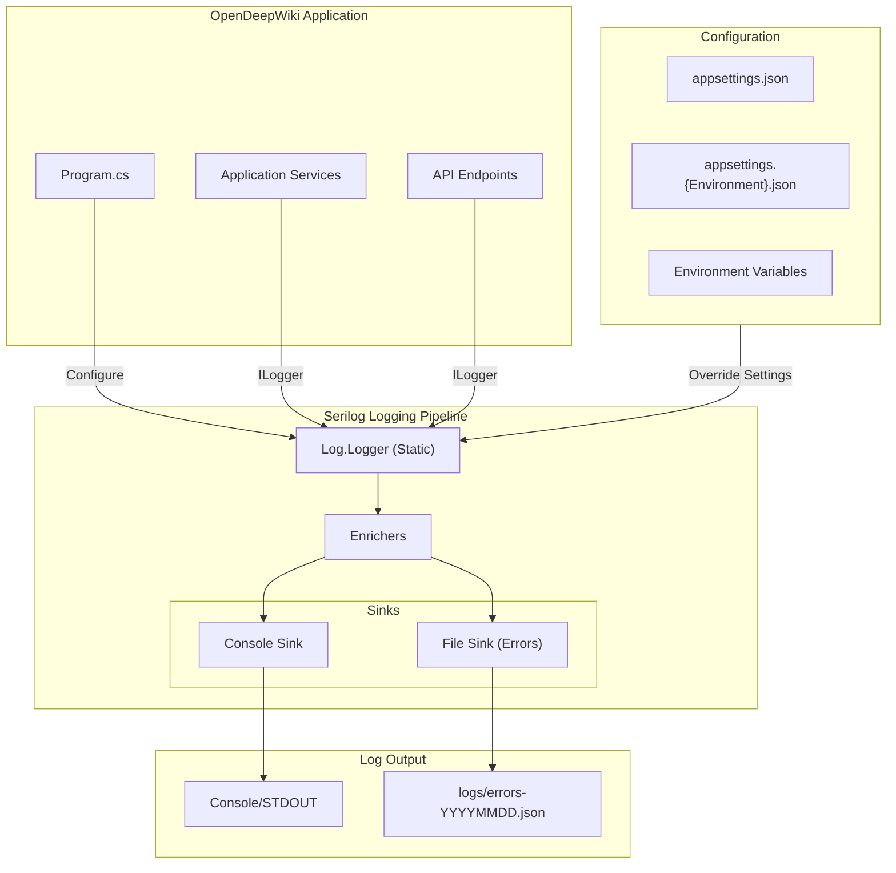
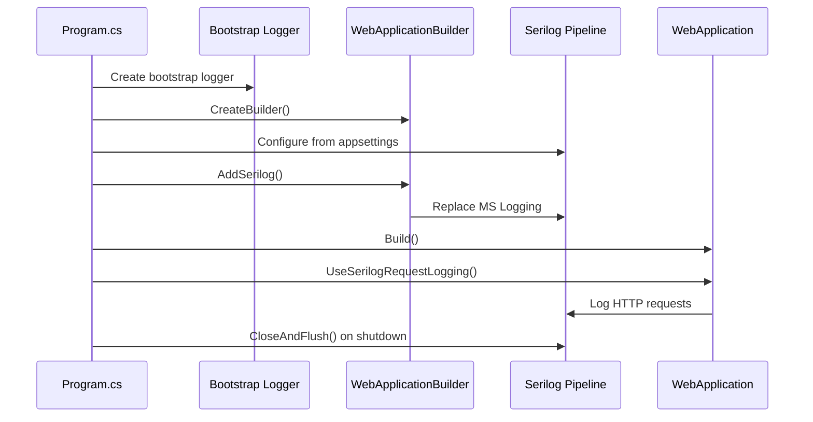

# Design Document: Serilog Logging Integration

## Overview

This design document describes the implementation of Serilog as the structured logging provider for the OpenDeepWiki ASP.NET Core application. The solution replaces the default Microsoft logging infrastructure with Serilog, providing enhanced capabilities including file-based error logging, console output with environment-specific configuration, and structured contextual information.

The implementation follows the recommended patterns from Serilog's author (Nicholas Blumhardt) for .NET 8+ minimal APIs, using configuration-as-code for reliability while supporting appsettings.json overrides for deployment flexibility.

## Architecture



### Key Design Decisions

1. **Bootstrap Logger Pattern**: Use a two-phase logging setup with a bootstrap logger to capture startup errors before full configuration is available.

2. **Configuration-as-Code Primary**: Define sinks and enrichers in C# code for compile-time safety, with appsettings.json for runtime overrides (log levels, paths).

3. **Structured JSON for Files**: Use JSON format for file output to enable log analysis tools and structured queries.

4. **Environment-Aware Console Output**: Different log levels for Development (Debug+) vs Production (Information+).

5. **Request Logging via Middleware**: Use `UseSerilogRequestLogging()` for consolidated HTTP request/response logging.

## Components and Interfaces

### 1. Serilog Configuration Extension

```csharp
namespace OpenDeepWiki.Infrastructure;

public static class SerilogConfiguration
{
    public static WebApplicationBuilder AddSerilogLogging(this WebApplicationBuilder builder)
    {
        // Configure Serilog from configuration and code
    }
    
    public static WebApplication UseSerilogLogging(this WebApplication app)
    {
        // Add request logging middleware
    }
}
```

### 2. Logging Options

```csharp
namespace OpenDeepWiki.Infrastructure;

public class LoggingOptions
{
    public const string SectionName = "Serilog";
    
    public string LogDirectory { get; set; } = "logs";
    public int RetainedFileCountLimit { get; set; } = 30;
    public string MinimumLevel { get; set; } = "Information";
    public Dictionary<string, string> LevelOverrides { get; set; } = new();
}
```

### 3. NuGet Packages Required

| Package | Purpose |
|---------|---------|
| `Serilog.AspNetCore` | ASP.NET Core integration, includes request logging |
| `Serilog.Sinks.Console` | Console output sink |
| `Serilog.Sinks.File` | File output sink with rolling support |
| `Serilog.Expressions` | Filtering and formatting expressions |

### 4. Component Interactions



## Data Models

### LoggingOptions Configuration Model

```csharp
public class LoggingOptions
{
    /// <summary>
    /// Directory path for log files (relative or absolute)
    /// </summary>
    public string LogDirectory { get; set; } = "logs";
    
    /// <summary>
    /// Number of days to retain log files
    /// </summary>
    public int RetainedFileCountLimit { get; set; } = 30;
    
    /// <summary>
    /// Default minimum log level
    /// </summary>
    public string MinimumLevel { get; set; } = "Information";
    
    /// <summary>
    /// Per-namespace log level overrides
    /// </summary>
    public Dictionary<string, string> LevelOverrides { get; set; } = new();
}
```

### Configuration Schema (appsettings.json)

```json
{
  "Serilog": {
    "LogDirectory": "logs",
    "RetainedFileCountLimit": 30,
    "MinimumLevel": {
      "Default": "Information",
      "Override": {
        "Microsoft.AspNetCore": "Warning",
        "Microsoft.EntityFrameworkCore": "Warning",
        "System": "Warning"
      }
    },
    "WriteTo": [
      {
        "Name": "Console"
      },
      {
        "Name": "File",
        "Args": {
          "path": "logs/errors-.json",
          "rollingInterval": "Day",
          "restrictedToMinimumLevel": "Error",
          "formatter": "Serilog.Formatting.Json.JsonFormatter, Serilog"
        }
      }
    ],
    "Enrich": ["FromLogContext", "WithMachineName", "WithEnvironmentName"]
  }
}
```

### Log Event Structure (JSON Output)

```json
{
  "Timestamp": "2024-01-15T10:30:45.123Z",
  "Level": "Error",
  "MessageTemplate": "Failed to process repository {RepositoryId}",
  "Properties": {
    "RepositoryId": "abc-123",
    "SourceContext": "OpenDeepWiki.Services.RepositoryAnalyzer",
    "MachineName": "server-01",
    "Environment": "Production",
    "RequestId": "0HN123ABC",
    "RequestPath": "/api/repositories/abc-123"
  },
  "Exception": "System.InvalidOperationException: ..."
}
```


## Correctness Properties

*A property is a characteristic or behavior that should hold true across all valid executions of a system—essentially, a formal statement about what the system should do. Properties serve as the bridge between human-readable specifications and machine-verifiable correctness guarantees.*

Based on the prework analysis, the following properties have been identified and consolidated to eliminate redundancy:

### Property 1: Log Event Structure Completeness

*For any* log event generated by the Logging_System, the output SHALL contain: a UTC timestamp, the log level, the source context (when using typed logger), and the message template with all provided properties.

**Validates: Requirements 2.3, 4.1, 4.2, 4.3, 4.4**

### Property 2: File Sink Error Level Filtering

*For any* log event, if the log level is Error or above (Error, Fatal), the event SHALL appear in the rolling log file. If the log level is below Error (Verbose, Debug, Information, Warning), the event SHALL NOT appear in the rolling log file.

**Validates: Requirements 3.1**

### Property 3: JSON File Format Validity

*For any* log event written to the file sink, the output SHALL be valid JSON containing the standard Serilog event structure (Timestamp, Level, MessageTemplate, Properties).

**Validates: Requirements 3.5**

### Property 4: Exception Details Preservation

*For any* log event that includes an exception, the output SHALL contain the exception type, message, and full stack trace.

**Validates: Requirements 4.5**

### Property 5: HTTP Request Logging Completeness

*For any* HTTP request processed by the application, the Request_Logger SHALL produce a log event containing: the request path, HTTP method, response status code, and request duration.

**Validates: Requirements 4.6, 6.1, 6.2**

### Property 6: Correlation ID Enrichment

*For any* log event generated during HTTP request processing, the event SHALL be enriched with a correlation identifier (RequestId) that is consistent across all log events for that request.

**Validates: Requirements 6.3**

### Property 7: Default Configuration Fallback

*For any* configuration value that is not explicitly provided, the Logging_System SHALL use the defined default value (LogDirectory="logs", RetainedFileCountLimit=30, MinimumLevel="Information").

**Validates: Requirements 5.5**

## Error Handling

### Startup Errors

1. **Bootstrap Logger**: A minimal bootstrap logger is created before any configuration is loaded to capture early startup failures.

2. **Configuration Errors**: If Serilog configuration fails, the application logs the error to the bootstrap logger and falls back to console-only logging.

3. **File Sink Errors**: If the log directory cannot be created or written to, Serilog logs a self-log warning but continues with other sinks.

### Runtime Errors

1. **Sink Failures**: Individual sink failures do not affect other sinks. If the file sink fails, console logging continues.

2. **Serialization Errors**: Properties that cannot be serialized are replaced with error placeholders rather than failing the entire log event.

3. **Buffer Overflow**: Serilog uses bounded buffers; if a sink falls behind, oldest events are dropped with a warning.

### Shutdown Handling

```csharp
try
{
    // Application code
    await app.RunAsync();
}
catch (Exception ex)
{
    Log.Fatal(ex, "Application terminated unexpectedly");
}
finally
{
    await Log.CloseAndFlushAsync();
}
```

## Testing Strategy

### Dual Testing Approach

This feature requires both unit tests and property-based tests for comprehensive coverage:

- **Unit tests**: Verify specific configuration scenarios, edge cases, and error conditions
- **Property tests**: Verify universal properties across all log events using FsCheck

### Unit Tests

| Test Case | Description | Requirements |
|-----------|-------------|--------------|
| `Serilog_IsConfigured_AsLoggingProvider` | Verify Serilog replaces default logging | 1.1, 1.2 |
| `Configuration_LoadsFromAppSettings` | Verify appsettings.json is read | 1.3 |
| `Development_LogsDebugLevel` | Verify Debug logs in Development | 2.1 |
| `Production_FiltersDebugLevel` | Verify Debug filtered in Production | 2.2 |
| `FileSink_CreatesDirectory_WhenMissing` | Verify directory auto-creation | 3.6 |
| `FileSink_UsesRollingInterval_Daily` | Verify daily file rotation | 3.3 |
| `Configuration_SupportsNamespaceOverrides` | Verify per-namespace levels | 5.1 |
| `RequestLogging_ExcludesHealthChecks` | Verify health check filtering | 6.4 |

### Property-Based Tests (FsCheck)

Property-based tests will be implemented using FsCheck in `tests/OpenDeepWiki.Tests/Infrastructure/`.

Each property test must:
- Run minimum 100 iterations
- Reference the design document property
- Use tag format: **Feature: serilog-logging, Property {number}: {property_text}**

| Property Test | Design Property | Requirements |
|---------------|-----------------|--------------|
| `LogEventStructure_ContainsRequiredFields` | Property 1 | 2.3, 4.1-4.4 |
| `FileSink_OnlyContainsErrorAndAbove` | Property 2 | 3.1 |
| `FileOutput_IsValidJson` | Property 3 | 3.5 |
| `ExceptionLogs_ContainFullDetails` | Property 4 | 4.5 |
| `HttpRequestLogs_ContainRequiredFields` | Property 5 | 4.6, 6.1, 6.2 |
| `RequestLogs_HaveConsistentCorrelationId` | Property 6 | 6.3 |
| `MissingConfig_UsesDefaults` | Property 7 | 5.5 |

### Test Configuration

```csharp
// FsCheck configuration for property tests
public class SerilogPropertyTests
{
    private static readonly Arbitrary<LogEvent> LogEventArbitrary = 
        Arb.From<LogEvent>();
    
    [Property(MaxTest = 100)]
    // Feature: serilog-logging, Property 1: Log Event Structure Completeness
    public Property LogEventStructure_ContainsRequiredFields()
    {
        // Implementation
    }
}
```

### Integration Tests

Integration tests verify end-to-end logging behavior:

1. **Startup Integration**: Application starts with Serilog configured
2. **Request Logging Integration**: HTTP requests produce expected log output
3. **File Output Integration**: Error logs appear in rolling files
4. **Shutdown Integration**: Logs are flushed on graceful shutdown
