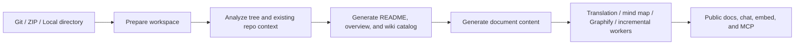

# OpenDeepWiki

[中文](README.zh-CN.md) | [English](README.md)

<div align="center">
  
  <h3>AI-driven repository knowledge base with docs, chat, and MCP</h3>
</div>

OpenDeepWiki turns Git repositories, ZIP archives, and local directories into searchable knowledge bases. It generates structured repository docs, serves them through a public Next.js site, and reuses the same indexed content for chat, embed, and MCP workflows.

Enterprise support and pricing: [docs.opendeep.wiki/pricing](https://docs.opendeep.wiki/pricing)

## What OpenDeepWiki Ships Today

- Import repository sources from Git URLs, uploaded ZIP archives, or approved local directories.
- Generate README summaries, project overviews, wiki catalogs, document content, multi-language translations, mind maps, and optional Graphify artifacts.
- Publish public repository docs on SEO-friendly routes such as `/{owner}/{repo}`, `/{owner}/{repo}/mindmap`, and `/{owner}/{repo}/graphify`.
- Expose repository knowledge through repository-scoped MCP endpoints, the built-in chat assistant, embedded chat APIs, and share links.
- Manage repositories, users, roles, departments, API keys, AI providers/models, skills, MCP providers, and GitHub App imports from the admin console.
- Run background workers for repository processing, translation, mind map generation, Graphify artifacts, and scheduled incremental updates.
- Support incoming chat/webhook channels for Feishu, QQ, WeChat, and Slack.

## Architecture At A Glance

| Layer | Current implementation |
| --- | --- |
| Backend | ASP.NET Core on .NET 10, MiniApis, background workers |
| AI orchestration | `Microsoft.Agents.AI`, prompt assets under `src/OpenDeepWiki/prompts`, provider/model binding from settings |
| Frontend | Next.js 16, React 19, App Router |
| Database | SQLite or PostgreSQL |
| Repo processing | `LibGit2Sharp`, ZIP/local-directory ingestion, incremental update pipeline |
| Visualization | Mermaid mind maps plus optional `graphifyy` artifacts |
| Deployment | Docker Compose, Makefile, optional Sealos deployment |

## Quick Start With Docker

### Prerequisites

- Docker with Compose support
- At least one LLM API key compatible with your chosen provider

### 1. Clone the repository

```bash
git clone https://github.com/AIDotNet/OpenDeepWiki.git
cd OpenDeepWiki
```

### 2. Edit `compose.yaml`

At minimum, set a real JWT secret and your AI credentials:

```yaml
services:
  opendeepwiki:
    environment:
      - JWT_SECRET_KEY=replace-this-in-production

      - CHAT_API_KEY=your-chat-api-key
      - ENDPOINT=https://api.openai.com/v1
      - CHAT_REQUEST_TYPE=OpenAI

      - WIKI_CATALOG_MODEL=gpt-4o
      - WIKI_CATALOG_ENDPOINT=https://api.openai.com/v1
      - WIKI_CATALOG_API_KEY=your-catalog-api-key
      - WIKI_CATALOG_REQUEST_TYPE=OpenAI

      - WIKI_CONTENT_MODEL=gpt-4o
      - WIKI_CONTENT_ENDPOINT=https://api.openai.com/v1
      - WIKI_CONTENT_API_KEY=your-content-api-key
      - WIKI_CONTENT_REQUEST_TYPE=OpenAI

      - WIKI_LANGUAGES=en,zh
      - WIKI_PARALLEL_COUNT=5
```

Notes:

- `CHAT_*`, `WIKI_CATALOG_*`, and `WIKI_CONTENT_*` can point to the same provider.
- Translation is optional. If `WIKI_TRANSLATION_*` is not set, translation falls back to the content-generation provider/model.
- `compose.yaml` uses `Database__Type=sqlite` and `ConnectionStrings__Default=Data Source=/data/opendeepwiki.db` by default.

### 3. Start the stack

```bash
docker compose up -d --build
```

Or use the Makefile shortcuts:

```bash
make build
make up
```

### 4. Open the app

- Web UI: [http://localhost:3000](http://localhost:3000)
- Backend health: [http://localhost:8080/health](http://localhost:8080/health)

On a fresh database, the seeded admin account is:

- Email: `admin@routin.ai`
- Password: `Admin@123`

Change the default JWT secret and admin password before any real deployment.

## PostgreSQL Instead Of SQLite

The current runtime code supports `sqlite` and `postgresql`.

To boot the bundled PostgreSQL stack:

```bash
docker compose -f compose.pgsql.yaml up -d --build
```

If you prefer your own database, configure either of these equivalent pairs:

```yaml
- Database__Type=postgresql
- ConnectionStrings__Default=Host=your-host;Port=5432;Database=opendeepwiki;Username=postgres;Password=secret
```

or

```yaml
- DB_TYPE=postgresql
- CONNECTION_STRING=Host=your-host;Port=5432;Database=opendeepwiki;Username=postgres;Password=secret
```

## Local Development

### Backend

```bash
dotnet restore OpenDeepWiki.sln
dotnet build OpenDeepWiki.sln
dotnet run --project src/OpenDeepWiki/OpenDeepWiki.csproj
```

Useful local endpoints:

- Backend API: [http://localhost:5265](http://localhost:5265) with the default `http` launch profile, or the URL printed by ASP.NET Core
- Health: [http://localhost:5265/health](http://localhost:5265/health)
- OpenAPI/Scalar: [http://localhost:5265/v1/scalar](http://localhost:5265/v1/scalar) when running in `Development`

### Web app

Set the backend proxy first. The web app reads `API_PROXY_URL` from the environment, `web/.env.local`, or `web/.env`.

```bash
cd web
npm install
echo API_PROXY_URL=http://localhost:5265 > .env.local
npm run dev
```

### Docs app (optional)

```bash
cd docs
npm install
npm run dev
```

### Tests and lint

```bash
dotnet test tests/OpenDeepWiki.Tests/OpenDeepWiki.Tests.csproj
cd web && npm test
cd web && npm run lint
```

Common Makefile shortcuts:

```bash
make dev
make down
make logs
make test
make build-arm
make build-amd
```

## Repository Processing Flow



In practice, the main runtime path looks like this:

1. Normalize the repository source and prepare a workspace under `REPOSITORIES_DIRECTORY`.
2. Build or refresh repository metadata, branch/language state, and processing logs.
3. Generate documentation catalogs and document content with the configured AI provider/model bindings.
4. Queue follow-up work such as translation, mind map generation, Graphify artifacts, and incremental updates.
5. Serve the final repository knowledge through the public web app, admin tooling, chat APIs, and MCP endpoints.

## MCP Usage

OpenDeepWiki registers official MCP endpoints at:

- `/api/mcp`
- `/api/mcp/{owner}/{repo}`

You can scope the repository either by path or query string. Example:

```json
{
  "mcpServers": {
    "OpenDeepWiki": {
      "url": "http://localhost:8080/api/mcp/AIDotNet/OpenDeepWiki"
    }
  }
}
```

Query-based alternative:

```text
http://localhost:8080/api/mcp?owner=AIDotNet&name=OpenDeepWiki
```

Optional:

- Set `MCP_ENABLED=false` to disable MCP endpoints.
- Set `GOOGLE_CLIENT_ID` and `GOOGLE_CLIENT_SECRET` if you want protected-resource MCP OAuth support.

## Optional Graphify Configuration

The backend Docker image already installs `graphifyy`. To enable Graphify artifact generation, configure one of the optional provider groups already present in `compose.yaml`, such as:

- `GRAPHIFY_BACKEND`
- `GRAPHIFY_MODEL`
- `GRAPHIFY_OPENAI_BASE_URL`
- `GRAPHIFY_OPENAI_API_KEY`
- `OPENAI_BASE_URL` / `OPENAI_API_KEY`
- `OLLAMA_BASE_URL` / `OLLAMA_MODEL`

## Repository Layout

- `src/OpenDeepWiki/`: ASP.NET Core entry point, endpoints, workers, AI/repository/chat/MCP services
- `src/OpenDeepWiki.Entities/`: domain entities
- `src/OpenDeepWiki.EFCore/`: shared EF Core model and context contract
- `src/EFCore/OpenDeepWiki.Sqlite/`: SQLite provider
- `src/EFCore/OpenDeepWiki.Postgresql/`: PostgreSQL provider
- `web/`: public docs site and admin UI built with Next.js
- `docs/`: separate documentation app
- `tests/OpenDeepWiki.Tests/`: xUnit and FsCheck tests
- `scripts/`: deployment and helper scripts

## Deployment Notes

- Sealos: [One-click deployment guide](scripts/sealos/README.zh-CN.md)
- Backend container definition: `src/OpenDeepWiki/Dockerfile`
- Frontend container definition: `web/Dockerfile`

## Community

- Discord: [join us](https://discord.gg/Y3fvpnGVwt)
- Feishu QR code:


## License

This project is licensed under the MIT License. See [LICENSE](./LICENSE) for details.

## Star History

[](https://www.star-history.com/#AIDotNet/OpenDeepWiki&Date)
