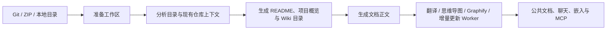

# OpenDeepWiki

[中文](README.zh-CN.md) | [English](README.md)

<div align="center">
  
  <h3>面向仓库文档、聊天与 MCP 的 AI 代码知识库</h3>
</div>

OpenDeepWiki 可以把 Git 仓库、ZIP 压缩包和本地目录转换成可检索的代码知识库。它会生成结构化仓库文档，通过 Next.js 公共站点对外提供阅读入口，并把同一份仓库知识复用到聊天、嵌入式对话和 MCP 场景中。

企业支持与定价：[docs.opendeep.wiki/pricing](https://docs.opendeep.wiki/pricing)

## 当前版本能做什么

- 从 Git URL、上传 ZIP 压缩包或受允许的本地目录导入仓库。
- 生成 README 摘要、项目概览、Wiki 目录、文档正文、多语言翻译、思维导图，以及可选的 Graphify 产物。
- 在 `/{owner}/{repo}`、`/{owner}/{repo}/mindmap`、`/{owner}/{repo}/graphify` 等 SEO 友好路由上发布公共文档。
- 通过仓库级 MCP、内置聊天助手、嵌入式聊天 API 和分享链接复用仓库知识。
- 在后台管理台中管理仓库、用户、角色、部门、API Key、AI Provider/Model、技能包、MCP Provider 以及 GitHub App 导入。
- 通过后台 Worker 处理仓库解析、翻译、思维导图、Graphify 产物和定时增量更新。
- 支持飞书、QQ、微信、Slack 等聊天/Webhook 接入。

## 架构总览

| 层 | 当前实现 |
| --- | --- |
| 后端 | .NET 10 上的 ASP.NET Core、MiniApis、后台 Worker |
| AI 编排 | `Microsoft.Agents.AI`，配合 `src/OpenDeepWiki/prompts` 中的提示词资产与系统设置中的 provider/model 绑定 |
| 前端 | Next.js 16、React 19、App Router |
| 数据库 | SQLite 或 PostgreSQL |
| 仓库处理 | `LibGit2Sharp`、ZIP/本地目录导入、增量更新流水线 |
| 可视化 | Mermaid 思维导图与可选的 `graphifyy` 图谱产物 |
| 部署 | Docker Compose、Makefile、可选 Sealos |

## 使用 Docker 快速启动

### 前置条件

- 已安装 Docker 和 Docker Compose
- 至少准备一个可用的 LLM API Key

### 1. 克隆仓库

```bash
git clone https://github.com/AIDotNet/OpenDeepWiki.git
cd OpenDeepWiki
```

### 2. 修改 `compose.yaml`

最少需要把 JWT 密钥和 AI 配置改成真实值：

```yaml
services:
  opendeepwiki:
    environment:
      - JWT_SECRET_KEY=replace-this-in-production

      - CHAT_API_KEY=your-chat-api-key
      - ENDPOINT=https://api.openai.com/v1
      - CHAT_REQUEST_TYPE=OpenAI

      - WIKI_CATALOG_MODEL=gpt-4o
      - WIKI_CATALOG_ENDPOINT=https://api.openai.com/v1
      - WIKI_CATALOG_API_KEY=your-catalog-api-key
      - WIKI_CATALOG_REQUEST_TYPE=OpenAI

      - WIKI_CONTENT_MODEL=gpt-4o
      - WIKI_CONTENT_ENDPOINT=https://api.openai.com/v1
      - WIKI_CONTENT_API_KEY=your-content-api-key
      - WIKI_CONTENT_REQUEST_TYPE=OpenAI

      - WIKI_LANGUAGES=en,zh
      - WIKI_PARALLEL_COUNT=5
```

说明：

- `CHAT_*`、`WIKI_CATALOG_*`、`WIKI_CONTENT_*` 可以共用同一个 provider。
- 翻译配置是可选的；如果没有设置 `WIKI_TRANSLATION_*`，会回退到内容生成的 provider/model。
- 默认使用 `Database__Type=sqlite` 和 `ConnectionStrings__Default=Data Source=/data/opendeepwiki.db`。

### 3. 启动服务

```bash
docker compose up -d --build
```

或者使用 Makefile：

```bash
make build
make up
```

### 4. 访问系统

- Web 界面：[http://localhost:3000](http://localhost:3000)
- 后端健康检查：[http://localhost:8080/health](http://localhost:8080/health)

全新数据库首次启动后会自动创建管理员账号：

- 邮箱：`admin@routin.ai`
- 密码：`Admin@123`

正式部署前请务必修改默认 JWT 密钥和管理员密码。

## 使用 PostgreSQL 代替 SQLite

当前运行时代码只支持 `sqlite` 和 `postgresql`。

如果想直接使用仓库自带的 PostgreSQL 编排文件：

```bash
docker compose -f compose.pgsql.yaml up -d --build
```

如果使用你自己的 PostgreSQL，可以配置下面任意一组等价变量：

```yaml
- Database__Type=postgresql
- ConnectionStrings__Default=Host=your-host;Port=5432;Database=opendeepwiki;Username=postgres;Password=secret
```

或者：

```yaml
- DB_TYPE=postgresql
- CONNECTION_STRING=Host=your-host;Port=5432;Database=opendeepwiki;Username=postgres;Password=secret
```

## 本地开发

### 后端

```bash
dotnet restore OpenDeepWiki.sln
dotnet build OpenDeepWiki.sln
dotnet run --project src/OpenDeepWiki/OpenDeepWiki.csproj
```

常用本地地址：

- 后端 API：默认 `http` launch profile 下为 [http://localhost:5265](http://localhost:5265)，也可以直接使用 ASP.NET Core 实际输出的监听地址
- 健康检查：[http://localhost:5265/health](http://localhost:5265/health)
- OpenAPI / Scalar：[http://localhost:5265/v1/scalar](http://localhost:5265/v1/scalar)，仅在 `Development` 环境下启用

### Web 前端

前端需要先配置后端代理地址。它会从环境变量、`web/.env.local` 或 `web/.env` 中读取 `API_PROXY_URL`。

```bash
cd web
npm install
echo API_PROXY_URL=http://localhost:5265 > .env.local
npm run dev
```

### 文档站（可选）

```bash
cd docs
npm install
npm run dev
```

### 测试与检查

```bash
dotnet test tests/OpenDeepWiki.Tests/OpenDeepWiki.Tests.csproj
cd web && npm test
cd web && npm run lint
```

常用 Makefile 命令：

```bash
make dev
make down
make logs
make test
make build-arm
make build-amd
```

## 仓库处理流程



实际运行时，主链路大致如下：

1. 规范化仓库来源，并在 `REPOSITORIES_DIRECTORY` 下准备工作区。
2. 构建或刷新仓库元数据、分支/语言状态以及处理日志。
3. 使用当前绑定的 AI provider/model 生成目录结构和文档内容。
4. 追加翻译、思维导图、Graphify 产物和增量更新等后续任务。
5. 通过公共站点、后台工具、聊天 API 和 MCP 端点对外提供最终知识。

## MCP 用法

OpenDeepWiki 当前注册的 MCP 入口是：

- `/api/mcp`
- `/api/mcp/{owner}/{repo}`

你可以用路径或查询参数来限定仓库范围。示例：

```json
{
  "mcpServers": {
    "OpenDeepWiki": {
      "url": "http://localhost:8080/api/mcp/AIDotNet/OpenDeepWiki"
    }
  }
}
```

基于查询参数的等价写法：

```text
http://localhost:8080/api/mcp?owner=AIDotNet&name=OpenDeepWiki
```

可选配置：

- 设定 `MCP_ENABLED=false` 可关闭 MCP 端点。
- 如果需要受保护资源式的 MCP OAuth，设置 `GOOGLE_CLIENT_ID` 和 `GOOGLE_CLIENT_SECRET`。

## 可选的 Graphify 配置

后端 Docker 镜像已经内置 `graphifyy`。如果你想启用 Graphify 产物生成，可以在 `compose.yaml` 里补充这些可选变量中的一组或多组：

- `GRAPHIFY_BACKEND`
- `GRAPHIFY_MODEL`
- `GRAPHIFY_OPENAI_BASE_URL`
- `GRAPHIFY_OPENAI_API_KEY`
- `OPENAI_BASE_URL` / `OPENAI_API_KEY`
- `OLLAMA_BASE_URL` / `OLLAMA_MODEL`

## 仓库结构

- `src/OpenDeepWiki/`：ASP.NET Core 入口、Endpoints、Worker、AI/仓库/聊天/MCP 服务
- `src/OpenDeepWiki.Entities/`：领域实体
- `src/OpenDeepWiki.EFCore/`：共享 EF Core 模型与上下文契约
- `src/EFCore/OpenDeepWiki.Sqlite/`：SQLite Provider
- `src/EFCore/OpenDeepWiki.Postgresql/`：PostgreSQL Provider
- `web/`：Next.js 公共文档站与后台管理台
- `docs/`：独立文档站
- `tests/OpenDeepWiki.Tests/`：xUnit 与 FsCheck 测试
- `scripts/`：部署与辅助脚本

## 部署说明

- Sealos： [一键部署说明](scripts/sealos/README.zh-CN.md)
- 后端容器定义：`src/OpenDeepWiki/Dockerfile`
- 前端容器定义：`web/Dockerfile`

## 交流社区

- Discord: [join us](https://discord.gg/Y3fvpnGVwt)
- 飞书二维码：


## 许可证

本项目采用 MIT 许可证，详情见 [LICENSE](./LICENSE)。

## Star 历史

[](https://www.star-history.com/#AIDotNet/OpenDeepWiki&Date)
