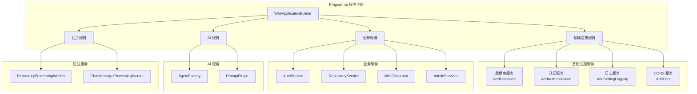
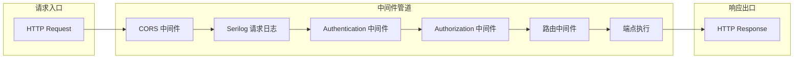
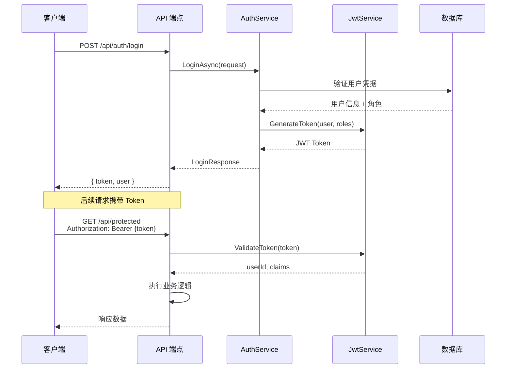
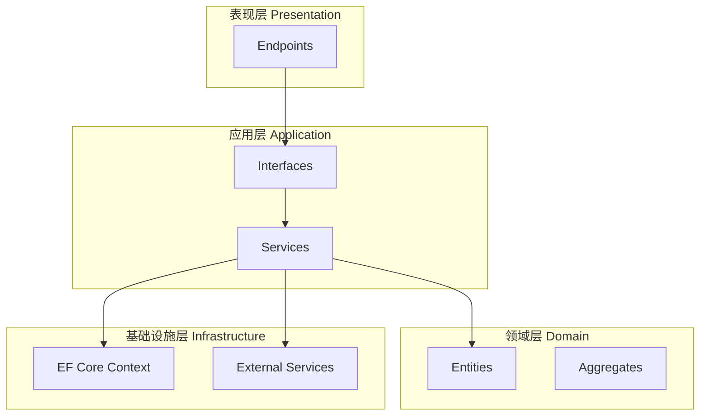
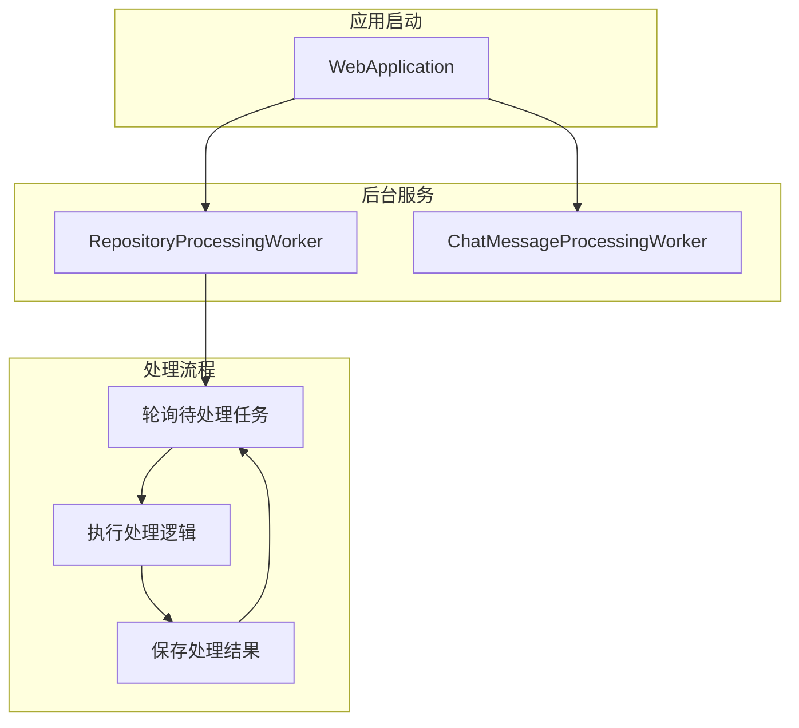

# 后端架构原理

## 概述

OpenDeepWiki 后端基于 ASP.NET Core 9 构建，采用 Minimal APIs 设计模式，结合依赖注入、中间件管道和后台任务处理等现代化架构实践。本文档深入解析后端核心架构设计原理。

## ASP.NET Core Minimal APIs 设计模式

### 设计理念

Minimal APIs 是 ASP.NET Core 6+ 引入的轻量级 API 开发模式，相比传统 Controller 模式具有以下优势：

- **更少的样板代码**: 无需继承 Controller 基类
- **更直观的路由定义**: 使用 Lambda 表达式直接定义端点
- **更好的性能**: 减少反射开销
- **更灵活的组织方式**: 按功能模块组织端点

### 端点组织结构

```
src/OpenDeepWiki/Endpoints/
├── Admin/                          # 管理后台端点
│   ├── AdminEndpoints.cs           # 管理端点入口
│   ├── AdminUserEndpoints.cs       # 用户管理
│   ├── AdminRoleEndpoints.cs       # 角色管理
│   ├── AdminRepositoryEndpoints.cs # 仓库管理
│   └── ...
├── AuthEndpoints.cs                # 认证端点
├── BookmarkEndpoints.cs            # 书签端点
├── ChatEndpoints.cs                # 聊天/MCP 端点
├── OAuthEndpoints.cs               # OAuth 端点
├── OrganizationEndpoints.cs        # 组织端点
├── RecommendationEndpoints.cs      # 推荐端点
└── SubscriptionEndpoints.cs        # 订阅端点
```

### 端点注册模式

OpenDeepWiki 使用扩展方法模式组织端点注册：

```csharp
// Program.cs 中的端点注册
app.MapMiniApis();           // 核心 API 端点
app.MapAuthEndpoints();      // 认证端点
app.MapOAuthEndpoints();     // OAuth 端点
app.MapBookmarkEndpoints();  // 书签端点
app.MapAdminEndpoints();     // 管理后台端点
// ...
```

每个端点模块实现为静态扩展方法：

```csharp
public static class AuthEndpoints
{
    public static void MapAuthEndpoints(this WebApplication app)
    {
        var group = app.MapGroup("/api/auth")
            .WithTags("Authentication");

        group.MapPost("/login", LoginAsync);
        group.MapPost("/register", RegisterAsync);
        group.MapPost("/refresh", RefreshTokenAsync);
    }

    private static async Task<IResult> LoginAsync(
        LoginRequest request,
        IAuthService authService)
    {
        var result = await authService.LoginAsync(request);
        return Results.Ok(result);
    }
}
```

## 依赖注入配置解析

### 服务注册架构



### 核心服务注册代码解析

```csharp
var builder = WebApplication.CreateBuilder(args);

// 1. 基础设施服务
builder.AddSerilogLogging();                    // 结构化日志
builder.Services.AddOpenApi();                  // OpenAPI 文档
builder.Services.AddDatabase(configuration);   // 多数据库支持

// 2. 认证授权服务
builder.Services.AddAuthentication(JwtBearerDefaults.AuthenticationScheme)
    .AddJwtBearer(options => { /* JWT 配置 */ });
builder.Services.AddAuthorization(options =>
{
    options.AddPolicy("AdminOnly", policy => policy.RequireRole("Admin"));
});

// 3. 业务服务（Scoped 生命周期）
builder.Services.AddScoped<IAuthService, AuthService>();
builder.Services.AddScoped<IRepositoryAnalyzer, RepositoryAnalyzer>();
builder.Services.AddScoped<IWikiGenerator, WikiGenerator>();

// 4. AI 服务（Singleton 生命周期）
builder.Services.AddSingleton<AgentFactory>();
builder.Services.AddSingleton<IPromptPlugin>(sp => 
    new FilePromptPlugin(promptsDir));

// 5. 后台服务
builder.Services.AddHostedService<RepositoryProcessingWorker>();
builder.Services.AddChatServices(configuration);  // 聊天系统服务
```

### 服务生命周期选择原则

| 生命周期 | 适用场景 | 示例服务 |
|---------|---------|---------|
| Singleton | 无状态、线程安全、全局共享 | AgentFactory, PromptPlugin |
| Scoped | 请求级别状态、数据库上下文 | AuthService, WikiGenerator |
| Transient | 轻量级、无状态、每次新实例 | 工具类服务 |

## 请求处理管道

### 中间件管道架构



### 管道配置代码

```csharp
var app = builder.Build();

// 1. 数据库初始化
await DbInitializer.InitializeAsync(app.Services);

// 2. CORS（必须在认证之前）
app.UseCors("AllowAll");

// 3. 请求日志
app.UseSerilogLogging();

// 4. 开发环境特定中间件
if (app.Environment.IsDevelopment())
{
    app.MapOpenApi();
    app.MapScalarApiReference("/v1/scalar");
}

// 5. 认证授权
app.UseAuthentication();
app.UseAuthorization();

// 6. 端点映射
app.MapMiniApis();
app.MapAuthEndpoints();
// ...
```

## JWT 认证机制

### 认证流程



### JWT 配置

```csharp
// JWT 选项配置
builder.Services.AddOptions<JwtOptions>()
    .Bind(builder.Configuration.GetSection("Jwt"))
    .PostConfigure(options =>
    {
        // 支持环境变量覆盖
        if (string.IsNullOrWhiteSpace(options.SecretKey))
        {
            options.SecretKey = builder.Configuration["JWT_SECRET_KEY"]
                ?? "OpenDeepWiki-Default-Secret-Key-Please-Change";
        }
    });

// JWT Bearer 认证
builder.Services.AddAuthentication(JwtBearerDefaults.AuthenticationScheme)
    .AddJwtBearer(options =>
    {
        options.TokenValidationParameters = new TokenValidationParameters
        {
            ValidateIssuerSigningKey = true,
            IssuerSigningKey = new SymmetricSecurityKey(
                Encoding.UTF8.GetBytes(secretKey)),
            ValidateIssuer = true,
            ValidIssuer = jwtOptions.Issuer,
            ValidateAudience = true,
            ValidAudience = jwtOptions.Audience,
            ValidateLifetime = true,
            ClockSkew = TimeSpan.Zero  // 严格的过期时间验证
        };
    });
```

### JwtService 实现

```csharp
public class JwtService : IJwtService
{
    public string GenerateToken(User user, List<string> roles)
    {
        var claims = new List<Claim>
        {
            new(ClaimTypes.NameIdentifier, user.Id),
            new(ClaimTypes.Name, user.Name),
            new(ClaimTypes.Email, user.Email),
            new(JwtRegisteredClaimNames.Jti, Guid.NewGuid().ToString())
        };

        // 添加角色声明
        claims.AddRange(roles.Select(role => 
            new Claim(ClaimTypes.Role, role)));

        var key = new SymmetricSecurityKey(
            Encoding.UTF8.GetBytes(_options.SecretKey));
        var credentials = new SigningCredentials(
            key, SecurityAlgorithms.HmacSha256);

        var token = new JwtSecurityToken(
            issuer: _options.Issuer,
            audience: _options.Audience,
            claims: claims,
            expires: DateTime.UtcNow.AddMinutes(_options.ExpirationMinutes),
            signingCredentials: credentials
        );

        return new JwtSecurityTokenHandler().WriteToken(token);
    }
}
```

## 服务层设计模式

### 分层架构



### 服务接口设计

每个业务服务都定义接口，便于测试和替换实现：

```csharp
// 接口定义
public interface IWikiGenerator
{
    Task GenerateCatalogAsync(
        RepositoryWorkspace workspace,
        BranchLanguage branchLanguage,
        CancellationToken cancellationToken = default);

    Task GenerateDocumentsAsync(
        RepositoryWorkspace workspace,
        BranchLanguage branchLanguage,
        CancellationToken cancellationToken = default);

    Task IncrementalUpdateAsync(
        RepositoryWorkspace workspace,
        BranchLanguage branchLanguage,
        string[] changedFiles,
        CancellationToken cancellationToken = default);
}

// 实现类
public class WikiGenerator : IWikiGenerator
{
    private readonly AgentFactory _agentFactory;
    private readonly IPromptPlugin _promptPlugin;
    private readonly IContext _context;
    // ...
}
```

### 服务目录结构

```
src/OpenDeepWiki/Services/
├── Admin/                    # 管理服务
│   ├── IAdminUserService.cs
│   ├── AdminUserService.cs
│   └── ...
├── Auth/                     # 认证服务
│   ├── IAuthService.cs
│   ├── AuthService.cs
│   ├── IJwtService.cs
│   └── JwtService.cs
├── Repositories/             # 仓库服务
│   ├── IRepositoryAnalyzer.cs
│   ├── RepositoryAnalyzer.cs
│   └── RepositoryProcessingWorker.cs
├── Wiki/                     # Wiki 生成服务
│   ├── IWikiGenerator.cs
│   └── WikiGenerator.cs
└── Prompts/                  # Prompt 服务
    ├── IPromptPlugin.cs
    └── FilePromptPlugin.cs
```

## 后台任务处理（HostedService）

### BackgroundService 架构



### RepositoryProcessingWorker 实现

```csharp
public class RepositoryProcessingWorker : BackgroundService
{
    private static readonly TimeSpan PollingInterval = TimeSpan.FromSeconds(30);

    protected override async Task ExecuteAsync(CancellationToken stoppingToken)
    {
        _logger.LogInformation("Repository processing worker started");

        while (!stoppingToken.IsCancellationRequested)
        {
            try
            {
                await ProcessPendingAsync(stoppingToken);
            }
            catch (OperationCanceledException) when (stoppingToken.IsCancellationRequested)
            {
                break;
            }
            catch (Exception ex)
            {
                _logger.LogError(ex, "Processing loop failed");
            }

            await Task.Delay(PollingInterval, stoppingToken);
        }
    }

    private async Task ProcessPendingAsync(CancellationToken stoppingToken)
    {
        // 创建独立的 DI Scope
        using var scope = _scopeFactory.CreateScope();
        var context = scope.ServiceProvider.GetService<IContext>();
        var wikiGenerator = scope.ServiceProvider.GetService<IWikiGenerator>();

        // 获取待处理的仓库
        var repository = await context.Repositories
            .OrderBy(item => item.CreatedAt)
            .FirstOrDefaultAsync(item => 
                item.Status == RepositoryStatus.Pending, 
                stoppingToken);

        if (repository is null) return;

        // 更新状态为处理中
        repository.Status = RepositoryStatus.Processing;
        await context.SaveChangesAsync(stoppingToken);

        try
        {
            // 执行处理逻辑
            await ProcessRepositoryAsync(repository, ...);
            repository.Status = RepositoryStatus.Completed;
        }
        catch (Exception)
        {
            repository.Status = RepositoryStatus.Failed;
            throw;
        }
        finally
        {
            await context.SaveChangesAsync(stoppingToken);
        }
    }
}
```

### 后台服务设计要点

1. **独立 Scope**: 使用 `IServiceScopeFactory` 创建独立的 DI Scope，避免 Scoped 服务生命周期问题

2. **优雅关闭**: 响应 `CancellationToken`，支持应用优雅关闭

3. **错误恢复**: 捕获异常后继续轮询，避免单次失败导致服务停止

4. **状态管理**: 使用数据库状态（Pending/Processing/Completed/Failed）管理任务

5. **并行控制**: 使用 `SemaphoreSlim` 控制并行处理数量

```csharp
// 并行处理示例
using var semaphore = new SemaphoreSlim(parallelCount);
var tasks = items.Select(async item =>
{
    await semaphore.WaitAsync(cancellationToken);
    try
    {
        await ProcessItemAsync(item, cancellationToken);
    }
    finally
    {
        semaphore.Release();
    }
});
await Task.WhenAll(tasks);
```

## 配置管理

### Options 模式

OpenDeepWiki 使用 ASP.NET Core Options 模式管理配置：

```csharp
// 配置类定义
public class WikiGeneratorOptions
{
    public const string SectionName = "WikiGenerator";
    
    public string CatalogModel { get; set; } = "gpt-4o";
    public string ContentModel { get; set; } = "gpt-4o";
    public int MaxRetryAttempts { get; set; } = 3;
    public int ParallelCount { get; set; } = 3;
}

// 配置注册
builder.Services.AddOptions<WikiGeneratorOptions>()
    .Bind(builder.Configuration.GetSection(WikiGeneratorOptions.SectionName))
    .PostConfigure(options =>
    {
        // 支持环境变量覆盖
        var model = builder.Configuration["WIKI_CATALOG_MODEL"];
        if (!string.IsNullOrWhiteSpace(model))
        {
            options.CatalogModel = model;
        }
    });

// 服务中使用
public class WikiGenerator
{
    private readonly WikiGeneratorOptions _options;
    
    public WikiGenerator(IOptions<WikiGeneratorOptions> options)
    {
        _options = options.Value;
    }
}
```

### 配置优先级

1. 环境变量（最高优先级）
2. appsettings.{Environment}.json
3. appsettings.json
4. 代码默认值（最低优先级）

## 相关文档

- [系统架构总览](./overview.md) - 整体架构设计
- [前端架构原理](./frontend-architecture.md) - Next.js 架构详解
- [数据层架构](./data-layer.md) - EF Core 多数据库支持
