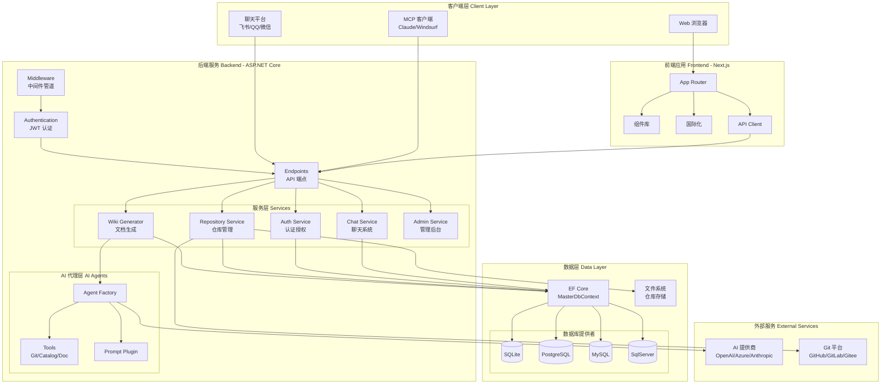
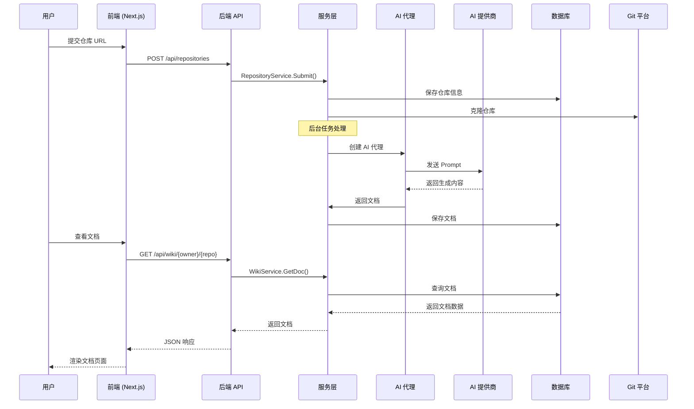
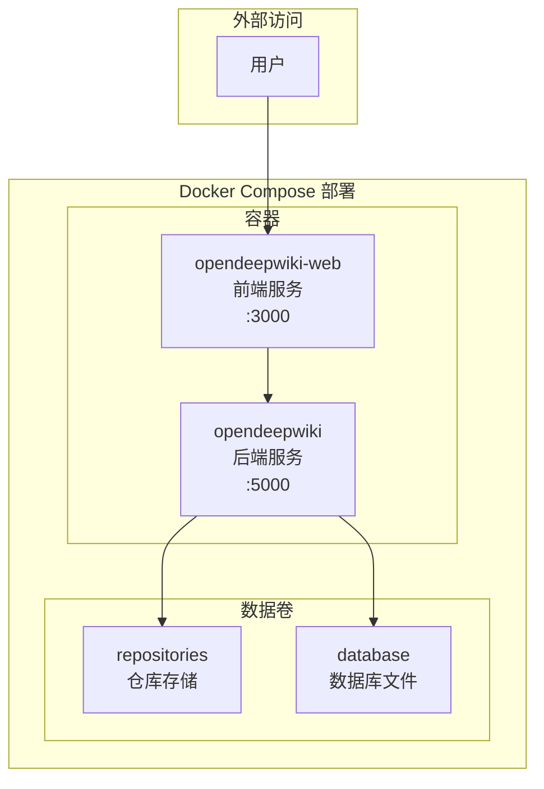

# 系统架构总览

## 概述

OpenDeepWiki 是一个 AI 驱动的代码知识库系统，采用现代化的前后端分离架构设计。系统能够自动分析代码仓库，利用大语言模型生成结构化的技术文档，并提供多平台聊天机器人集成能力。

## 设计理念

### 核心原则

1. **前后端分离**: 后端提供 RESTful API，前端独立部署，通过 HTTP 通信
2. **模块化设计**: 按业务领域划分模块，每个模块职责单一
3. **可扩展性**: 支持多种 AI 提供商、多种数据库、多种聊天平台
4. **配置驱动**: 通过环境变量和配置文件控制系统行为

### 技术选型

| 层级 | 技术栈 | 说明 |
|------|--------|------|
| 前端 | Next.js 15 (App Router) | React 服务端渲染框架 |
| 后端 | ASP.NET Core 9 | 高性能 Web API 框架 |
| AI 集成 | Semantic Kernel | 微软 AI 编排框架 |
| 数据库 | EF Core + 多数据库 | 支持 SQLite/PostgreSQL/MySQL/SqlServer |
| 容器化 | Docker Compose | 一键部署方案 |

## 整体架构图



## 核心模块划分

### 后端模块结构

```
src/
├── OpenDeepWiki/                 # 主应用程序
│   ├── Agents/                   # AI 代理系统
│   │   ├── AgentFactory.cs       # 代理工厂
│   │   └── Tools/                # AI 工具集
│   ├── Chat/                     # 聊天系统
│   │   ├── Providers/            # 平台提供者
│   │   ├── Queue/                # 消息队列
│   │   └── Sessions/             # 会话管理
│   ├── Endpoints/                # API 端点
│   │   └── Admin/                # 管理后台端点
│   ├── Services/                 # 业务服务层
│   │   ├── Auth/                 # 认证服务
│   │   ├── Repositories/         # 仓库服务
│   │   ├── Wiki/                 # Wiki 生成服务
│   │   └── ...                   # 其他服务
│   └── Infrastructure/           # 基础设施
├── OpenDeepWiki.Entities/        # 实体模型
│   ├── Repositories/             # 仓库相关实体
│   ├── Users/                    # 用户相关实体
│   └── Chat/                     # 聊天相关实体
├── OpenDeepWiki.EFCore/          # EF Core 共享上下文
└── EFCore/                       # 数据库提供者实现
    ├── OpenDeepWiki.Sqlite/
    └── OpenDeepWiki.Postgresql/
```

### 前端模块结构

```
web/
├── app/                          # Next.js App Router
│   ├── (main)/                   # 主要页面组
│   │   ├── bookmarks/            # 书签页
│   │   ├── recommend/            # 推荐页
│   │   └── settings/             # 设置页
│   ├── admin/                    # 管理后台
│   ├── auth/                     # 认证页面
│   └── [owner]/[repo]/           # 动态仓库页面
├── components/                   # 组件库
│   ├── ui/                       # 基础 UI 组件
│   ├── repo/                     # 仓库相关组件
│   └── admin/                    # 管理后台组件
├── hooks/                        # 自定义 Hooks
├── i18n/                         # 国际化配置
├── lib/                          # 工具库和 API 客户端
└── contexts/                     # React Context
```

## 数据流向图



## 扩展点设计

OpenDeepWiki 提供多个扩展点，便于定制和扩展系统功能：

### 1. AI 提供商扩展

通过 `AiRequestType` 枚举和 `AgentFactory` 支持多种 AI 提供商：

```csharp
public enum AiRequestType
{
    OpenAI,
    AzureOpenAI,
    Anthropic
}
```

添加新的 AI 提供商只需：
1. 在 `AiRequestType` 添加新枚举值
2. 在 `AgentFactory` 中实现对应的客户端创建逻辑

### 2. 数据库提供者扩展

通过 EF Core Provider 模式支持多种数据库：

```csharp
// 在 DatabaseServiceExtensions 中根据配置选择数据库
services.AddDatabase(configuration);
```

添加新的数据库支持只需：
1. 创建新的 DbContext 实现
2. 添加对应的迁移文件
3. 在配置中指定数据库类型

### 3. 聊天平台扩展

通过 `IMessageProvider` 接口支持多种聊天平台：

```csharp
public interface IMessageProvider
{
    Task<WebhookValidationResult> ValidateWebhookAsync(HttpContext context);
    Task<SendResult> SendMessageAsync(string userId, string message);
}
```

添加新的聊天平台只需：
1. 实现 `IMessageProvider` 接口
2. 在 `ChatServiceExtensions` 中注册新的 Provider

### 4. Prompt 模板扩展

通过 `IPromptPlugin` 接口支持自定义 Prompt 模板：

```csharp
public interface IPromptPlugin
{
    string GetPrompt(string name, Dictionary<string, string> variables);
}
```

自定义 Prompt 只需：
1. 在 `prompts/` 目录添加新的 Markdown 模板文件
2. 使用 `{{variable}}` 语法定义变量占位符

## 部署架构



## 相关文档

- [后端架构原理](./backend-architecture.md) - ASP.NET Core 架构详解
- [前端架构原理](./frontend-architecture.md) - Next.js 架构详解
- [数据层架构](./data-layer.md) - EF Core 多数据库支持
