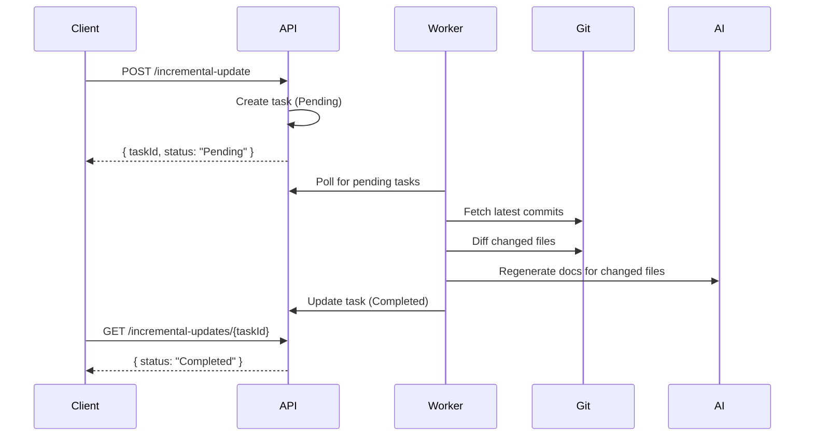

import { Callout } from 'fumadocs-ui/components/callout';

# 增量更新 API

增量更新 API 允许你在仓库有新提交时手动触发文档更新、查询任务状态和重试失败的任务。增量更新仅重新生成已更改文件的文档，使其比完全重新生成快得多。

## 触发增量更新

手动为特定仓库分支触发增量更新。创建高优先级更新任务。

```
POST /api/v1/repositories/{repositoryId}/branches/{branchId}/incremental-update
```

### 路径参数

| 参数 | 类型 | 描述 |
|---|---|---|
| `repositoryId` | string | 仓库 ID |
| `branchId` | string | 分支 ID |

### 响应

```json
{
  "success": true,
  "taskId": "t1a2b3c4-...",
  "status": "Pending",
  "message": "增量更新任务已创建"
}
```

如果此分支已有任务在处理：

```json
{
  "success": true,
  "taskId": "t1a2b3c4-...",
  "status": "Processing",
  "message": "任务正在处理中"
}
```

### 错误响应

| 状态 | 错误代码 | 描述 |
|---|---|---|
| 404 | `REPOSITORY_NOT_FOUND` | 仓库不存在 |
| 404 | `BRANCH_NOT_FOUND` | 分支不存在或不属于该仓库 |
| 500 | `TRIGGER_FAILED` | 创建更新任务时的内部错误 |

### 错误响应格式

```json
{
  "success": false,
  "error": "仓库不存在",
  "errorCode": "REPOSITORY_NOT_FOUND",
  "details": null
}
```

---

## 获取任务状态

检索增量更新任务的详细状态信息。

```
GET /api/v1/incremental-updates/{taskId}
```

### 路径参数

| 参数 | 类型 | 描述 |
|---|---|---|
| `taskId` | string | 增量更新任务 ID |

### 响应

```json
{
  "success": true,
  "taskId": "t1a2b3c4-...",
  "repositoryId": "a1b2c3d4-...",
  "repositoryName": "AIDotNet/OpenDeepWiki",
  "branchId": "b1c2d3e4-...",
  "branchName": "main",
  "status": "Completed",
  "priority": 10,
  "isManualTrigger": true,
  "previousCommitId": "abc1234",
  "targetCommitId": "def5678",
  "retryCount": 0,
  "errorMessage": null,
  "createdAt": "2025-01-15T10:30:00Z",
  "startedAt": "2025-01-15T10:30:05Z",
  "completedAt": "2025-01-15T10:32:00Z"
}
```

### 任务状态值

| 状态 | 描述 |
|---|---|
| `Pending` | 等待被后台工作者选择 |
| `Processing` | 正在处理 |
| `Completed` | 成功完成 |
| `Failed` | 失败（可重试） |

### 错误响应

| 状态 | 错误代码 | 描述 |
|---|---|---|
| 404 | `TASK_NOT_FOUND` | 任务不存在 |
| 500 | `GET_STATUS_FAILED` | 查询任务状态时的内部错误 |

---

## 重试失败的任务

重试失败的增量更新任务。将任务状态重置为 `Pending`，以便后台工作者再次选择它。

```
POST /api/v1/incremental-updates/{taskId}/retry
```

### 路径参数

| 参数 | 类型 | 描述 |
|---|---|---|
| `taskId` | string | 增量更新任务 ID |

### 响应

```json
{
  "success": true,
  "taskId": "t1a2b3c4-...",
  "status": "Pending",
  "retryCount": 1,
  "message": "任务已重置，将在下次轮询时重新处理"
}
```

### 错误响应

| 状态 | 错误代码 | 描述 |
|---|---|---|
| 404 | `TASK_NOT_FOUND` | 任务不存在 |
| 400 | `INVALID_TASK_STATUS` | 任务不在 `Failed` 状态 — 仅失败的任务可重试 |
| 500 | `RETRY_FAILED` | 重试任务时的内部错误 |

<Callout type="info">
每次重试都会增加 `retryCount` 字段。任务的 `errorMessage`、`startedAt` 和 `completedAt` 字段在重试时被清除。
</Callout>

---

## 增量更新如何工作



后台工作者自动轮询待处理任务并按优先级顺序处理它们。手动触发的任务比计划更新获得更高的优先级。
