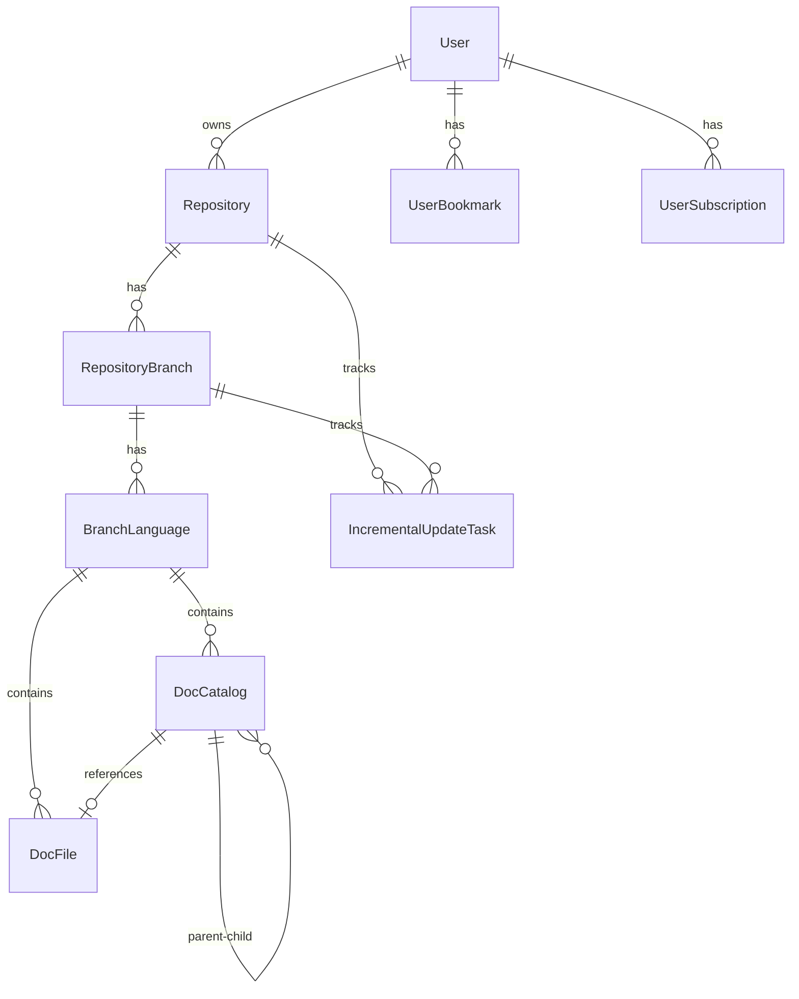

## 概览

所有实体都继承自 `AggregateRoot<TKey>`，它提供用于审计和软删除的通用字段：

| 字段 | 类型 | 描述 |
|-------|------|-------------|
| `Id` | `TKey` | 主键（通常为 `string`，GUID 格式） |
| `CreatedAt` | `DateTime` | 创建时间戳（UTC） |
| `UpdatedAt` | `DateTime?` | 最后更新时间戳 |
| `DeletedAt` | `DateTime?` | 软删除时间戳 |
| `IsDeleted` | `bool` | 软删除标志 |
| `Version` | `byte[]?` | 乐观并发令牌 |

## 实体关系图



## 核心实体

### Repository

代表提交用于分析和文档生成的 Git 仓库。

| 字段 | 类型 | 描述 |
|-------|------|-------------|
| `OwnerUserId` | `string` | 提交仓库的用户 ID |
| `GitUrl` | `string` | Git 克隆 URL |
| `RepoName` | `string` | 仓库名称 |
| `OrgName` | `string` | 组织或所有者名称 |
| `AuthAccount` | `string?` | Git 认证用户名（用于私有仓库） |
| `AuthPassword` | `string?` | Git 认证密码/令牌 |
| `IsPublic` | `bool` | 仓库是否公开可见 |
| `Status` | `RepositoryStatus` | 处理状态：`Pending`、`Processing`、`Completed`、`Failed` |
| `StarCount` | `int` | GitHub 星数 |
| `ForkCount` | `int` | GitHub fork 数 |

### RepositoryBranch

代表已处理的仓库的特定分支。

| 字段 | 类型 | 描述 |
|-------|------|-------------|
| `RepositoryId` | `string` | 父仓库 ID |
| `BranchName` | `string` | 分支名称（例如 `main`） |
| `LastCommitId` | `string?` | 最后处理的提交 SHA |
| `LastProcessedAt` | `DateTime?` | 分支最后处理时间 |

### BranchLanguage

代表特定分支的文档的语言变体。每个分支可以生成多种语言的文档。

| 字段 | 类型 | 描述 |
|-------|------|-------------|
| `RepositoryBranchId` | `string` | 父分支 ID |
| `LanguageCode` | `string` | 语言代码（例如 `en`、`zh`、`ja`、`ko`） |
| `UpdateSummary` | `string?` | 最新更新摘要 |
| `IsDefault` | `bool` | 是否为默认语言 |
| `MindMapContent` | `string?` | Markdown 标题格式的思维导图内容 |
| `MindMapStatus` | `MindMapStatus` | 思维导图生成状态：`Pending`、`Generating`、`Completed`、`Failed` |

### DocCatalog

代表文档目录树中的节点。支持通过自引用父子关系的分层结构。

| 字段 | 类型 | 描述 |
|-------|------|-------------|
| `BranchLanguageId` | `string` | 父分支语言 ID |
| `ParentId` | `string?` | 父目录 ID（根节点为 `null`） |
| `Title` | `string` | 显示标题 |
| `Path` | `string` | URL 友好路径（例如 `1-overview`） |
| `Order` | `int` | 在父级内的排序顺序 |
| `DocFileId` | `string?` | 关联的文档文件 ID |

目录树使用 `CatalogItem` 模型序列化为/从 JSON：

```csharp
public class CatalogItem
{
    public string Title { get; set; }
    public string Path { get; set; }
    public int Order { get; set; }
    public List<CatalogItem> Children { get; set; }
}
```

### DocFile

存储实际生成的文档内容。

| 字段 | 类型 | 描述 |
|-------|------|-------------|
| `BranchLanguageId` | `string` | 父分支语言 ID |
| `Content` | `string` | 文档内容（Markdown） |
| `SourceFiles` | `string?` | 用于生成此文档的源文件路径的 JSON 数组 |

### User

代表系统用户。

| 字段 | 类型 | 描述 |
|-------|------|-------------|
| `Name` | `string` | 用户名 |
| `Email` | `string` | 电子邮件地址 |
| `Password` | `string?` | 哈希密码（BCrypt） |
| `Avatar` | `string?` | 头像 URL |
| `Phone` | `string?` | 电话号码 |
| `Status` | `int` | `0` = 禁用，`1` = 活跃，`2` = 待验证 |
| `IsSystem` | `bool` | 是否为系统用户 |
| `LastLoginAt` | `DateTime?` | 最后登录时间戳 |

### IncrementalUpdateTask

跟踪仓库分支的增量更新操作。

| 字段 | 类型 | 描述 |
|-------|------|-------------|
| `RepositoryId` | `string` | 目标仓库 ID |
| `BranchId` | `string` | 目标分支 ID |
| `PreviousCommitId` | `string?` | 上次处理的提交 ID |
| `TargetCommitId` | `string?` | 当前目标提交 ID |
| `Status` | `IncrementalUpdateStatus` | `Pending`、`Processing`、`Completed`、`Failed`、`Cancelled` |
| `Priority` | `int` | 任务优先级（更高 = 更紧急） |
| `IsManualTrigger` | `bool` | 是否通过 API 手动触发 |
| `RetryCount` | `int` | 重试次数 |
| `ErrorMessage` | `string?` | 失败时的错误详情 |
| `StartedAt` | `DateTime?` | 处理开始时间 |
| `CompletedAt` | `DateTime?` | 处理完成时间 |

## 数据库提供商

数据层支持多个数据库提供商，通过 `DB_TYPE` 环境变量选择：

| 提供商 | DbContext | 连接字符串示例 |
|----------|-----------|---------------------------|
| SQLite | `SqliteDbContext` | `Data Source=/data/opendeepwiki.db` |
| PostgreSQL | `PostgresqlDbContext` | `Host=localhost;Database=opendeepwiki;Username=postgres;Password=xxx` |

两个提供商都继承自 `MasterDbContext`，它定义共享的模型配置、关系和索引。

## 其他实体

除核心实体外，系统还包含以下辅助实体：

### 聊天和应用

| 实体 | 描述 |
|------|------|
| `ChatApp` | 用户创建的嵌入式聊天应用，包含允许域、模型配置和系统提示 |
| `ChatSession` | 聊天会话记录 |
| `ChatLog` | 聊天日志，记录每次对话的详细信息 |
| `ChatMessageHistory` | 消息历史记录 |
| `ChatMessageQueue` | 消息队列，用于异步处理 Webhook 消息 |
| `ChatProviderConfig` | 聊天提供商配置（飞书、QQ、微信等） |
| `ChatAssistantConfig` | 对话助手全局配置 |
| `AppStatistics` | 应用使用统计数据 |

### 用户相关

| 实体 | 描述 |
|------|------|
| `UserBookmark` | 用户书签，收藏的仓库 |
| `UserSubscription` | 用户订阅信息 |
| `UserActivity` | 用户活动记录 |
| `UserDislike` | 用户不喜欢标记 |
| `UserPreferenceCache` | 用户偏好缓存 |
| `TokenUsage` | Token 消耗统计 |

### 系统配置

| 实体 | 描述 |
|------|------|
| `McpConfig` | MCP 工具服务器配置 |
| `ModelConfig` | AI 模型配置 |
| `SkillConfig` | Skill 插件配置 |
| `LocalStorage` | 系统本地存储键值对 |

### 仓库处理

| 实体 | 描述 |
|------|------|
| `RepositoryAssignment` | 仓库与部门的分配关系 |
| `RepositoryProcessingLog` | 仓库处理日志，记录每次生成的详细过程 |
| `TranslationTask` | 文档翻译任务 |
