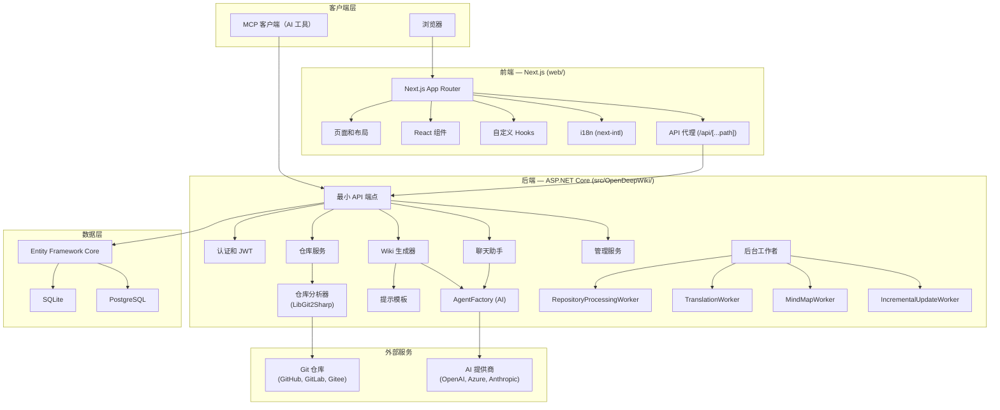

## 系统架构

OpenDeepWiki 采用经典的前后端分离架构：后端是 ASP.NET Core API 服务，负责 Git 仓库分析、AI 驱动的文档生成和数据持久化；前端是 Next.js 应用，提供用户界面和文档浏览体验。

## 核心模块

| 模块 | 位置 | 描述 |
|--------|----------|-------------|
| API 端点 | `src/OpenDeepWiki/Endpoints/` | 最小 API 端点定义，按域组织 |
| 管理端点 | `src/OpenDeepWiki/Endpoints/Admin/` | 管理员专用端点（仓库、用户、角色、工具等） |
| 服务 | `src/OpenDeepWiki/Services/` | 业务逻辑层，涵盖仓库、wiki 生成、聊天、管理等 |
| 代理 | `src/OpenDeepWiki/Agents/` | 通过 `AgentFactory` 的 AI 代理编排，支持多个 LLM 提供商 |
| Chat 系统 | `src/OpenDeepWiki/Chat/` | 多平台聊天系统（飞书、QQ、微信等 Webhook 集成） |
| 实体 | `src/OpenDeepWiki.Entities/` | 域实体定义（Repository、DocCatalog、User 等） |
| EF Core | `src/OpenDeepWiki.EFCore/` | 共享 `MasterDbContext` 基类和 `IContext` 接口 |
| 数据库提供商 | `src/EFCore/` | SQLite 和 PostgreSQL 特定的 DbContext 实现 |
| 前端应用 | `web/app/` | Next.js App Router 页面和布局 |
| 组件 | `web/components/` | 可复用的 React UI 组件 |
| Hooks | `web/hooks/` | 自定义 React hooks（聊天历史、翻译、滚动等） |

## 请求流程

典型的用户请求遵循以下路径：

1. 浏览器向 Next.js 前端发送请求
2. API 调用通过 `/api/[...path]` 代理到 ASP.NET Core 后端
3. 后端端点委托给相应的服务
4. 服务通过 EF Core（`IContext`）与数据库交互
5. 对于 wiki 生成，服务使用 `AgentFactory` 调用 AI 提供商
6. 后台工作者处理长时间运行的任务（仓库处理、翻译、增量更新）

## 关键设计决策

- **最小 API** — 后端使用 ASP.NET Core 最小 API 而不是控制器，保持端点定义简洁并按域组织
- **多提供商 AI** — `AgentFactory` 抽象了 LLM 提供商差异，通过统一接口支持 OpenAI、Azure OpenAI 和 Anthropic
- **分离的生成模型** — Wiki 生成支持为目录结构、内容生成和翻译使用不同的 AI 模型，允许成本/质量优化
- **后台工作者** — 长时间运行的任务（仓库处理、翻译、思维导图生成、增量更新）作为 `IHostedService` 后台工作者运行
- **数据库抽象** — `MasterDbContext` 提供共享基类，SQLite 和 PostgreSQL 实现可通过配置选择
