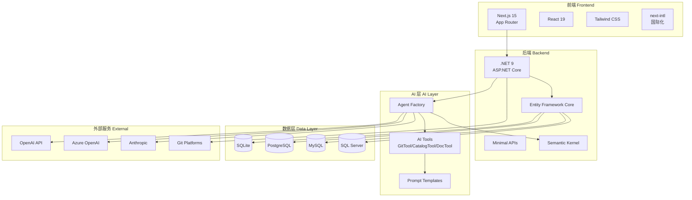
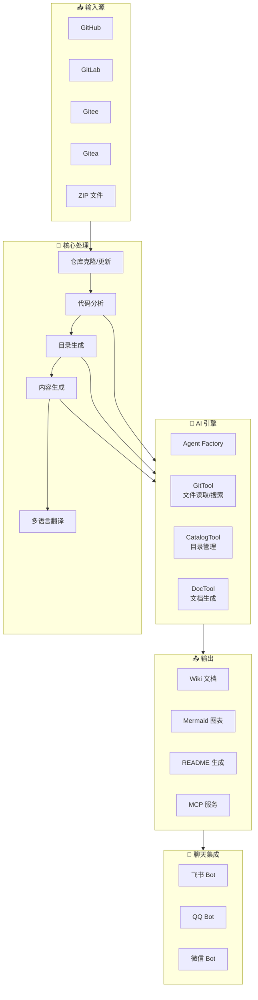

# OpenDeepWiki 项目简介

## 项目定位与愿景

OpenDeepWiki 是一个 **AI 驱动的代码知识库系统**，灵感来源于 [DeepWiki](https://deepwiki.com/)。它能够自动分析代码仓库，生成结构化的技术文档和知识图谱，帮助开发者快速理解和利用代码资源。

### 核心愿景

- **降低代码理解门槛**：通过 AI 自动生成文档，让新成员快速上手项目
- **知识沉淀与传承**：将代码中的隐性知识转化为可检索的文档
- **提升开发效率**：通过 MCP 协议集成，让 AI 助手直接访问代码知识库

## 核心功能列表

| 功能模块 | 描述 |
|---------|------|
| 🚀 快速转换 | 支持 GitHub、GitLab、Gitee、Gitea 等代码仓库在分钟级别内转换为知识库 |
| 🌍 多语言支持 | 支持所有编程语言的代码分析和文档生成 |
| 📊 代码结构图 | 自动生成 Mermaid 图表，帮助理解代码结构 |
| 🤖 自定义模型 | 支持 OpenAI、Azure OpenAI、Anthropic 等多种 AI 提供商 |
| 💬 对话交互 | 支持与 AI 对话，深入理解代码细节 |
| 🔌 MCP 协议 | 支持 Model Context Protocol，可作为 AI 助手的知识源 |
| 📱 多平台聊天 | 集成飞书、QQ、微信等聊天平台 |

## 技术栈概览

OpenDeepWiki 采用现代化的技术栈，前后端分离架构：

### 技术栈详情

| 层级 | 技术 | 版本 | 用途 |
|-----|------|------|------|
| **前端** | Next.js | 15.x | React 框架，支持 SSR/SSG |
| | React | 19.x | UI 组件库 |
| | Tailwind CSS | 3.x | 样式框架 |
| | next-intl | - | 国际化支持 |
| **后端** | .NET | 9.0 | 运行时平台 |
| | ASP.NET Core | 9.0 | Web API 框架 |
| | Entity Framework Core | 9.x | ORM 框架 |
| | Semantic Kernel | 1.x | AI 编排框架 |
| **数据库** | SQLite | - | 默认轻量级数据库 |
| | PostgreSQL | 14+ | 生产环境推荐 |
| | MySQL | 8.0+ | 可选数据库 |
| | SQL Server | 2019+ | 可选数据库 |

## 功能架构图

## 与 DeepWiki 的关系

OpenDeepWiki 是受 [DeepWiki](https://deepwiki.com/) 启发的开源实现：

| 对比项 | DeepWiki | OpenDeepWiki |
|-------|----------|--------------|
| **开源性** | 闭源商业产品 | MIT 开源协议 |
| **部署方式** | SaaS 服务 | 自托管部署 |
| **AI 提供商** | 固定 | 可自定义（OpenAI/Azure/Anthropic） |
| **数据存储** | 云端 | 本地/私有云 |
| **定制能力** | 有限 | 完全可定制 |
| **MCP 支持** | - | ✅ 支持 |
| **聊天集成** | - | ✅ 飞书/QQ/微信 |

### 为什么选择 OpenDeepWiki？

1. **数据安全**：代码和文档完全存储在您的服务器上
2. **成本可控**：使用自己的 AI API Key，按实际用量付费
3. **灵活定制**：可以修改 Prompt 模板、调整生成逻辑
4. **私有部署**：支持内网环境，满足企业合规要求
5. **社区驱动**：持续迭代，功能不断完善

## 适用场景

### 🏢 企业内部知识库

- 将内部代码仓库转化为可搜索的知识库
- 新员工快速了解项目架构和代码逻辑
- 跨团队知识共享和技术传承

### 📚 开源项目文档

- 自动生成项目文档，降低维护成本
- 提供交互式代码问答功能
- 通过 MCP 协议集成到 AI 开发工具

### 🎓 学习与研究

- 快速理解开源项目的架构设计
- 生成代码结构图辅助学习
- 与 AI 对话深入理解代码细节

## 下一步

- [快速启动指南](./quick-start.md) - 5 分钟内启动 OpenDeepWiki
- [环境配置说明](./configuration.md) - 详细的配置选项说明
- [系统架构总览](../architecture/overview.md) - 深入了解系统设计
