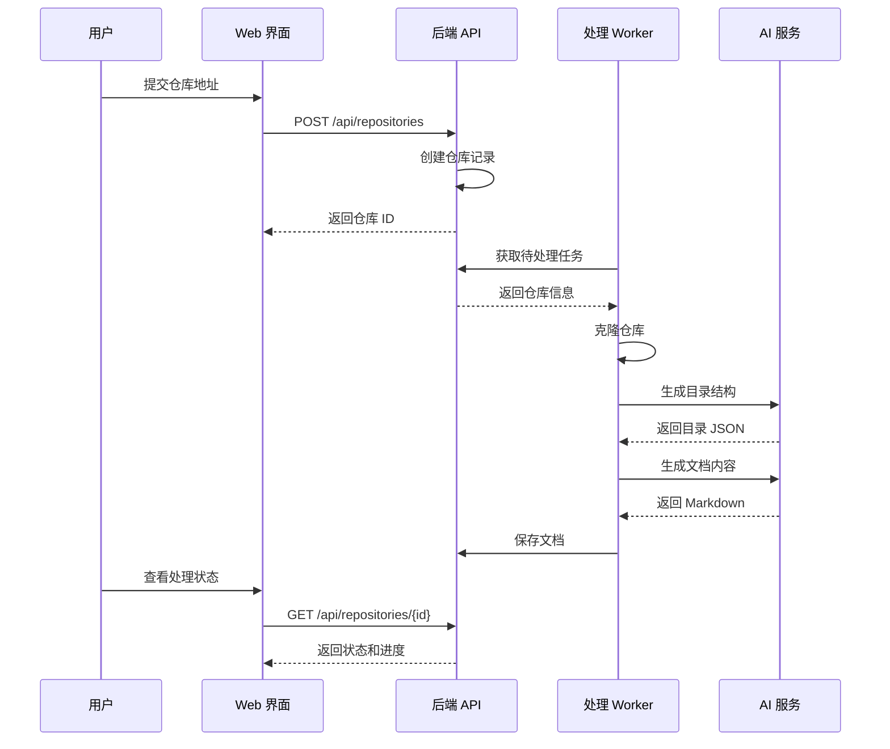

# 快速启动指南

本指南将帮助你在 5 分钟内启动 OpenDeepWiki 服务。

## 环境要求

### 必需环境

| 软件 | 最低版本 | 推荐版本 | 说明 |
|-----|---------|---------|------|
| Docker | 20.10+ | 24.0+ | 容器运行时 |
| Docker Compose | 2.0+ | 2.20+ | 容器编排工具 |

### 可选环境（本地开发）

| 软件 | 最低版本 | 推荐版本 | 说明 |
|-----|---------|---------|------|
| .NET SDK | 9.0 | 9.0 | 后端开发 |
| Node.js | 18.x | 20.x | 前端开发 |
| Git | 2.30+ | 最新版 | 版本控制 |

### AI 服务要求

你需要准备一个支持 **Function Calling** 的 AI 模型 API：

- OpenAI API（GPT-4、GPT-4o 等）
- Azure OpenAI Service
- Anthropic Claude
- 其他兼容 OpenAI API 格式的服务

## 方式一：Docker 一键启动（推荐）

### 1. 克隆仓库

```bash
git clone https://github.com/AIDotNet/OpenDeepWiki.git
cd OpenDeepWiki
```

### 2. 配置环境变量

编辑 `compose.yaml` 文件，修改以下关键配置：

```yaml
services:
  opendeepwiki:
    environment:
      # 必须配置：AI API Key
      - CHAT_API_KEY=your-api-key-here
      
      # 必须配置：AI 服务端点
      - ENDPOINT=https://api.openai.com/v1
      
      # 可选：指定模型（需支持 Function Calling）
      - WIKI_CATALOG_MODEL=gpt-4o
      - WIKI_CONTENT_MODEL=gpt-4o
```

### 3. 启动服务

**Linux/macOS（使用 Make）：**

```bash
# 构建并启动所有服务
make build
make up

# 或者一步完成
make all
```

**Windows（使用 Docker Compose）：**

```bash
# 构建镜像
docker-compose build

# 启动服务（后台运行）
docker-compose up -d
```

### 4. 访问服务

启动完成后，访问以下地址：

| 服务 | 地址 | 说明 |
|-----|------|------|
| Web 界面 | http://localhost:3000 | 主要访问入口 |
| API 服务 | http://localhost:8080 | 后端 API |
| API 文档 | http://localhost:8080/v1/scalar | Scalar API 文档（开发环境） |


## 方式二：本地开发启动

如果你需要进行开发或调试，可以使用本地启动方式。

### 1. 启动后端服务

```bash
# 进入后端目录
cd src/OpenDeepWiki

# 设置环境变量（Linux/macOS）
export CHAT_API_KEY=your-api-key
export ENDPOINT=https://api.openai.com/v1
export DB_TYPE=sqlite
export DB_CONNECTION_STRING="Data Source=./opendeepwiki.db"

# 设置环境变量（Windows PowerShell）
$env:CHAT_API_KEY="your-api-key"
$env:ENDPOINT="https://api.openai.com/v1"
$env:DB_TYPE="sqlite"
$env:DB_CONNECTION_STRING="Data Source=./opendeepwiki.db"

# 运行后端
dotnet run
```

### 2. 启动前端服务

```bash
# 进入前端目录
cd web

# 安装依赖
npm install

# 配置 API 代理（编辑 .env 文件）
echo "API_PROXY_URL=http://localhost:5085" > .env

# 启动开发服务器
npm run dev
```

### 3. 访问服务

- 前端：http://localhost:3000
- 后端：http://localhost:5085

## 首次配置

### 1. 注册管理员账号

首次访问时，系统会引导你创建管理员账号：

1. 访问 http://localhost:3000
2. 点击「注册」按钮
3. 填写用户名、邮箱和密码
4. 首个注册用户自动成为管理员

### 2. 配置 AI 服务（可选）

如果需要在界面中修改 AI 配置：

1. 登录管理员账号
2. 进入「管理后台」→「系统设置」
3. 配置 AI 模型和 API Key

## 添加第一个仓库

### 通过 Web 界面添加

1. 登录后，点击「添加仓库」按钮
2. 输入仓库地址，例如：
   - `https://github.com/AIDotNet/OpenDeepWiki`
   - `https://gitee.com/your-org/your-repo`
3. 选择分支（默认为主分支）
4. 点击「提交」开始处理

### 处理流程



### 查看处理状态

- 在仓库列表页面可以看到处理进度
- 状态说明：
  - `Pending` - 等待处理
  - `Processing` - 正在处理
  - `Completed` - 处理完成
  - `Failed` - 处理失败

## 验证安装成功

完成以下检查确认安装成功：

### ✅ 检查清单

- [ ] Web 界面可以正常访问
- [ ] 可以注册/登录账号
- [ ] 可以提交仓库地址
- [ ] 仓库开始处理（状态变为 Processing）
- [ ] 处理完成后可以查看生成的文档

### 常见问题排查

**Q: 服务无法启动？**

```bash
# 查看日志
docker-compose logs -f

# 或使用 Make
make logs
```

**Q: AI 调用失败？**

检查以下配置：
- `CHAT_API_KEY` 是否正确
- `ENDPOINT` 是否可访问
- 模型是否支持 Function Calling

**Q: 仓库克隆失败？**

- 检查仓库地址是否正确
- 私有仓库需要配置访问凭证
- 检查网络连接

## 下一步

- [环境配置说明](./configuration.md) - 详细的配置选项
- [系统架构总览](../architecture/overview.md) - 了解系统设计
- [Docker 部署指南](../deployment/docker-deployment.md) - 生产环境部署
