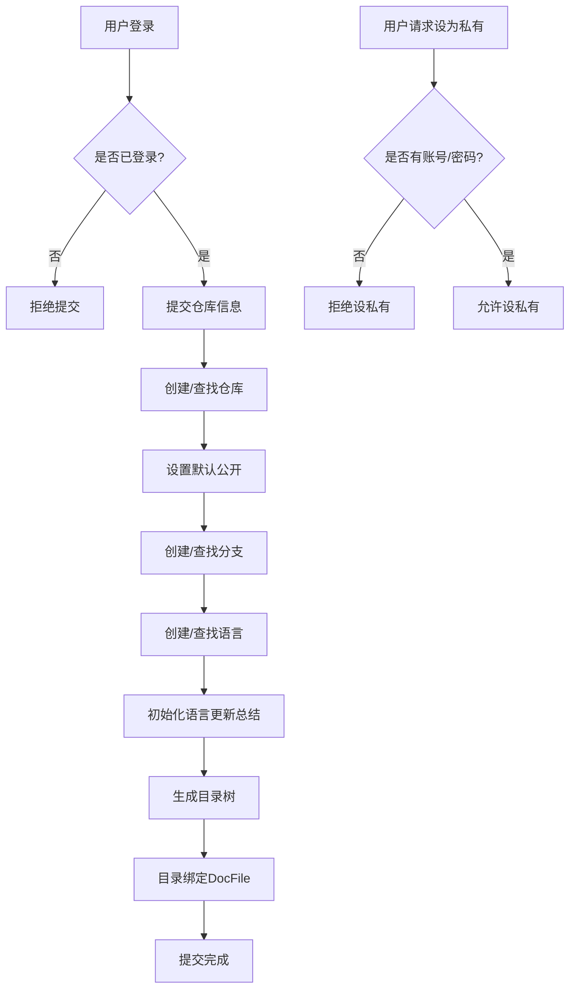

# 仓库设计说明（草案）

> 说明：本文件仅为需求与设计探讨稿，暂不实现。

## 目标与约束

- 用户必须登录后才能提交仓库信息。
- 提交后**默认公开**。
- 用户可在“私有仓库”中选择关闭（设为私有）。
  - **限制：** 若仓库未提供账户/密码，则不允许关闭（即必须保持公开）。
- 目录即文档文件：每个目录节点绑定一个文档文件（Docs），目录本身即代表文档内容。
- 语言维度有更新总结。

## 提交信息字段（用户输入）

- `git地址`
- `仓库名称`
- `仓库组织`
- `仓库账户`
- `仓库密码`
- `仓库分支`
- `仓库当前生成语言`

## 核心模型（逻辑关系）

### User
- `Id`
- `...`

### Repository
- `Id`
- `OwnerUserId`
- `GitUrl`
- `RepoName`
- `OrgName`
- `AuthAccount`（可为空）
- `AuthPassword`（可为空）
- `IsPublic`（默认 `true`）
- `Status`（默认 `Pending`，状态见下文）

> **规则：** 当 `AuthAccount`/`AuthPassword` 为空时，`IsPublic` 不能置为 `false`。

### RepositoryBranch
- `Id`
- `RepositoryId`
- `BranchName`

### BranchLanguage
- `Id`
- `RepositoryBranchId`
- `LanguageCode`
- `UpdateSummary`（语言更新总结）

### DocDirectory
- `Id`
- `BranchLanguageId`
- `Path`（目录路径）
- `DocFileId`

### DocFile
- `Id`
- `BranchLanguageId`
- `Content`（Docs 内容）

## 关系与唯一约束

- `User 1 - N Repository`
- `Repository 1 - N RepositoryBranch`
- `RepositoryBranch 1 - N BranchLanguage`
- `BranchLanguage 1 - N DocDirectory`
- `DocDirectory 1 - 1 DocFile`

建议唯一约束：
- `Repository(OwnerUserId, OrgName, RepoName)` 唯一
- `RepositoryBranch(RepositoryId, BranchName)` 唯一
- `BranchLanguage(RepositoryBranchId, LanguageCode)` 唯一
- `DocDirectory(BranchLanguageId, Path)` 唯一

## 权限与业务规则

- **提交**：仅登录用户允许。
- **仓库归属**：提交的仓库属于用户私有仓库列表，但默认公开。
- **公开/私有切换**：
  - 若仓库凭据缺失（账户/密码为空）→ 禁止设为私有。
  - 若仓库凭据存在 → 允许设为私有。

## 仓库处理状态

- `Pending`：提交后默认状态，等待后台处理。
- `Processing`：后台正在处理仓库。
- `Completed`：处理完成。
- `Failed`：处理失败。

## 后台处理流程

- 定时任务扫描 `Pending` 状态的仓库，按创建时间顺序处理。
- 开始处理时更新状态为 `Processing`。
- 处理流程：
  - 分析仓库内容。
  - 生成 Wiki 树形目录结构。
  - 为每个目录生成 Docs。
- 处理成功后更新为 `Completed`。
- 处理异常则更新为 `Failed`，继续处理下一条。

## 业务流程（Markdown 流程图）

## 备注与待确认

- “仓库账户/密码”用于拉取和更新仓库，不做加密处理（按需求）。
- 后续实现时需明确：
  - `AuthPassword` 是否允许空字符串或必须为 `null`
  - `IsPublic` 变更入口（UI/接口）与权限控制
